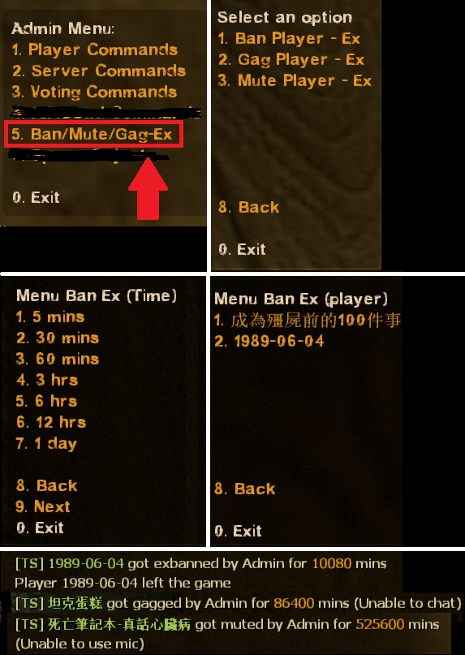
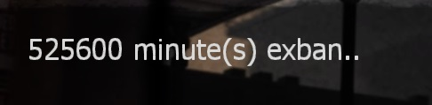
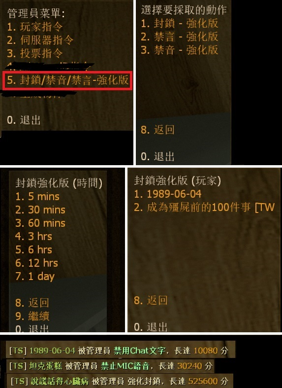
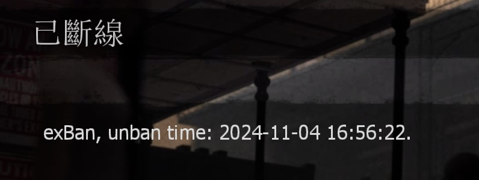

# Description | 內容
Gag & Mute & Ban - Ex

* Video | 影片展示
<br/>None

* Image
	* !admin -> Ban/Mute/Gag-Ex
    <br/>
    <br/>

* <details><summary>How does it work?</summary>

    * Type !admin to call adm menu and you will see "Ban/Mute/Gag-Ex" option
    * Admin can type
        * ```sm_exban``` to ban player
        * ```sm_exgag``` to gag player (Unable to type any words in chatbox)
        * ```sm_exmute``` to mute player (Unable to use microphone)
    * The database of players with gag & mute & ban: [data/gagmutebanex.txt](data/gagmutebanex.txt)
        * Before ban timeout, player still got banned even if he rejoins server
        * Before gag/mute timeout, player still got gag or mute even if he rejoins server
    * Records all actions about gag & mute & ban: ```logs/GagMuteBan.log```
    * Compatible with [SourceBan++](https://github.com/sbpp/sourcebans-pp)
</details>

* Require | 必要安裝
    1. [[INC] Multi Colors](https://github.com/fbef0102/L4D1_2-Plugins/releases/tag/Multi-Colors)

* <details><summary>ConVar | 指令</summary>

	* cfg/sourcemod/GagMuteBanEx.cfg
		```php
        // 0=Ban Menu off, 1=Ban Menu on.
        GagMuteBanEx_ban_allow "1"

        // 0=Mute Menu off, 1=Mute Menu on.
        GagMuteBanEx_mute_allow "1"

        // 0=Gag Menu off, 1=Gag Menu on.
        GagMuteBanEx_gag_allow "1"

        // Players with these flags can chat when '_chatenable' is 0 (Empty = Everyone, -1: Nobody)
        GagMuteBanEx_chat_immue_flag "z"
		```

    * Not in cfg/sourcemod/GagMuteBanEx.cfg
        ```php
        // If 0, Be Quient, No one can chat.
        sv_chatenable "1"
        ```
</details>

* <details><summary>Command | 命令</summary>
    
    * **Open exBan Steamid Menu or exBan Player (Adm Required: ADMFLAG_BAN)**
		```php
        sm_exban
        sm_exban <#userid|name> <minutes|0>
		```

    * **Open exGag Menu or exGag Player (Adm Required: ADMFLAG_CHAT)**
		```php
        sm_exgag
        sm_exgag <#userid|name> <minutes|0>
		```

    * **Open exMute Menu or exMute Player (Adm Required: ADMFLAG_CHAT)**
		```php
        sm_exmute
        sm_exmute <#userid|name> <minutes|0>
		```

    * **exBan Player by SteamID 64 (Adm Required: ADMFLAG_BAN)**
		```php
        sm_exbanid <minutes|0> <STEAM_ID64>
        sm_exbansteam <minutes|0> <STEAM_ID64>
        sm_exbansteamid <minutes|0> <STEAM_ID64>
		```
</details>

* <details><summary>Data Config</summary>
	
    * The database of players with gag & mute & ban
    * 🟥 DO NOT Modify this file unless you know what you are doing
    * [Search Steam64 ID](https://steamid.xyz/), [Unix Timestamp](https://www.unixtimestamp.com/)
	* [data/gagmutebanex.txt](data/gagmutebanex.txt)
		```php
        "gagmuteban"
        {
            "xxxxxxxxxxxx" // <--- Player's Steam64 ID
            {
                "Name"		"死亡筆記本-真話心臟病" // <--- Player's Name
                "gag"		"1704357320" // <--- gag unix time
                "mute"		"1730709422" // <--- mute unix time
                "ban"		"1710666666" // <--- ban unix time
            }
        }
		```
</details>

* <details><summary>Related Official ConVar</summary>

	* Admin can change in game
		```php
		// 0 = All Players are unable to use mic in server
        // 1 = All Players are able to use mic in server
		sm_cvar sv_voiceenable 1
		```
</details>

* <details><summary>FAQ</summary>
    
    * What is the differece between sourcemod original sm_ban, sm_gag, sm_mute ?
        * The original sm_ban only works when ban time is permanent, player will be automatically unbanned when server restart
        * The original sm_gag, sm_mute does not work if player rejoins server again or map change
    
    * How do I unban, ungag, unmute player ?
        * unban - ```sm_unban <steamid>```
        * ungag - ```sm_ungag <target>```
        * unmute - ```sm_unmute <target>```
        * If the above cvars didn't work, modify file [data/gagmutebanex.txt](data/gagmutebanex.txt) => Search Player's Steam64 ID => delete => save file => restart server
</details>

* Apply to | 適用於
    ```
    L4D1
    L4D2
    Any source game
    ```

* <details><summary>Translation Support | 支援翻譯</summary>

	```
	English
	繁體中文
	简体中文
	Russian
	```
</details>

* <details><summary>Changelog | 版本日誌</summary>

    * v1.2h (2024-10-23)
        * Support L4D1 or any other source game

    * v1.1h (2024-2-28)
        * Compatible with SourceBan++
        * Update cvars

    * v1.0h (2023-11-05)
        * Add translation file
        * Remake code

    * v1.7
        * Improve code

    * v1.6
        * Remake Code
        * Add notification

    * v1.3
        * [Original Post by mak](https://forums.alliedmods.net/showthread.php?t=272356)
</details>

- - - -
# 中文說明
封鎖/禁音/禁言-強化版

* 圖示
	* !admin -> Ban/Mute/Gag-Ex
    <br/>
    <br/>

* 原理
    * 管理員輸入 !admin -> 將會看到 "封鎖/禁音/禁言-強化版"
    * 管理員可以輸入命令
        * ```sm_exban``` 封鎖玩家
        * ```sm_exgag``` 禁言玩家 (不能打字發言)
        * ```sm_exmute``` 禁音玩家 (不能用麥克風發出聲音)
    * 封鎖/禁音/禁言 的玩家資料將儲存於: [data/gagmutebanex.txt](data/gagmutebanex.txt)
        * 封鎖時間到之前，下次玩家進入伺服器依然被封鎖
        * 禁言/禁音時間到之前，下次玩家進入伺服器依然被禁言/禁音
    * 所有封鎖/禁音/禁言紀錄將保存在 ```logs/GagMuteBan.log```
    * 可以與[SourceBan++](https://github.com/sbpp/sourcebans-pp)並用

* <details><summary>指令中文介紹 (點我展開)</summary>

	* cfg/sourcemod/GagMuteBanEx.cfg
		```php
        // 0=關閉強化封鎖, 1=開啟強化封鎖
        GagMuteBanEx_ban_allow "1"

        // 0=關閉強化禁音, 1=開啟強化禁音
        GagMuteBanEx_mute_allow "1"

        // 0=關閉強化禁言, 1=開啟強化禁言
        GagMuteBanEx_gag_allow "1"

        // 擁有這些權限的玩家，才可以在 _chatenable 為0時輸入文字聊天 (留白 = 任何人都能, -1: 無人)
        GagMuteBanEx_chat_immue_flag "z"
		```

    * 以下插件指令不會寫在 cfg/sourcemod/GagMuteBanEx.cfg
        ```php
        // 0 = 所有人無法輸入文字聊天
        // 1 = 所有人可以輸入文字聊天
        sv_chatenable "1"
        ```
</details>

* <details><summary>命令中文介紹 (點我展開)</summary>
    
    * **打開強化封鎖選單或直接封鎖玩家 (權限: ADMFLAG_BAN)**
		```php
        sm_exban
        sm_exban <#userid|name> <minutes|0>
		```

    * **打開強化禁言選單或直接禁言玩家 (權限: ADMFLAG_CHAT)**
		```php
        sm_exgag
        sm_exgag <#userid|name> <minutes|0>
		```

    * **打開強化禁音選單或直接禁音玩家 (權限: ADMFLAG_CHAT)**
		```php
        sm_exmute
        sm_exmute <#userid|name> <minutes|0>
		```

    * **輸入 STEAM_ID64 強化封鎖 (權限: ADMFLAG_BAN)**
		```php
        sm_exbanid <minutes|0> <STEAM_ID64>
        sm_exbansteam <minutes|0> <STEAM_ID64>
        sm_exbansteamid <minutes|0> <STEAM_ID64>
		```
</details>

* <details><summary>Data 文件</summary>
	
    * 封鎖/禁音/禁言 的玩家資料
    * 🟥 不要修改此文件除非你知道這是在幹嗎
    * [找出玩家的Steam64 ID](https://steamid.xyz/), [Unix Timestamp轉換為時間](https://www.unixtimestamp.com/)
	* [data/gagmutebanex.txt](data/gagmutebanex.txt)
		```php
        "gagmuteban"
        {
            "xxxxxxxxxxxx" // <--- 玩家的 Steam64 ID
            {
                "Name"		"死亡筆記本-真話心臟病" // <--- 玩家的 名子
                "gag"		"1704357320" // <--- 解除禁言的時間，數字為Unix Timestamp
                "mute"		"1730709422" // <--- 解除禁音的時間，數字為Unix Timestamp
                "ban"		"1710666666" // <--- 解除封鎖的時間，數字為Unix Timestamp
            }
        }
		```
</details>

* <details><summary>相關的官方指令中文介紹 (點我展開)</summary>

	* 管理員可以遊戲中途更換
		```php
		// 0 = 所有玩家不能使用麥克風說話
        // 1 = 所有玩家可以使用麥克風說話
		sm_cvar sv_voiceenable 1
		```
</details>

* <details><summary>FAQ 問題區 (點我展開)</summary>
    
    * 與Sourcemod自帶的 sm_ban, sm_gag, sm_mute 有何差別 ?
        * (sm_ban) 只要不是永久封鎖, 任何封鎖的名單在下次重啟伺服器之後都會失效
        * (sm_gag/sm_mute) 禁音/禁言名單, 在切換關卡之後會失效
        * 被禁音/禁言的人, 只要離開再重新加入伺服器, 禁音/禁言會失效
    
    * 我要如何解除封鎖、解除禁言、解除禁音玩家 ?
        * 解除封鎖 - ```sm_unban <steamid>```
        * 解除禁言 - ```sm_ungag <target>```
        * 解除禁音 - ```sm_unmute <target>```
        * 如果以上方法無效，請自行修改檔案 [data/gagmutebanex.txt](data/gagmutebanex.txt) => 尋找玩家的Steam ID64 => 刪除 => 儲存 => 重啟
</details>
