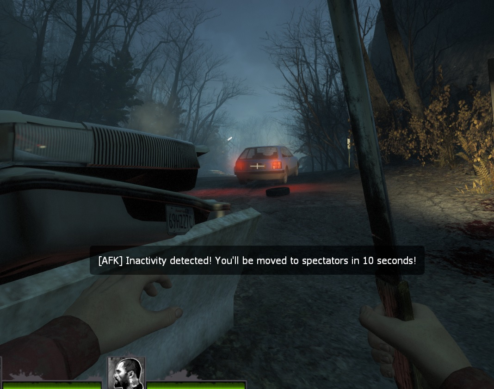
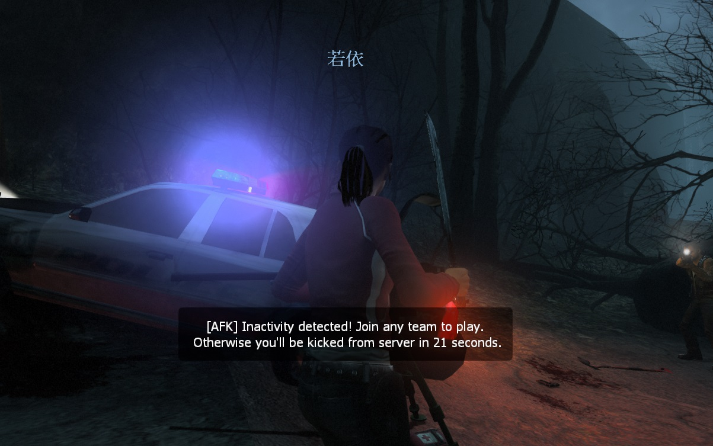

# Description | 內容
Forces survivors and infected to spectate if they're AFK after certain time

* Video | 影片展示
<br/>None

* Image | 圖示
    *  Warn time and spec
        > AFK警告提示並強制旁觀
        <br/>
    *  Warn time and kick while on spec
        > 旁觀區AFK警告提示並踢出伺服器
        <br/>

* Apply to | 適用於
    ```
    L4D1
    L4D2
    ```

* Translation Support | 支援翻譯
    ```
    English
    繁體中文
    简体中文
    ```

* <details><summary>Changelog | 版本日誌</summary>

    * v2.4 (2023-3-20)
        * Add a cvar
            ```php
            // If 1, Reset time when player types words in chatbox.
            l4d_specafk_say_reset "1"
            ```

    * v2.3 (2023-3-9)
        * Improve afk detection
        * Add more Translation
        * Add multicolors 

    * v2.2
        * [AlliedModders Post](https://forums.alliedmods.net/showpost.php?p=2728816&postcount=98)
        * Add more hints
        * Fixed wrong timer
        * Remake code, convert code to latest syntax
        * Fix warnings when compiling on SourceMod 1.11.
        * Optimize code and improve performance
        * Translation Support

    * v1.3.1
        * [Original plugin from djromero](https://forums.alliedmods.net/showthread.php?p=761203)
</details>

* Require | 必要安裝
	1. [left4dhooks](https://forums.alliedmods.net/showthread.php?t=321696)
	2. [[INC] Multi Colors](https://github.com/fbef0102/L4D1_2-Plugins/releases/tag/Multi-Colors)

* Related Plugin | 相關插件
	1. [l4d_afk_commands](https://github.com/fbef0102/L4D1_2-Plugins/tree/master/l4d_afk_commands): Adds commands to let the player spectate and join team. (!afk, !survivors, !infected, etc.), but no change team abuse.
		> 提供多種命令轉換隊伍陣營 (譬如: !afk, !survivors, !infected), 但不可濫用.

* <details><summary>ConVar | 指令</summary>

	* cfg/sourcemod/L4DVSAutoSpectateOnAFK.cfg
        ```php
        // Check/warn time interval
        l4d_specafk_checkinteral "1"

        // Players with these flags have immune to be kicked while spec. (Empty = Everyone, -1: Nobody)
        l4d_specafk_immune_access_flag "z"

        // If 1, kick enabled on afk while on spec
        l4d_specafk_kickenabled "1"

        // time before kick (while already on spec after warn)
        l4d_specafk_kicktime "30"

        // If 1, player will still be forced to spectate and kicked whether surviros leave saferoom or not.
        l4d_specafk_saferoom_ignore "0"

        // If 1, Reset time when player types words in chatbox.
        l4d_specafk_say_reset "1"

        // time before spec (after warn)
        l4d_specafk_spectime "15"

        // Warn time before kick (while already on spec)
        l4d_specafk_warnkicktime "60"

        // Warn time before spec
        l4d_specafk_warnspectime "20"
        ```
</details>

* <details><summary>Command | 命令</summary>

	None
</details>

- - - -
# 中文說明
當有玩家AFK一段時間，強制將玩家旁觀並踢出伺服器

* 原理
	* 如果玩家不動則一段時間後強制旁觀
        * 倒地、掛邊、被特感抓則忽略
    * 如果玩家在旁觀區不下來玩則一段時間後強制踢出伺服器
        * 管理員不受影響

* 用意在哪?
    * 惡意玩家進來伺服器掛機佔位子，不用等隊友投票跳出踢出遊戲
    * 強制傻B進來旁觀必須得遊玩
    * 空出伺服器位子讓給其他玩家

* 功能
	* 詳見下方"指令中文介紹"

* <details><summary>指令中文介紹 (點我展開)</summary>

	* cfg/sourcemod/L4DVSAutoSpectateOnAFK.cfg
        ```php
        // 每隔1秒檢查所有玩家AFK狀態
        l4d_specafk_checkinteral "1"

        // 擁有這權限的玩家在旁觀區不會被踢出伺服器 (留白 = 任何人都有權限, -1: 任何人都沒權限)
        l4d_specafk_immune_access_flag "z"

        // 為1時，啟動旁觀者AFK踢出伺服器
        l4d_specafk_kickenabled "1"

        // 為1時，即使玩家在安全區域內依然強制旁觀並踢出伺服器
        l4d_specafk_saferoom_ignore "0"

        // 在遊戲中偵測AFK 20秒後開始出現警告提示
        l4d_specafk_warnspectime "20"

        // 30秒後強制旁觀 (當已經檢測AFK一段時間過後)
        l4d_specafk_spectime "15"

        // 在旁觀區偵測AFK 60秒後開始出現警告提示
        l4d_specafk_warnkicktime "60"
        
        // 30秒後踢出伺服器 (當已經檢測AFK一段時間過後)
        l4d_specafk_kicktime "30"
        ```
</details>

