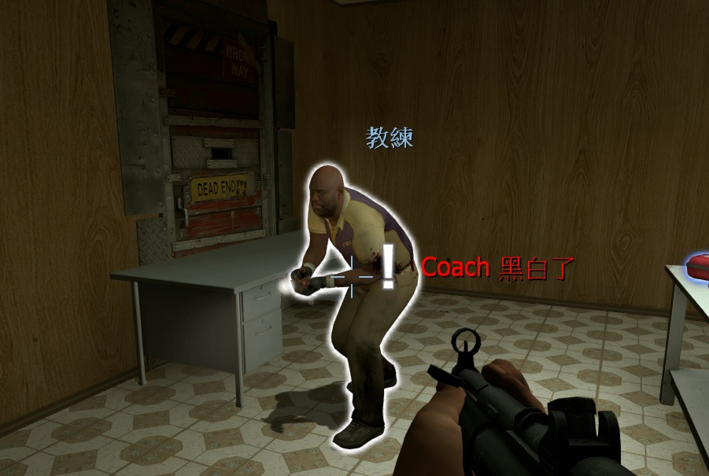
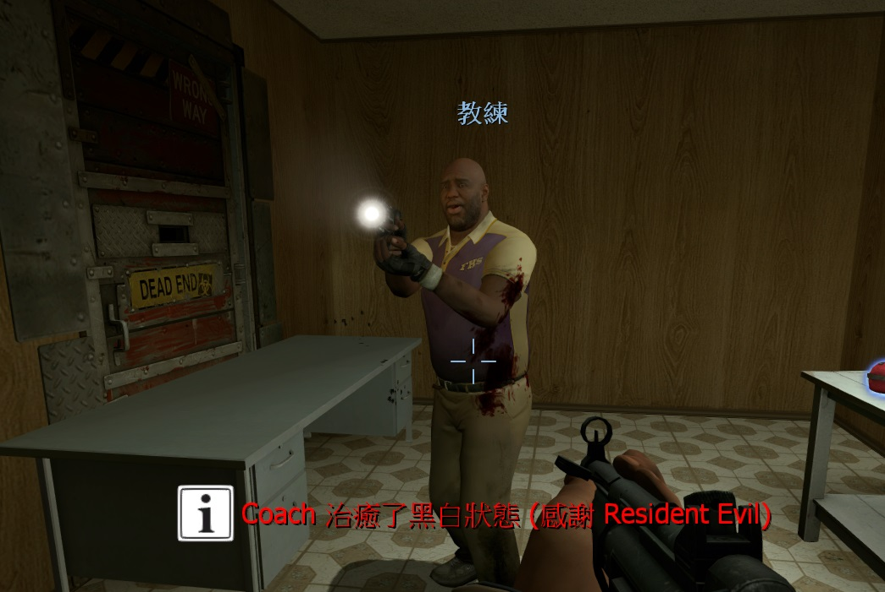

# Description | 內容
Notifies selected team(s) when someone is on final strike and add glow (Support LMC model if any)

* Apply to | 適用於
    ```
    L4D2
    ```

* Image | 圖示
    * Display who is black and white (顯示哪個玩家黑白)
    <br/>
    * Display who healed (顯示誰治癒了黑白)
    <br/>

* <details><summary>How does it work?</summary>

	* Notify all survivors who becomes black and white
    * Notify all survivors who heals the black and white player
    * Support "Lux's Model Changer" plugin
</Chargedetails>

* Require | 必要安裝
    1. [left4dhooks](https://forums.alliedmods.net/showthread.php?t=321696)
    2. [[INC] Multi Colors](https://github.com/fbef0102/L4D1_2-Plugins/releases/tag/Multi-Colors)
    3. [l4d_heartbeat](https://github.com/fbef0102/L4D1_2-Plugins/tree/master/l4d_heartbeat)

* <details><summary>Support | 支援插件</summary>

    1. [Lux's Model Changer](https://github.com/fbef0102/L4D1_2-Plugins/tree/master/Luxs-Model-Changer): LMC Allows you to use most models with most characters
		* 可以自由變成其他角色或NPC的模組
</details>

* <details><summary>ConVar | 指令</summary>

    * cfg/sourcemod/LMC_Black_and_White_Notifier.cfg
        ```php
        // Enable plugin? (1/0 = yes/no)
        lmc_blackandwhite_enable "1"

        // Enable making black white players glow?(1/0 = yes/no)
        lmc_blackandwhite_glow "1"

        // Black and white Glow color (255 255 255)
        lmc_blackandwhite_glowcolour "255 255 255"

        // Black and white Glow range
        lmc_blackandwhite_glowrange "800.0"

        // If 1, add a flashing effect on Black and white Glow
        lmc_blackandwhite_glowflash "1"

        // (Heal B&W) How to display notification. (0=off, 1=chat, 2=hint text, 3=director hint in survivor team, hint text in infected team)
        lmc_blackandwhite_announce_type_heal "3"

        // (Heal B&W) Display notification to who? (0=survivors only, 1=infected only, 2=all players)
        lmc_blackandwhite_announce_who_heal "0"

        // (Heal B&W) Director hint range
        lmc_blackandwhite_hintrange_heal "700"

        // (Heal B&W) Director hint Timeout (in seconds)
        lmc_blackandwhite_hinttime_heal "7.0"

        // (Heal B&W) Director hint colour (255 255 255)
        lmc_blackandwhite_hintcolour_heal "0 255 0"

        // (Become B&W) How to display notification. (0=off, 1=chat, 2=hint text, 3=director hint in survivor team, hint text in infected team)
        lmc_blackandwhite_announce_type_bw "3"

        // (Become B&W) Display notification to who? (0=survivors only, 1=infected only, 2=all players)
        lmc_blackandwhite_announce_who_bw "0"

        // (Become B&W) Director hint range
        lmc_blackandwhite_hintrange_bw "1000"

        // (Become B&W) Director hint Timeout (in seconds)
        lmc_blackandwhite_hinttime_bw "10.0"

        // (Become B&W) Director hint colour (255 255 255)
        lmc_blackandwhite_hintcolour_bw "250 0 0"
        ```
</details>

* Translation Support | 支援翻譯
	```
	translations/LMC_Black_and_White_Notifier.phrases.txt
	```

* <details><summary>Changelog | 版本日誌</summary>

    * v1.3h (2026-4-4)
        * Update cvars, translations
        * Use code from l4d_heartbeat to detect if player is black and white

    * v1.2h (2025-6-8)
        * Require l4d_heartbeat

    * v1.1h (2023-6-23)
        * Fixed glow disappear when B&W player switches team

    * v1.0h (2022-11-26)
        * Remake Code
        * Converted plugin source to the latest syntax
        * Changes to fix warnings when compiling on SourceMod 1.11.
        * Support Translation
        * Check Last Life every 1.0 second (For people using admin cheats and other stuff that changes survivor health)
    
    * Original & Credit
        * [Lux](https://forums.alliedmods.net/showthread.php?t=310235)
</details>

- - - -
# 中文說明
顯示誰是黑白狀態，有更多的提示與支援LMC模組

* 原理
    * 救起玩家之後判定玩家是否為黑白狀態
    * 支援其他恢复玩家血量的插件
    * 支援LMC模組插件 (也可不裝LMC)

* <details><summary>指令中文介紹 (點我展開)</summary>

    * cfg/sourcemod/LMC_Black_and_White_Notifier.cfg
        ```php
        // 0=關閉插件, 1=啟動插件
        lmc_blackandwhite_enable "1"

        // 為1時，黑白玩家有光圈效果
        lmc_blackandwhite_glow "1"

        // 光圈的顏色，填入RGB三色 (三個數值介於0~255，需要空格)
        lmc_blackandwhite_glowcolour "255 255 255"

        // 光圈最遠可見範圍
        lmc_blackandwhite_glowrange "800.0"

        // 為1時，光圈會閃爍 (0 = 關閉這項功能)
        lmc_blackandwhite_glowflash "1"

        // (治癒黑白) 提示該如何顯示. (0: 不提示, 1: 聊天框, 2: 黑底白字框, 3: 倖存者隊伍導演系統提示, 感染者隊伍黑底白字框)
        lmc_blackandwhite_announce_type_heal "3"

        // (治癒黑白) 提示給誰看? (0=倖存者隊伍, 1=特感隊伍, 2=所有玩家)
        lmc_blackandwhite_announce_who_heal "0"

        // (治癒黑白) 導演系統提示的範圍
        lmc_blackandwhite_hintrange_heal "700"

        // (治癒黑白) 導演系統提示的時間 (單位: 秒)
        lmc_blackandwhite_hinttime_heal "7.0"

        // (治癒黑白) 導演系統提示文字的顏色
        lmc_blackandwhite_hintcolour_heal "0 255 0"

        // (變成黑白) 提示該如何顯示. (0: 不提示, 1: 聊天框, 2: 黑底白字框, 3: 倖存者隊伍導演系統提示, 感染者隊伍黑底白字框)
        lmc_blackandwhite_announce_type_bw "3"

        // (變成黑白) 提示給誰看? (0=倖存者隊伍, 1=特感隊伍, 2=所有玩家)
        lmc_blackandwhite_announce_who_bw "0"

        // (變成黑白) 導演系統提示的範圍
        lmc_blackandwhite_hintrange_bw "1000"

        // (變成黑白) 導演系統提示的時間 (單位: 秒)
        lmc_blackandwhite_hinttime_bw "10.0"

        // (變成黑白) 導演系統提示文字的顏色
        lmc_blackandwhite_hintcolour_bw "250 0 0"
        ```
</details>