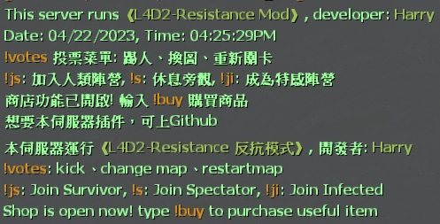

# Description | 內容
Display advertisements

* Video | 影片展示
<br/>None

* Image | 圖示
	* Display advertisements in chat box (顯示公告)
    <br/>

* Require | 必要安裝
    1. [[INC] Multi Colors](https://github.com/fbef0102/L4D1_2-Plugins/releases/tag/Multi-Colors)

* <details><summary>ConVar | 指令</summary>

	* cfg\sourcemod\advertisements.cfg
		```php
		// Enable/disable displaying advertisements.
		sm_advertisements_enabled "1"

		// File to read the advertisements from.
		sm_advertisements_file "advertisements.txt"

		// Amount of seconds between advertisements.
		sm_advertisements_interval "30"

		// Display advertisement sound file (relative to to sound/, empty=disable)
		sm_advertisements_soundfile "ui/beepclear.wav"
		```
</details>

* <details><summary>Command | 命令</summary>

	* **Reload the advertisements (Server Cmd)**
		```php
		sm_advertisements_reload
		```
</details>

* <details><summary>Example Config</summary>

	* [configs\advertisements.txt](configs\advertisements.txt)
		```php
		// Types
		// -----
		// center: Center message
		// chat: Chat message
		// hint: Hint message
		// menu: Menu message
		//
		// -----
		//	Following named colors are supported in L4D1/L4D2:
		//	 - {default}	(white color)
		//	 - {green}		(olive color)
		//	 - {olive}		(green color)
		//	 - {lightgreen}	(light green color)
		//	 - {red}		(red color) - There must be at least one player or bot in infected team，or red will turn into {green} color
		//	 - {blue}		(blue color) - There must be at least one player or bot in survivor team，or blue will turn into {green} color 
		//	 Warning: {lightgreen}、{red}、{blue}, 2 of 3 colors can not be used at the same sentence
		"Advertisements"
		{
			"1"
			{
				"chat"			"{olive}Type !votes{lightgreen}: kick、change map、restartmap"
			}
			"2"
			{
				"chat"			"{lightgreen}Weclome to join our Steam Group or Discord Channel"
			}
		}
		```
</details>

* Apply to | 適用於
	```
	L4D1
	L4D2
	```

* <details><summary>Changelog | 版本日誌</summary>

	```php
	//DJ Tsunami @ 2008-2021
	//HarryPotter @ 2022-2023
	```
	* v2.2.1 (2023-4-22)
		* Remake Code
		* Remove updater
		* Add multicolors to support l4d1, l4d2

	* v2.1.0
		* [Original Plugin by DJ Tsunami](https://forums.alliedmods.net/showthread.php?t=155705)
</details>

- - - -
# 中文說明
廣告&公告欄插件，每隔一段時間於聊天框自動顯示一段內容

* 原理
	* 伺服器每隔一段時間會自動顯示一段內容，可以自行決定想要顯示的內容

* 用意在哪?
	* 打廣告，譬如澳門線上賭場，等你來挑戰，網址www.sexL4D2noob.com
	* 顯示公告，譬如歡迎加入XXX群組、官方FB社團XXXX、輸入XXX指令等等
	* 宣揚理念，譬如票投給美國共和黨支持XXX總統候選人

* 功能
	* 可設置廣告顯示間隔
	* 可設置廣告音效

* 文件設定
	* [configs\advertisements.txt](configs\advertisements.txt)
		```php
		// 中文說明
		// -----
		// center: 廣告文字顯示於螢幕中央
		// chat: 廣告文字顯示於聊天框
		// hint: 廣告文字顯示於螢幕下方黑底白字框
		// menu: 廣告文字顯示於Menu選單
		//
		// -----
		//	以下顏色只支援於 L4D1/L4D2:
		//	 - {default}	(白色)
		//	 - {green}		(橘色)
		//	 - {olive}		(綠色)
		//	 - {lightgreen}	(淺綠色)
		//	 - {red}		(紅色) - 特感隊伍要有人或bot在才會顯示紅色，否則顯示橘色
		//	 - {blue}		(藍色) - 人類隊伍要有人或bot在才會顯示藍色，否則顯示橘色
		//	 注意事項: 藍色、紅色、淺綠色，這三種顏色的其中兩種不可出現在同一句話裡
		//
		"Advertisements"
		{
			"1"
			{
				"chat"			"{olive}!votes {lightgreen}投票選單: 踢人、換圖、重新關卡"
			}
			"2"
			{
				"chat"			"{lightgreen}歡迎加入Steam群組、官方FB社團、Discord頻道"
			}
		}
		```