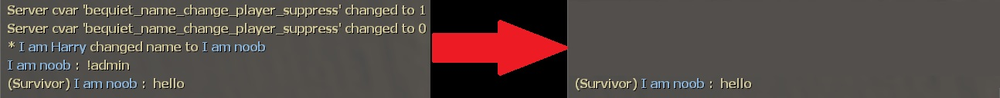
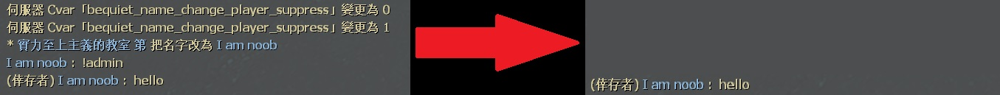

# Description | 內容
Please be Quiet! Block unnecessary chat or announcement

* Video | 影片展示
<br/>None

* Image | 圖示
    <br/>

* <details><summary>How does it work?</summary>

    * Block name change announcement
    * Block server convars change announcement
    * Block chat with ```'!'``` or ```'/'```
</details>

* Require | 必要安裝
<br/>None

* <details><summary>ConVar | 指令</summary>

    * cfg/sourcemod/bequiet.cfg
        ```php
        // 0=Plugin off, 1=Plugin on.
        bequiet_enable "1"

        // If 1, Silence Server Cvars announcement.
        bequiet_cvar_change_suppress "1"

        // If 1, Silence Player name Changes announcement including spectators.
        bequiet_name_change_player_suppress "1"

        // If 1, Silence chat with '!' or '/'
        bequiet_chatbox_cmd_suppress "1"
        ```
</details>

* <details><summary>Command | 命令</summary>

    None
</details>

* Apply to | 適用於
    ```
    L4D1
    L4D2
    ```

* <details><summary>Related Plugin | 相關插件</summary>

    1. [lfd_noTeamSay](/lfd_noTeamSay): Redirecting all 'say_team' messages to 'say'
        > 沒有團隊聊天頻道只有公開聊天頻道
</details>

* <details><summary>Changelog | 版本日誌</summary>

    * v1.0h (2024-3-3)
        * Update Cvars
        * Imrpove code

    * v1.33.7
        * [From SirPlease/L4D2-Competitive-Rework](https://github.com/SirPlease/L4D2-Competitive-Rework/blob/master/addons/sourcemod/scripting/bequiet.sp)
</details>

- - - -
# 中文說明
阻擋一些非必要提示的訊息在聊天框 (指令更改、名字更改)

* 圖示
    <br/>

* 原理
    1. 阻擋指令更改的提示
    2. 阻擋玩家名字更改的提示
    3. 阻擋玩家使用```!```或```/```輸入指令的提示

* <details><summary>指令中文介紹 (點我展開)</summary>

    * cfg/sourcemod/bequiet.cfg
        ```php
        // 0=關閉插件, 1=啟動插件
        bequiet_enable "1"

        // 為1時，阻擋指令更改的提示
        bequiet_cvar_change_suppress "1"

        // 為1時，阻擋玩家名字更改的提示
        bequiet_name_change_player_suppress "1"

        // 為1時，阻擋玩家使用```!```或```/```輸入指令的提示
        bequiet_chatbox_cmd_suppress "1"
        ```
</details>