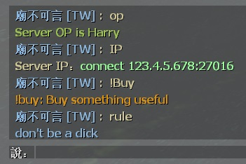

# Description | 內容
Displays chat advertisements when specified text is said in player chat.

* Video | 影片展示
<br/>None

* Image | 圖示
    <br/>

* Require | 必要安裝
    1. [[INC] Multi Colors](https://github.com/fbef0102/L4D1_2-Plugins/releases/tag/Multi-Colors)

* <details><summary>ConVar | 指令</summary>

    None
</details>

* <details><summary>Command | 命令</summary>

    None
</details>

* <details><summary>Data Config</summary>

	* [configs\chat_responses.txt](configs\chat_responses.txt)
		```php
        "ChatResponses"
        {
            "OP" // specified text is said in player chat.
            {
                // Displays message
                "text"		"{olive}Server OP is Harry"
            }
        }
		```
</details>

* Apply to | 適用於
    ```
    L4D1
    L4D2
    ```

* <details><summary>Similar Plugin | 相似插件</summary>

    1. [server_vpn_hop](https://github.com/fbef0102/Game-Private_Plugin/tree/main/Plugin_%E6%8F%92%E4%BB%B6/Server_%E4%BC%BA%E6%9C%8D%E5%99%A8/server_vpn_hop): Type Command to show Server/Vpn List
        > 輸入指令顯示 Server/Vpn 列表
</details>

* <details><summary>Changelog | 版本日誌</summary>

	* v1.1 (2023-12-21)
		* Optimize code and improve performance
</details>

- - - -
# 中文說明
玩家在聊天框輸入特地文字，伺服器會顯示廣告或提示

* 原理
    * 輸入特定文字，聊天框反饋提示給你

* <details><summary>文件設定範例</summary>

	* [configs\chat_responses.txt](configs\chat_responses.txt)
		```php
        "ChatResponses"
        {
            "OP" // 玩家在聊天框輸入特地文字
            {
                // 伺服器會顯示訊息
                "text"		"{olive}Server OP is Harry"
            }
        }
		```
</details>

