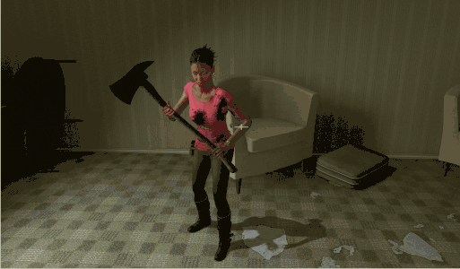
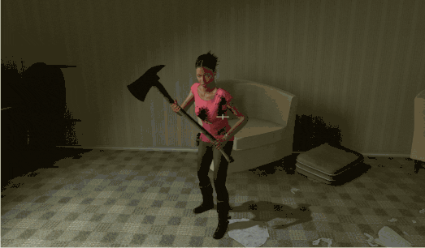
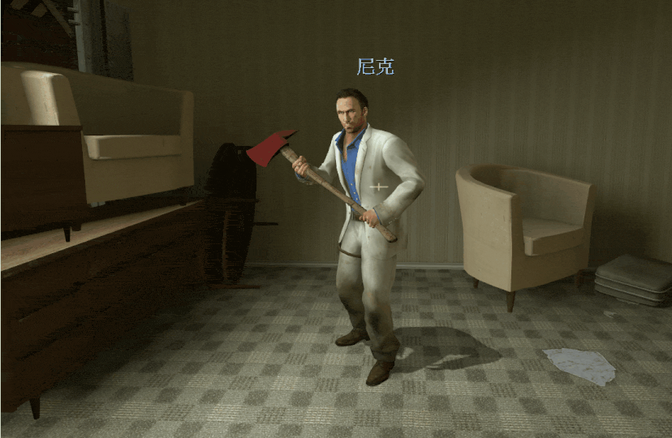
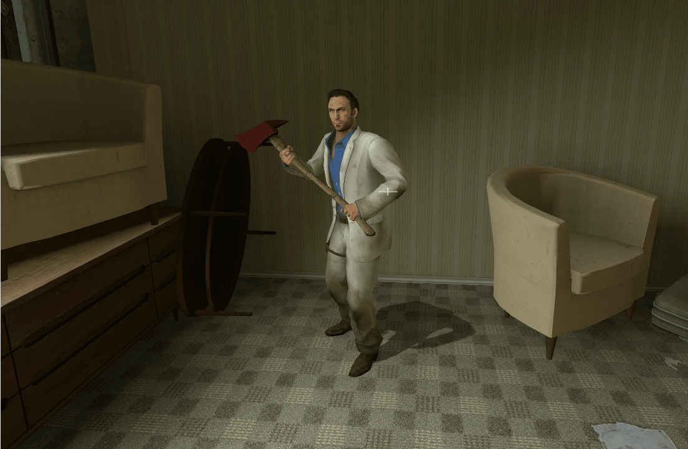

# Description | 內容
Survivor players will drop their secondary weapon (including melee) when they die

* Apply to | 適用於
	```
	L4D1
	L4D2
	```

* Image | 圖示
	| Before (裝此插件之前)  			| After (裝此插件之後) |
	| -------------|:-----------------:|
	| ||
	| ||

* <details><summary>How does it work?</summary>

	* When you die, drop your secondary weapon
	* When survivor bots were kicked by server or plugins, they will also drop their secondary weapon
		* Pistol 
		* Dual pistol
		* Magnum
		* Melee weapons (support custom map melee)
		* Chainsaw
</details>

* Require | 必要安裝
	1. [left4dhooks](https://forums.alliedmods.net/showthread.php?t=321696)

* <details><summary>Related Plugin | 相關插件</summary>

	1. [l4d_drop](https://github.com/fbef0102/L4D1_2-Plugins/tree/master/l4d_drop): Allows players to drop the weapon they are holding
		> 玩家可自行丟棄手中的武器
</details>

* <details><summary>ConVar | 指令</summary>

    * cfg/sourcemod/drop_secondary.cfg
        ```php
		// If 1, Survivor bots will drop their secondary weapon when they were kicked
		drop_secondary_bot_kick "1"
        ```
</details>

* <details><summary>Changelog | 版本日誌</summary>

	* v2.8 (2026-4-20)
		* Update cvars
		* Fix melee weapon sometimes drops from player who does not have melee weapon at all
		* Survivor bots will drop their secondary weapon when they were kicked
		* Optimize code

	* v2.7 (2025-11-8)
		* Support L4D1

	* v2.6 (2025-1-16)
		* Remake code
		* Clear hidden weapon data for player

	* v2.5 (2022-12-18)
		* Delete l4d_info_editor, too frequently call forward function from l4d_info_editor (every 20~30 seconds)

	* v2.4 (2022-12-7)
		* Use other method to get the melee weapon

	* v2.3 (2022-10-7)
		* Convert All codes to new syntax.
		* Support Custom Melee
		* Create Fake Event "weapon_drop" when drop secondary weapon on death

	* v1.6
		* [Original Plugin by PVNDV](https://forums.alliedmods.net/showthread.php?t=283713)
</details>

- - - -
# 中文說明
死亡時掉落第二把武器

* 原理
	* 死亡時掉落手上裝備的第二把武器
	* 當倖存者bot被踢出遊戲時，掉落副武器
		* 手槍
		* 雙手槍
		* 麥格農手槍
		* 電鋸
		* 近戰武器 (可掉三方圖自製近戰武器)

* <details><summary>指令中文介紹 (點我展開)</summary>

    * cfg/sourcemod/drop_secondary.cfg
        ```php
		// 為1時，當倖存者bot被踢出遊戲時，掉落副武器
		drop_secondary_bot_kick "1"
        ```
</details>
