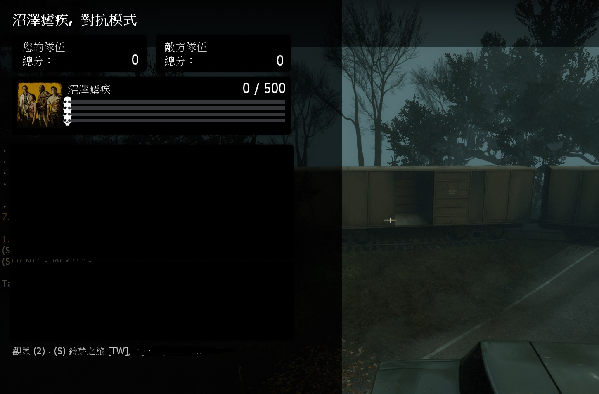

# Description | 內容
Fixed no Survivor bots issue or too many Survivor bots issue after map loading.
(Usually this bug happens when using readyup plugin.)

* Video | 影片展示
<br>None

* Image | 圖示
	* No survivor bots after map loading (This is bug).
		> 修復換圖後沒有倖存者bot
		<br/>

* Apply to | 適用於
	```
	L4D1
	L4D2
	```

* <details><summary>Changelog | 版本日誌</summary>

	* v1.3
		* Remake Code
</details>

* Require | 必要安裝
<br>None

* <details><summary>ConVar | 指令</summary>

	None
</details>

* <details><summary>Command | 命令</summary>

	* **Trying to fix wrong numbers of survivor bots in server. (Adm required: ADMFLAG_ROOT)**
		```php
		sm_botfix
		```
</details>

* <details><summary>Related Official ConVar</summary>

	```php
    // Max # of survivors
    sm_cvar survivor_limit 4
    ```
</details>    

- - - -
# 中文說明
解決換圖之後沒有任何倖存者Bot的問題

* 原理
    * 換圖之後偶而沒有任何倖存者Bot
        * 使用某一些藥抗插件或者readyup插件才會發生這個bug
    * 建議等真的有這個bug再來安裝此插件
    * 此插件不適用於多人對抗或多人5+戰役伺服器
    
* 功能
    * 管理員手動輸入!botfix修復

* <details><summary>相關的官方指令中文介紹 (點我展開)</summary>

	```php
    // 倖存者最大數量限制
    sm_cvar survivor_limit 4
    ```
</details>    