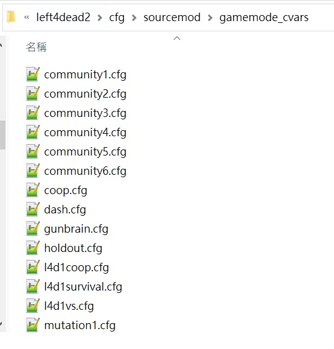

# Description | 內容
Allows for custom settings for each gamemode and mutatuion.

* Video | 影片展示
<br/>None

* Image | 圖示
	<br/>

* <details><summary>How does it work?</summary>

	* Execute different cfg file based on gamemode or mutatuion when
		* Map change
		* Gamemode/Mutation change
		* This is called right after OnMapStart() but any time before OnConfigsExecuted(). After the "exec sourcemod.cfg"command and all AutoExecConfig() exec commands have been added to the ServerCommand() buffer.
	* Cfg files are in ```cfg\sourcemod\gamemode_cvars\xxxxx.cfg```
		* xxxxx is gamemode or mutation name
	* [L4D2 all mutations](https://developer.valvesoftware.com/wiki/L4D2_Decrypted_mutations)
</details>

* Require | 必要安裝
<br/>None

* <details><summary>ConVar | 指令</summary>

	None
</details>

* <details><summary>Command | 命令</summary>

	None
</details>

* Apply to | 適用於
	```
	L4D1
	L4D2
	```

* <details><summary>Related Plugin | 相關插件</summary>

	1. [Map-based Configs](https://forums.alliedmods.net/showthread.php?t=306525): Allows for custom settings for each map
		> 根據地圖執行不同的cfg文件
</details>

* <details><summary>Changelog | 版本日誌</summary>

	* v1.1 (2024-3-9)
		* Initial Release

	* v1.0 (2023-8-25)
		* Initial Release
</details>

- - - -
# 中文說明
根據遊戲模式或突變模式執行不同的cfg文件

* 原理
	* 根據當前的遊戲模式或突變模式執行不同的cfg文件，執行時間點為
		* 地圖載入時
		* 遊戲模式/突變模式改變時
		* Server.cfg 和 sourcemod.cfg 以及所有插件產生的cfg 執行之後，```OnConfigsExecuted()``` 之前
	* cfg文件位於```cfg\sourcemod\gamemode_cvars\xxxxx.cfg```
		* xxxxx 是遊戲模式名稱或突變模式名稱
    * [L4D2 突變模式列表](https://developer.valvesoftware.com/wiki/L4D2_Decrypted_mutations)

* 用意在哪?
    * 給需要開不同遊戲模式或突變模式的伺服器使用，方便載入不同的cfg

