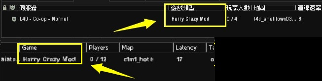
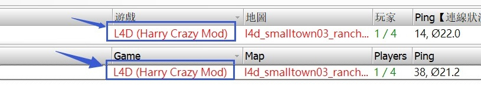
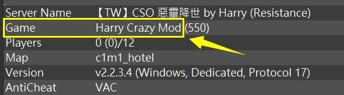
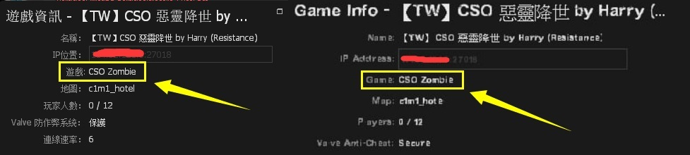

# Description | 內容
Allows changing of displayed game type in server browser

* Video | 影片展示
<br/>None

* Image | 圖示
	<br/>  
	<br/>  
	<br/>  
	<br/>  

* Require | 必要安裝
	1. [sourcescramble](https://github.com/nosoop/SMExt-SourceScramble/releases)

* <details><summary>ConVar | 指令</summary>

	None
</details>

* <details><summary>Command | 命令</summary>

	None
</details>

* <details><summary>How to Modify Game description</summary>

    1. Modify file: [configs\gametype_description.cfg](configs\gametype_description.cfg)
        ```php
        Harry Crazy Mod
        ```
    2. The ame description will change on map change or server restart
</details>

* Apply to | 適用於
	```
	L4D1
	L4D2
	```

* <details><summary>Related Plugin | 相關插件</summary>

	1. [l4d_DynamicHostname](/l4d_DynamicHostname)</b>: Server name with txt file (Support any language)
    	* 伺服器房名可以寫中文的插件
</details>

* <details><summary>Changelog | 版本日誌</summary>

    * v1.0 (2024-3-25)
		* Initial Release
</details>

- - - -
# 中文說明
更改伺服器的遊戲欄資訊

* <details><summary>改遊戲欄資訊步驟</summary>

    1. 請打開文件[configs\gametype_description.cfg](configs\gametype_description.cfg)並更改 (可以寫中文)
        ```php
        Harry 瘋狂模式
        ```
    2. 等待伺服器重啟或換圖
</details>