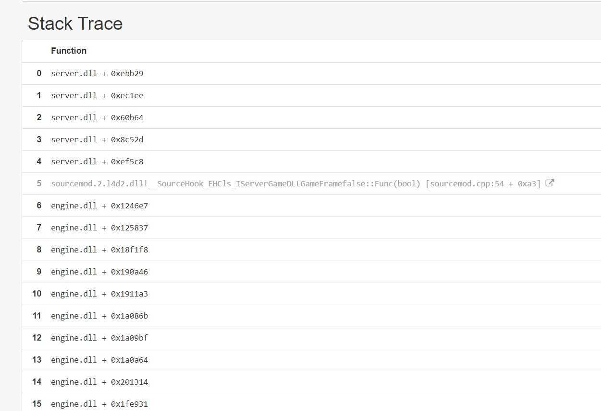
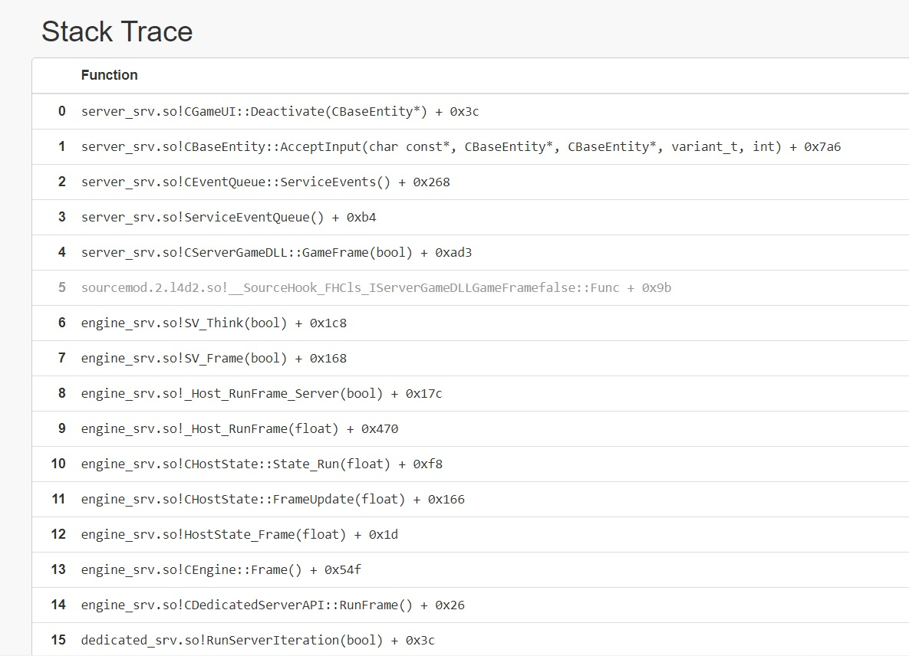

# Description | 內容
Fixes a crash in game_ui entities

* Video | 影片展示
<br/>None

* <details><summary>Image | 圖示</summary>

    * Crash Stack (Windows)
    <br/>
    * Crash Stack (Linux)
    <br/>
</details>

* <details><summary>How does it work?</summary>

	* Prevents a server crash when maps are using [game_ui](https://developer.valvesoftware.com/wiki/Game_ui) entities. More information [here](https://forums.alliedmods.net/showthread.php?t=261039)
    * The game will crash if the Deactivate input is fired on a game_ui that was activated by a player who has since disconnected
</details>

* Require | 必要安裝
<br/>None

* <details><summary>ConVar | 指令</summary>

	None
</details>

* <details><summary>Command | 命令</summary>

	None
</details>

* Apply to | 適用於
    ```
    L4D1
    L4D2
    ```

* <details><summary>Changelog | 版本日誌</summary>

    * v1.0h (2024-3-7)
        * Fixed incorrect offset in l4d2
        * Add support in l4d1
        * Update gamedata
		* Remake code, convert code to latest syntax
		* Fix warnings when compiling on SourceMod 1.11.

	* v1.0.0
		* [Original Plugin by GoD-Tony](https://forums.alliedmods.net/showthread.php?t=261173)
</details>

- - - -
# 中文說明
修復"game_ui"實體所造成的崩潰 (常見於三方圖)

* 原理
    * 這是所有source引擎的遊戲都會有的bug (幹你Valve)
    * [```game_ui```](https://developer.valvesoftware.com/wiki/Game_ui) 是地圖內的一個實體 (常見於三方圖)
        * 反應玩家的鍵盤或滑鼠，用來操控譬如直升機、車子之類的載具
        * 當正在操控的玩家突然離開遊戲時，伺服器會立刻崩潰
    * 想知道更多詳情點擊[這裡](https://forums.alliedmods.net/showthread.php?t=261039)