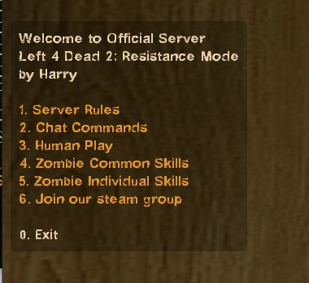

# Description | 內容
In-game Help Menu (Support Translation)

* Video | 影片展示
<br/>None

* Image
	* Help menu
	<br/>

* Apply to | 適用於
```
L4D1
L4D2
```

* Translation Support | 支援翻譯
```
English
繁體中文
简体中文
Russian
```


* <details><summary>Changelog | 版本日誌</summary>

	```php
	//chundo @ 2008
	//Harry @ 2020 - 2022
	```
	* v0.8 (2022-11-29)
		* Convert All codes to new syntax.
		* Translation support.
		* Add more convars
		* Add more commands
		* Support readyup plugin
	* v0.3 
		* [Original Plugin By chundo](https://forums.alliedmods.net/showthread.php?p=637467)
</details>

* Require | 必要安裝
	1. [[INC] Multi Colors](https://forums.alliedmods.net/showthread.php?t=247770)
	2. Optional - [[INC] readyup](https://github.com/fbef0102/Game-Private_Plugin/blob/main/left4dead2/scripting/include/readyup.inc)

* Optional | 輔助插件
	1. [readyup](/Plugin_插件/Server_伺服器/readyup): Ready Plugin
		> 準備插件

* Data & Translation Example
	* configs/helpmenu.cfg
		```php
		"Help"
		{
			"MENU1"
			{
				"title"		"MENU1"
				"type"		"text"      //<-- choose text or list
				"items"
				{
					""		"AAA"
					""		"BBB"
				}
			}
			"Chat Commands"
			{
				"title"		"Chat Commands"
				"type"		"list"       //<-- choose text or list
				"items"
				{
					"say !help"		"Default Description"
				}
			}

			// Add more menu if you want
			...
		}
		```
	* translations/helpmenu.phrases.txt
		```php
		"Phrases"
		{
			"MENU1"
			{
				"en"			"Write down translation for MENU1 Title"
			}
			"AAA"
			{
				"en"			"Write down translation for AAA description"
			}
			"BBB"
			{
				"en"			"Write down translation for BBB description"
			}
			"Chat Commands"
			{
				"en"			"Write down translation for Chat Commands Title"
			}
			"say !help"
			{
				"en"			"Write down translation for !help command description"
			}
		}
		```

* <details><summary>ConVar | 指令</summary>

	* cfg/sourcemod/helpmenu.cfg
		```php
		// Show a list of online admins in the menu.
		sm_helpmenu_admins "1"

		// Automatically reload the configuration file when changing the map.
		sm_helpmenu_autoreload "1"

		// Path to configuration file.
		sm_helpmenu_config_path "configs/helpmenu.cfg"

		// Show 'Don't display again' and 'Display again next time' item in the menu.
		sm_helpmenu_do_not_display "1"

		// Shows the map rotation in the menu.
		sm_helpmenu_rotation "0"

		// Show 'Join our steam group' item in the menu.
		sm_helpmenu_steam_group "1"

		// Show welcome message and help menu to newly connected users.
		sm_helpmenu_welcome "1"
		```
</details>

* <details><summary>Command | 命令</summary>

	* **Display the help menu.**
		```php
		sm_help
		sm_helpmenu
		sm_helpcommands
		sm_helpcomands
		sm_helpcommand
		sm_helpcomand
		sm_commands
		sm_comands
		sm_cmds
		sm_cmd
		```
	* **Reload the help menu configuration file (Adm required: ADMFLAG_ROOT)**
		```php
		helpmenu_reload
		```
	* **Disable the help menu forever.**
		```php
		sm_helpoff
		```
	* **Enable the help menu next time.**
		```php
		sm_helpon
		```
</details>

- - - -
# 中文說明
輸入!helpmenu顯示菜單，用來幫助玩家瞭解你的伺服器內容

* 圖示
	* 幫助菜單
	<br/>

* 原理
	* 玩家進來伺服器的時後自動顯示或者玩家自己輸入菜單
	* 菜單內容可以自訂新增或修改，是用來幫助玩家更快速瞭解你的伺服器有什麼內容與玩法

* 功能
	1. 顯示在線管理員
	2. 顯示steam群組
	3. 顯示可使用的指令列表

* 文件設定 範例
	* 菜單配置: configs/helpmenu.cfg
		```php
		"Help"
		{
			"MENU1" //MENU1 菜單標題，名稱可自取，翻譯文件會用到
			{
				"title"		"MENU1"　	//MENU1 菜單標題
				"type"		"text"      //<-- 請寫 text 或是 list
				"items"
				{
					""		"AAA"　//菜單上AAA的內容，名稱可自取，翻譯文件會用到
					""		"BBB"　//菜單上BBB的內容，名稱可自取，翻譯文件會用到
				}
			}
			"Chat Commands"　//Chat Commands 菜單標題，名稱可自取，翻譯文件會用到
			{
				"title"		"Chat Commands"　//Chat Commands 菜單標題
				"type"		"list"       //<-- 請寫 text 或是 list
				"items"
				{
					"say !help"		"Default Description"　//菜單上say !help的內容，名稱可自取，翻譯文件會用到
				}
			}

			// 自行新增其他菜單配置
			....
		}
		```
	* 翻譯文件: translations/helpmenu.phrases.txt
		```php
		"Phrases"
		{
			"MENU1"
			{
				"zho"			"請寫下 MENU1 的菜單標題"
			}
			"AAA"
			{
				"zho"			"請寫下 AAA 的詳細內容"
			}
			"BBB"
			{
				"zho"			"請寫下 BBB 的詳細內容"
			}
			"Chat Commands"
			{
				"zho"			"請寫下 Chat Commands 的菜單標題"
			}
			"say !help"
			{
				"zho"			"請寫下 say !help 的詳細內容"
			}
		}
		```
