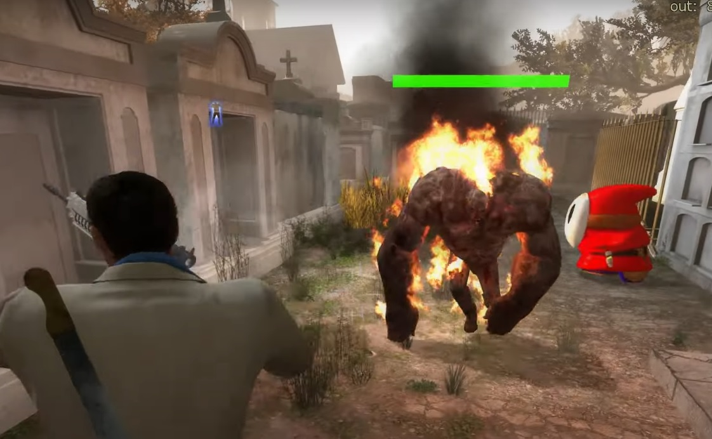
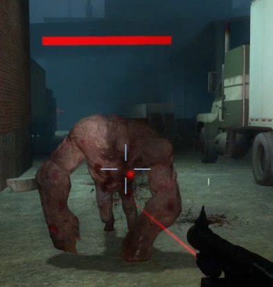
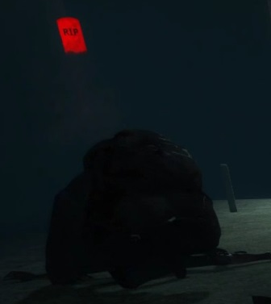

# Description | 內容
Shows a sprite at the tank head that goes from green to red based on its HP

* Apply to | 適用於
    ```
    L4D1
    L4D2
    ```

* Image | 圖示
	* Tank HP stats on his head (Tank頭上顯示血量狀態)
    <br/>
    <br/>
	* R.I.P. (安息吧)
    <br/>

* Require | 必要安裝
	1. [left4dhooks](https://forums.alliedmods.net/showthread.php?t=321696)

* <details><summary>Similar Plugin | 相似插件</summary>

	1. [l4d2_wallhack_cheat](https://github.com/fbef0102/Game-Private_Plugin/tree/main/L4D_插件/Nothing_Impossible_%E7%84%A1%E7%90%86%E6%94%B9%E9%80%A0%E7%89%88/l4d2_wallhack_cheat): Admins can use commands to see the infected model glows though the wall
		> 管理員輸入指令能透視看到特感
</details>

* <details><summary>Related Plugin | 相關插件</summary>

    1. [HP Sprite](https://forums.alliedmods.net/showthread.php?p=2735149): Shows a sprite at the client head based on its HP
	    > 頭上有血量提示，支援所有特感與倖存者

	2. [HP Laser](https://forums.alliedmods.net/showthread.php?t=330590): Shows a laser beam at the client head based on its HP
	    > 頭上有血量激光束提示，支援所有特感與倖存者 (比較卡)
</details>

* <details><summary>Changelog | 版本日誌</summary>

	* v1.3
        * Fork by Harry

	* v1.1.3
        * [Original Plugin by Marttt](https://forums.alliedmods.net/showthread.php?t=330370)
</details>

- - - -
# 中文說明
Tank頭上顯示血量狀態

* 原理
    * 在Tank頭上顯示HP血量狀態
        * 綠色: 血高於一半
        * 橘色: 血低於一半
        * 紅色: 快死掉
        * R.I.P.: 已經死亡
    * 被障礙物或牆壁擋住的時候看不到Tank頭上的血量狀態
    * 只有在tank受傷的時候才會顯示一段時間