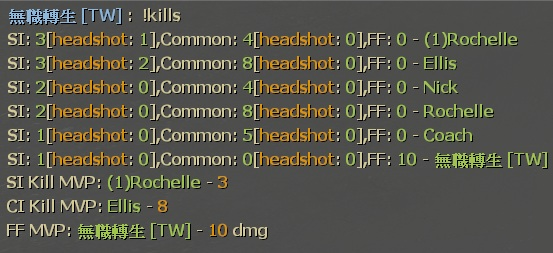
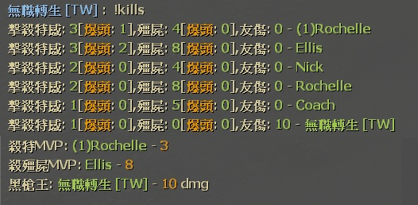

# Description | 內容
Show statistics of surviviors (kill S.I, C.I. and FF)on round end

* Apply to | 適用於
	```
	L4D1
	L4D2
	```

* Image | 圖示
	* Statistics
	<br/>

* <details><summary>How does it work?</summary>

	* Display Statistics when round end
	* Display Statistics when mission complete
	* Display Statistics when player types ```!kills``` in chatbox
	* Display MVP (si kill, ci kill, ff)
	* Support 5+ multi players
</details>

* Require | 必要安裝
	1. [left4dhooks](https://forums.alliedmods.net/showthread.php?t=321696)
	2. [[INC] Multi Colors](https://github.com/fbef0102/L4D1_2-Plugins/releases/tag/Multi-Colors)

* <details><summary>ConVar | 指令</summary>

	* cfg/sourcemod/kills.cfg
		```php
		// Interval to display kills statistics on chatbox after new round starts (0=Off)
		kills_display_interval "0"

		// If 1, display ff mvp, si kill mvp, ci kill mvp
		kills_display_mvp "1"
		```
</details>

* <details><summary>Command | 命令</summary>

	* **Print statistics of surviviors**
		```php
		sm_kills
		```
</details>

* Translation Support | 支援翻譯
	```
	translations/kills.phrases.txt
	```

* <details><summary>Changelog | 版本日誌</summary>

	* v1.8 (2026-2-27)
		* Display MVP (si kill, ci kill, ff)

	* v1.7 (2023-5-17)
		* Optimize code

	* v1.6 (2023-2-2)
		* Translation Support
		* Support 5+ survivors

	* v1.0
		* Initial Release
</details>

- - - -
# 中文說明
擊殺殭屍與特殊感染者統計

* 圖示
	* 統計表
	<br/>

* 原理
	* 滅團時顯示統計
	* 過關時顯示統計
	* 聊天窗輸入```!kills```顯示統計
	* 顯示MVP (擊殺特感、擊殺殭屍、黑槍)
	* 支援5+多人倖存者伺服器

* <details><summary>指令中文介紹 (點我展開)</summary>

	* cfg/sourcemod/kills.cfg
		```php
		// 回合開始後每經過多少秒自動打印統計 (0=關閉)
		kills_display_interval "0"

		// 為1時，顯示MVP (擊殺特感、擊殺殭屍、黑槍)
		kills_display_mvp "1"
		```
</details>

* <details><summary>命令中文介紹 (點我展開)</summary>

	* **顯示統計**
		```php
		sm_kills
		```
</details>
