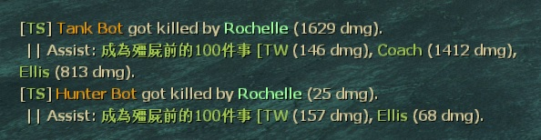
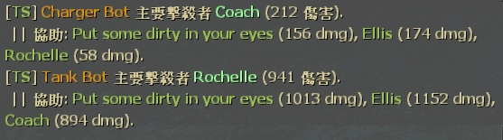

# Description | 內容
Show damage done to S.I. by survivors

* Video | 影片展示
<br/>None

* Image | 圖示
	<br/>  

* Require | 必要安裝
	1. [[INC] Multi Colors](https://github.com/fbef0102/L4D1_2-Plugins/releases/tag/Multi-Colors)

* <details><summary>ConVar | 指令</summary>

	* cfg/sourcemod/l4d2_assist.cfg
		```php
		// If 1, Enables this plugin.
		sm_assist_enable "1"

		// Turn on the plugin in these game modes, separate by commas (no spaces). (Empty = all).
		sm_assist_modes ""

		// Turn off the plugin in these game modes, separate by commas (no spaces). (Empty = none).
		sm_assist_modes_off ""

		// Turn on the plugin in these game modes. 0=All, 1=Coop, 2=Survival, 4=Versus, 8=Scavenge. Add numbers together.
		sm_assist_modes_tog "0"

		// (L4D2) Which zombie class should report damage on death, 0=None, 1=Smoker, =Boomer, 4=Hunter, 8=Spitter, 16=Jockey, 32=Charger, 64=Tank. Add numbers together.
		sm_assist_infected_flag "127"

		// (L4D1) Which zombie class should report damage on death, 0=None, 1=Smoker, =Boomer, 4=Hunter, 8=Spitter, 16=Jockey, 32=Charger, 64=Tank. Add numbers together.
		sm_assist_infected_flag "15"

		// How many players displayed on assist message each line
		sm_assist_display_num "2"
		```
</details>

* <details><summary>Command | 命令</summary>

	None
</details>

* Apply to | 適用於
	```
	L4D1
	L4D2
	```

* <details><summary>Translation Support | 支援翻譯</summary>

	```
	English
	繁體中文
	简体中文
	Russian
	```
</details>

* <details><summary>Related Plugin | 相關插件</summary>

	1. [l4d_witch_dmg_report](https://github.com/fbef0102/Game-Private_Plugin/tree/main/Plugin_%E6%8F%92%E4%BB%B6/Witch_%E5%A5%B3%E5%B7%AB/l4d_witch_dmg_report): Displays how much damage done to witch on witch death + display health remaining when witch kills or incaps the survivor.
		> Witch死亡時，顯示對Witch造成傷害統計表 + Witch抓傷或抓死人時，顯示剩餘血量
</details>

* <details><summary>Changelog | 版本日誌</summary>

	* v2.5 (2024-12-3)
		* Update cvars

	* v2.4 (2024-11-24)
		* Delete witch report
		* Update translation

	* v2.3 (2023-9-27)
		* Accurate damage stats, now consider SI hurt from other damage (teammate claw dmg, fire dmg, fall dmg, etc.)

	* v2.2 (2023-5-14)
		* Optimize code

	* v2.1 (2022-12-16)
		* Translation Support

	* v2.0
		* Remake code

	* v1.6
		* [Original Post by [E]c](https://forums.alliedmods.net/showthread.php?t=123811?t=123811)
</details>

- - - -
# 中文說明
特感死亡時顯示人類造成的傷害統計

* 圖示
	<br/>  

* 原理
	* 記錄人類對特感造成的傷害，當特感或Tank死亡時顯示傷害統計
	* 特感有時候會受到其他的傷害，因此統計的數字總和不符合血量是正常的
		* 隊友抓傷
		* 墬樓摔傷
		* 地圖火傷

* <details><summary>指令中文介紹 (點我展開)</summary>

	* cfg/sourcemod/l4d2_assist.cfg
		```php
		// 0=關閉插件, 1=啟動插件
		sm_assist_enable "1"

		// 什麼模式下啟動此插件, 逗號區隔 (無空白). (留白 = 所有模式)
		sm_assist_modes ""

		// 什麼模式下關閉此插件, 逗號區隔 (無空白). (留白 = 無)
		sm_assist_modes_off ""

		// 什麼模式下啟動此插件. 0=所有模式, 1=戰役, 2=生存, 4=對抗, 8=清道夫. 請將數字相加起來
		sm_assist_modes_tog "0"

		// (L4D2) 哪些特感被殺死時顯示統計傷害?, 0=無, 1=Smoker, =Boomer, 4=Hunter, 8=Spitter, 16=Jockey, 32=Charger, 64=Tank. 將數字相加起來
		sm_assist_infected_flag "127"

		// (L4D1) 哪些特感被殺死時顯示統計傷害?, 0=None, 1=Smoker, =Boomer, 4=Hunter, 8=Spitter, 16=Jockey, 32=Charger, 64=Tank. 將數字相加起來
		sm_assist_infected_flag "15"

		// 協助擊殺者的訊息當中, 每一行顯示多少玩家? (用於多人房，倖存者數量太多顯示不完)
		sm_assist_display_num "2"
		```
</details>


