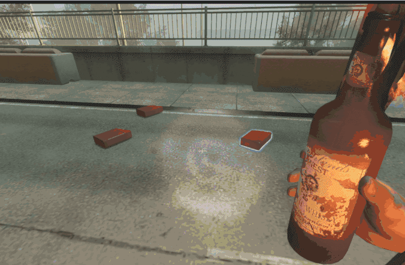

# Description | 內容
Fixed unable to ignite gascan sometimes due to poorly written official code

* Apply to | 適用於
    ```
    L4D2
    ```

* [Video | 影片展示](https://youtu.be/l94IKCxHYkw)

* Image | 圖示
    | Before (裝此插件之前)  			| After (裝此插件之後) |
    | -------------|:-----------------:|
    | ||

* <details><summary>How does it work?</summary>

    * These bugs won't happen in l4d1
    * Before
        * Bug 1: Fixed gas cans being unable to ignite after being extinguished while held by survivors.
        * Bug 2: If a gas can comes into contact with flames and starts burning within 0.5 seconds of spawning, the game grants it an additional 20-second protection period (defined by the official cvar ```scavenge_item_respawn_delay```), during which it cannot be ignited by fire.
            * However, due to poorly written official code, every gas can spawned afterward is also incorrectly given this 20-second protection period.
    * After 
        * All gascan can be ignited again after drop from survivors
        * Remove protection period if is not scavenge gas can
</details>

* Require | 必要安裝
<br/>None

* <details><summary>ConVar | 指令</summary>

    * cfg/sourcemod/l4d2_gascan_flame_fix.cfg
        ```php
        // 0=Plugin off, 1=Plugin on.
        l4d2_gascan_flame_fix_enable "1"
        ```
</details>

* <details><summary>Changelog | 版本日誌</summary>

    * v1.0 (2026-1-27)
        * Initial Release

    * Credit
        * [Forgetest](https://github.com/jensewe): Help find game official code
</details>

- - - -
# 中文說明
修復汽油桶有時候無法被火焰點燃

* 原理
    * 一代沒有這些bug
    * 裝此插件之前 
        * Bug 1: 倖存者拿走正在被點燃的汽油桶，當手上的汽油桶被滅火之後，該汽油桶已無法再被任何火焰點燃
        * Bug 2: 汽油桶生成的0.5秒內碰到火焰燃燒時，遊戲會給予汽油桶額外的20秒保護時間(時間由官方指令```scavenge_item_respawn_delay```決定)不會被火焰點燃。
            * 但是因為官方代碼寫太爛導致往後生成的每一個汽油桶都被賦予了20秒保護期
    * 裝此插件之後
        * 所有從倖存者身上扔出去的汽油桶都可以被火焰點燃
        * 如果不是黃色與綠色的汽油桶，移除20秒保護期

* <details><summary>指令中文介紹 (點我展開)</summary>

    * cfg/sourcemod/l4d2_gascan_flame_fix.cfg
        ```php
        // 0=關閉插件, 1=啟動插件
        l4d2_gascan_flame_fix_enable "1"
        ```
</details>


