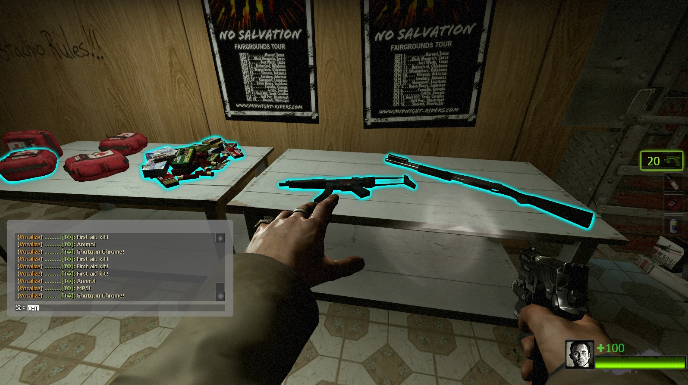
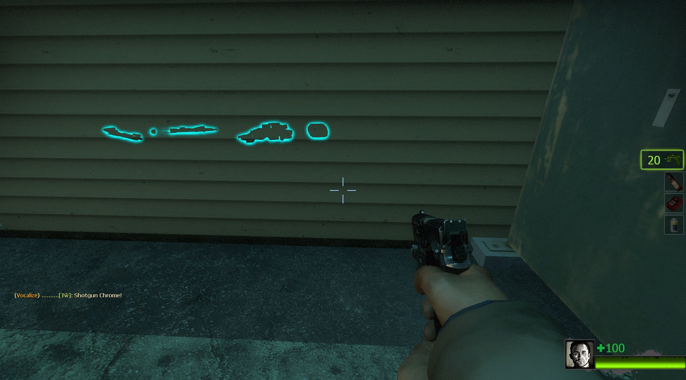
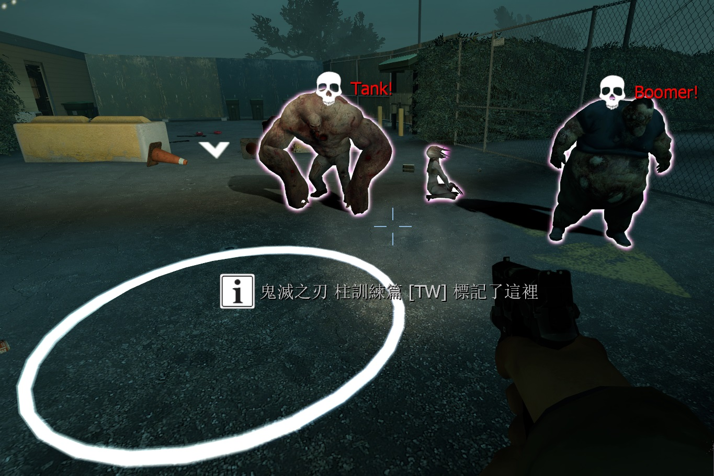
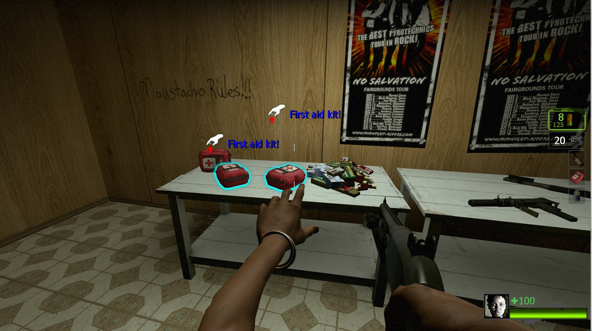
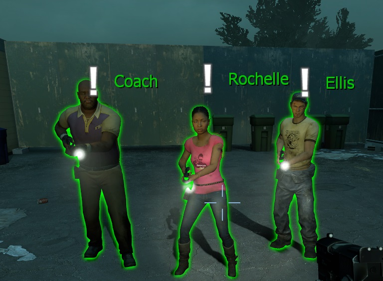
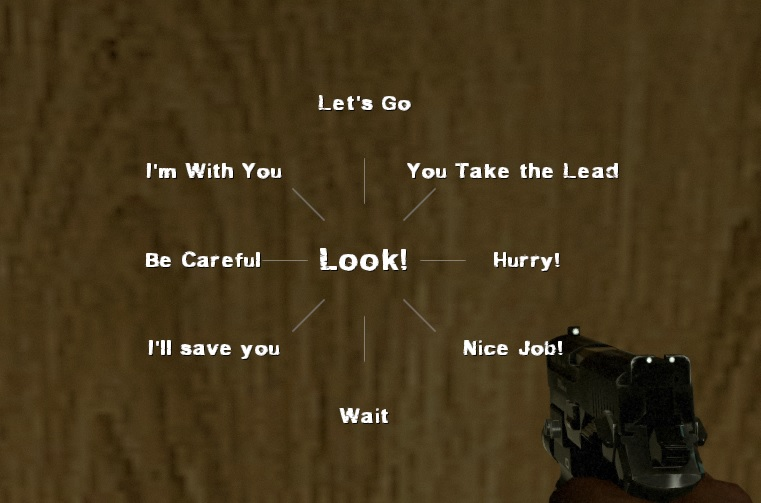
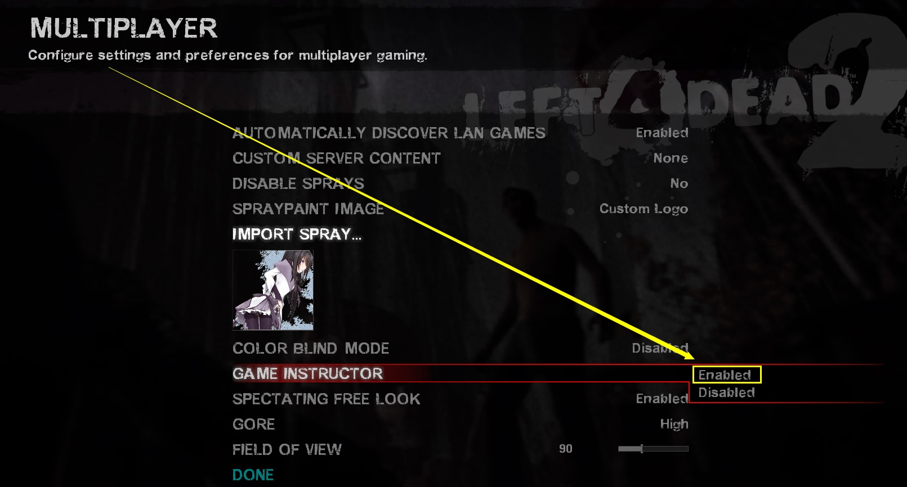
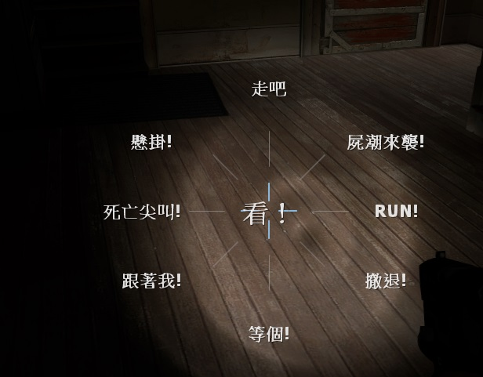

# Description | 內容
When using 'Look' in vocalize menu, print corresponding item to chat area and make item glow or create spot marker/infeced maker like back 4 blood.

* Apply to | 適用於
    ```
    L4D2
    ```

* [Video | 影片展示](https://youtu.be/FxFyhFxaZug)

* Image | 圖示
    * Mark weapons and items (標記武器與物品)
    <br/>
    <br/>
    * Mark place and infected (標記地點與特殊感染者)
    <br/>
    * Support director hint (支援指導系統圖案提示)
    <br/>
    * Mark your teammates (標記隊友)
    <br/>

* <details><summary>How does it work?</summary>

    * Survivors can mark any weapons, items, infected and spots
        * 'Look' in vocalize menu
        <br/>
        * Type```!mark```(Survivors only)
        * Press Shift+E (Survivors only)
    * Survivors marker priority: Infected > Witch > Survivor > Item or Weapon > Spot marker
    * If not aiming target or item, the plugin detects what player is looking at using field of view angle
        * If has more than two targets, it finds the target nearest to your crosshair
        <br/>
    * Infected players can also mark targets
        * Pressing Shift
        * Infected marker priority: Survivor > Item or Weapon > Spot marker
    * Marks are only visible to teammates of the same team
</details>

* <details><summary>Important</summary>

    * Hats and others attaching stuff to players could block the players "use" function, which makes you unable to use 'look' item hint. Install [Use Priority Patch](https://forums.alliedmods.net/showthread.php?t=327511) plugin to fix.
    * Player must Enabled GAME INSTRUCTOR, in ESC -> Options -> Multiplayer, or they can't see the hint
    <br/>
    * DO NOT modify convar ```sv_gameinstructor_disable``` this force all clients to disable their game instructors.
</details>

* Require | 必要安裝
    1. [left4dhooks](https://forums.alliedmods.net/showthread.php?t=321696)
    2. [[INC] Multi Colors](https://github.com/fbef0102/L4D1_2-Plugins/releases/tag/Multi-Colors)
    3. [Use Priority Patch](https://forums.alliedmods.net/showthread.php?t=327511)

* <details><summary>Support | 支援插件</summary>

    1. [Lux's Model Changer](https://github.com/fbef0102/L4D1_2-Plugins/tree/master/Luxs-Model-Changer): LMC Allows you to use most models with most characters
        * 可以自由變成其他角色或NPC的模組
</details>

* <details><summary>ConVar | 指令</summary>

    * cfg/sourcemod/l4d2_item_hint.cfg
        * General Mark Controls
            ```php
            // If 1, Survivors can type !mark to mark targets
            l4d2_item_hint_cmd "1"

            // If 1, Survivors can press Shift+E to mark targets
            l4d2_item_hint_shiftE "1"

            // If 1, Survivors can use vocalize "Look" to mark targets
            l4d2_item_hint_vocalize "1"

            // If 1, pinned Survivors can still mark targets
            l4d2_item_hint_mark_capped "0"

            // If 1, hanging Survivors can still mark targets
            l4d2_item_hint_mark_hanging "0"

            // If 1, dead Survivors can still mark targets
            l4d2_item_hint_mark_dead "0"

            // Instructor hint language. 0=Server language (English), 1=Caller language
            l4d2_item_hint_instructorhint_translate "0"
            ```

        * Item Marker (both teams)
            ```php
            // Item marker glow color (RGB, space-separated). Empty = Off
            l4d2_item_marker_glow_color "0 255 255"

            // Cooldown between marking items (seconds)
            l4d2_item_marker_cooldown_time "1.0"

            // Max distance to mark an item
            l4d2_item_marker_use_range "150"

            // Sound when marking an item. (relative to sound/, Empty = Off)
            l4d2_item_marker_use_sound "buttons/blip1.wav"

            // Item marker announce type: 0=Off, 1=Chat, 2=Hint text, 3=Center text
            l4d2_item_marker_announce_type "1"

            // Item glow duration (seconds)
            l4d2_item_marker_glow_timer "10.0"

            // Item glow visible range
            l4d2_item_marker_glow_range "800"

            // If 1, show instructor hint on marked items
            l4d2_item_marker_instructorhint_enable "1"

            // Instructor hint color on items. (Empty = hide item name)
            l4d2_item_marker_instructorhint_color "0 255 255"

            // Instructor hint icon. (More icons: https://developer.valvesoftware.com/wiki/Env_instructor_hint)
            l4d2_item_marker_instructorhint_icon "icon_interact"
            ```

        * Spot Marker (both teams)
            ```php
            // Spot marker color (RGB, space-separated). Empty = Off
            l4d2_spot_marker_color "200 200 200"

            // Cooldown between spot marks (seconds)
            l4d2_spot_marker_cooldown_time "2.5"

            // Max distance to place a spot marker
            l4d2_spot_marker_use_range "1800"

            // Sound when placing a spot marker. (relative to sound/, Empty = Off)
            l4d2_spot_marker_use_sound "buttons/blip1.wav"

            // Spot marker announce type: 0=Off, 1=Chat, 2=Hint text, 3=Center text
            l4d2_spot_marker_announce_type "1"

            // Spot marker duration (seconds)
            l4d2_spot_marker_duration "10.0"

            // Spot marker sprite model. (Empty = Off)
            l4d2_spot_marker_sprite_model "materials/vgui/icon_arrow_down.vmt"

            // Spot marker sprite height from ground
            l4d2_spot_marker_sprite_height "50.0"

            // If 1, show instructor hint on spot marker
            l4d2_spot_marker_instructorhint_enable "1"

            // Instructor hint color on spot marker. (Empty = hide text)
            l4d2_spot_marker_instructorhint_color "200 200 200"

            // Instructor hint icon on spot marker
            l4d2_spot_marker_instructorhint_icon "icon_info"

            // Spot marker beam ring starting radius
            l4d2_spot_marker_ring_start_radius  "35.0"

            // Spot marker beam ring ending radius
            l4d2_spot_marker_ring_end_radius    "50.0"

            // Spot marker beam ring width
            l4d2_spot_marker_ring_width         "2.0"

            // Particle effect on spot marker.
            // Empty = Off
            // See more: https://forums.alliedmods.net/showthread.php?t=127111)
            l4d2_spot_marker_particle           "sline_sparks"
            ```

        * S.I. Marker (Survivors mark Special Infected)
            ```php
            // S.I. marker glow color (RGB, space-separated). Empty = Off. (Survivors mark S.I.)
            l4d2_infected_marker_glow_color "255 120 203"

            // Cooldown for Survivors marking S.I. (seconds)
            l4d2_infected_marker_cooldown_time "0.25"

            // Max distance for Survivors to mark S.I.
            l4d2_infected_marker_use_range "1000"

            // Sound when Survivors mark S.I. (relative to sound/, Empty = Off)
            l4d2_infected_marker_use_sound "items/suitchargeok1.wav"

            // S.I. marker announce type: 0=Off, 1=Chat, 2=Hint text, 3=Center text
            l4d2_infected_marker_announce_type "1"

            // S.I. glow duration when marked by Survivors (seconds)
            l4d2_infected_marker_glow_timer "10.0"

            // S.I. glow visible range when marked by Survivors
            l4d2_infected_marker_glow_range "2500"

            // If 1, allow Survivors to mark Witch
            l4d2_infected_marker_witch_enable "1"

            // Which S.I. can Survivors mark? 1=Smoker, 2=Boomer, 4=Hunter, 8=Spitter, 16=Jockey, 32=Charger, 64=Tank. Add together (127=All)
            l4d2_infected_marker_si_flag "127"

            // If 1, show instructor hint on S.I. marked by Survivors
            l4d2_infected_marker_instructorhint_enable "1"

            // Instructor hint color on S.I. (Empty = hide S.I. name)
            l4d2_infected_marker_instructorhint_color "255 0 0"

            // Instructor hint icon on S.I. marker
            l4d2_infected_marker_instructorhint_icon "icon_skull"

            // FOV angle to detect if Survivor is looking at S.I. (0=Crosshair only)
            l4d2_infected_marker_si_fov "15.0"

            // FOV angle to detect if Survivor is looking at Witch. (0=Crosshair only)
            l4d2_infected_marker_witch_fov "15.0"
            ```

        * Survivor Marker (both teams mark survivors)
            ```php
            // Survivor marker glow color (RGB, space-separated). Empty = Off. (Marking survivors)
            l4d2_survivor_marker_glow_color "0 200 0"

            // Cooldown between marking survivors (seconds)
            l4d2_survivor_marker_cooldown_time "1.0"

            // Max distance to mark a survivor
            l4d2_survivor_marker_use_range "1000"

            // Sound when marking a survivor. (relative to sound/, Empty = Off)
            l4d2_survivor_marker_use_sound "player/suit_denydevice.wav"

            // Announce type when marking a survivor: 0=Off, 1=Chat, 2=Hint text, 3=Center text
            l4d2_survivor_marker_announce_type "1"

            // Survivor glow duration when marked (seconds)
            l4d2_survivor_marker_glow_timer "10.0"

            // Survivor glow visible range when marked
            l4d2_survivor_marker_glow_range "2000"

            // If 1, show instructor hint on marked survivor
            l4d2_survivor_marker_instructorhint_enable "1"

            // Instructor hint color on survivor. (Empty = hide name)
            l4d2_survivor_marker_instructorhint_color "0 200 0"

            // Instructor hint icon on survivor marker
            l4d2_survivor_marker_instructorhint_icon "icon_alert"

            // FOV angle to detect if player is looking at a survivor. (0=Crosshair only)
            l4d2_survivor_marker_fov "15.0"

            // If 1, notify the target when marked by an infected
            l4d2_survivor_marker_infected_notify "1"
            ```

        * Infected Team Mark
            ```php
            // If 1, infected players can mark targets by pressing Shift
            l4d2_infected_team_mark_enable "1"

            // If 1, infected players can mark survivors
            l4d2_infected_team_mark_survivor "1"

            // If 1, infected players can mark items/weapons
            l4d2_infected_team_mark_item "1"

            // If 1, infected players can mark spots
            l4d2_infected_team_mark_spot "1"
            ```
</details>

* <details><summary>Command | 命令</summary>

    * **Mark item/infected/spot**
        ```php
        sm_mark
        ```
</details>

* Translation Support | 支援翻譯
    ```
    translations/l4d2_item_hint.phrases.txt
    ```

* <details><summary>Related Plugin | 相關插件</summary>

    1. [l4d2_infected_hp_hint](https://github.com/fbef0102/Game-Private_Plugin/tree/main/L4D_插件/Special_Infected_%E7%89%B9%E6%84%9F/l4d2_infected_hp_hint): Display corresponding health value hint of all Special Infected
        * 在特感身上顯示剩餘血量
</details>

* <details><summary>Changelog | 版本日誌</summary>

    * v4.3 (2026-6-7)
        * Infected players can now mark targets by pressing Shift
        * New cvars for infected team marking and cross-team visibility
        * Separate translation strings for infected mark messages

    * v4.2 (2025-5-25)
        * Update more cvars for spot marker
        * Display particle on spot marker

    * v4.1 (2025-12-27)
        * Force client and witch to transmit so glow entity won't be buggy behind the wall

    * v4.0 (2025-11-21)
    * v3.9 (2025-10-5)
    * v3.8 (2025-9-23)
        * Update cvars
        * Plugin now helps detect what player is looking at using field of view angle, which means player no longer aims hard at the target

    * v3.7 (2025-3-7)
        * Update cvars

    * v3.6 (2025-2-23)
        * Support LMC (Lux's Model Changer)

    * v3.5 (2024-6-22)
        * Update cvars

    * v3.4 (2024-6-18)
        * Player can makr if dead or incapped or get pinned by special infected
        * Update cvars

    * v3.3 (2024-6-17)
        * Compatible with [Attachments API](https://forums.alliedmods.net/showthread.php?t=325651)

    * v3.2 (2024-6-16)
        * Press Shift+E to mark
        * Update cvars

    * v3.1 (2024-6-11)
        * Add Survivor marker, support custom survivor model
        * Update translation

    * v3.0 (2024-3-6)
        * Custom infected model
        * Custom witch model
        * Update translation

    * v2.9 (2024-3-3)
        * Custom melee model
        * Custom ammo model
        * Update translation

    * v2.8 (2024-2-23)
        * Fixed spot maker error

    * v2.7 (2023-3-18)
        * Add spot maker announce

    * v2.6 (2023-3-8)
        * Translation Support

    * v2.5 (2022-12-27)
        * Add MultiColors

    * v2.4 (2022-12-24)
        * Add Command ```sm_mark```, Mark item/infected/spot for people who don't have 'Look' in vocalize menu

    * v2.3 (2022-10-02)
        * [AlliedModders Post](https://forums.alliedmods.net/showpost.php?p=2765332&postcount=30)
        * Add all gun weapons, melee weapons, minigun, ammo and items.
        * Add cooldown.
        * Add Item Glow, everyone can see the item through wall.
        * Add sound.
        * Fixes custom vocalizers that uses SmartLook with capitals.
        * Add Spot Marker, using 'Look' in vocalize menu to mark the area.
        * Add Infected Marker, using 'Look' in vocalize menu to mark the infected.
        * Add Instructor hint, display instructor hint on Spot Marker/Item Hint
        * Marker priority: Infected maker > Item hint > Spot marker

    * v0.2
        * [Original Post by fdxx](https://forums.alliedmods.net/showthread.php?t=333669)
</details>

- - - -
# 中文說明
使用語音雷達"看"可以標記任何物品、武器、地點、特感

* 原理
    * 人類可以標記準心指向的任何東西
        1. 使用角色語音雷達"看"
        <br/>
        2. 輸入```!mark```
        3. 按下Shift+E
    * 如果準心沒有指向任何東西，會依照玩家視野看到的目標進行標記
        * 如果有兩個目標以上，看哪一個目標離你的準心最近
        <br/>
    * 人類標記優先順序: 特感 > Witch > 隊友 > 物品或武器 > 地點
    * 活著的特感或是靈魂特感也可以標記目標
        * 按下Shift鍵
        * 標記優先順序: 倖存者 > 物品或武器 > 地點
    * 雙方陣營看不見對方的標記與提示

* 注意事項
    * 如果有其他插件會擋住視野的裝飾品譬如帽子插件，你可能無法使用標記功能，請安裝[Use Priority Patch](https://forums.alliedmods.net/showthread.php?t=327511)以修正
    * 玩家必須啟動[遊戲指導系統](https://github.com/fbef0102/Game-Private_Plugin/tree/main/Tutorial_教學區/Chinese_繁體中文/Game#啟動遊戲指導系統)，否則玩家看不見標記提示
    * 伺服器端不要修改指令 ```sv_gameinstructor_disable```，這會關閉所有玩家的遊戲指導系統

* <details><summary>指令中文介紹 (點我展開)</summary>

    * cfg/sourcemod/l4d2_item_hint.cfg
        * 標記指令
            ```php
            // 為1時，玩家可以輸入```!mark```標記
            l4d2_item_hint_cmd "1"

            // 為1時，玩家可以按下Shift+E標記
            l4d2_item_hint_shiftE "1"

            // 為1時，玩家可以用"看"語音標記
            l4d2_item_hint_vocalize "1"

            // 為1時，被特感控制的玩家可以使用標記
            l4d2_item_hint_mark_capped "0"

            // 為1時，掛邊的玩家可以使用標記
            l4d2_item_hint_mark_hanging "0"

            // 為1時，死亡的玩家可以使用標記
            l4d2_item_hint_mark_dead "0"

            // 標記的導演提示該使用何種語言翻譯給大家看? 0=伺服器的語言 (英文), 1=呼叫標記的玩家的語言
            l4d2_item_hint_instructorhint_translate "0"
            ```

        * 物品、武器標記
            ```php
            // 標記的光圈顏色，填入RGB三色 (三個數值介於0~255，需要空格)
            // 空=關閉此標記
            l4d2_item_marker_glow_color "0 255 255"

            // 玩家可以再次標記的時間間隔
            l4d2_item_marker_cooldown_time "1.0"

            // 能標記的距離
            l4d2_item_marker_use_range "150"

            // 標記音效. (路徑相對於sound資料夾, 空 = 無音效)
            l4d2_item_marker_use_sound "buttons/blip1.wav"

            // 標記提示該如何顯示. (0: 不提示, 1: 聊天框, 2: 黑底白字框, 3: 螢幕正中間)
            l4d2_item_marker_announce_type "1"

            // 標記的光圈顯示時間
            l4d2_item_marker_glow_timer "10.0"

            // 標記的光圈可見範圍
            l4d2_item_marker_glow_range "800"

            // 為1時，啟用導演提示
            l4d2_item_marker_instructorhint_enable "1"

            // 導演提示的文字顏色 (空=無文字)
            l4d2_item_marker_instructorhint_color "0 255 255"

            // 導演提示的圖案 (查找更多圖案: https://developer.valvesoftware.com/wiki/Env_instructor_hint)
            l4d2_item_marker_instructorhint_icon "icon_interact"
            ```
            
        * 地點標記
            ```php
            // 標記的光圈顏色，填入RGB三色 (三個數值介於0~255，需要空格)
            // 空=關閉此標記
            l4d2_spot_marker_color "200 200 200"

            // 玩家可以再次標記的時間間隔
            l4d2_spot_marker_cooldown_time "2.5"

            // 能標記的距離
            l4d2_spot_marker_use_range "1800"

            // 標記音效. (路徑相對於sound資料夾, 空 = 無音效)
            l4d2_spot_marker_use_sound "buttons/blip1.wav"

            // 標記提示該如何顯示. (0: 不提示, 1: 聊天框, 2: 黑底白字框, 3: 螢幕正中間)
            l4d2_spot_marker_announce_type "1"

            // 標記的光圈顯示時間
            l4d2_spot_marker_duration "10.0"

            // 標記的中心模型圖案 (空=無中心模型圖案)
            l4d2_spot_marker_sprite_model "materials/vgui/icon_arrow_down.vmt"

            // 中心模型圖案距離地面的高度.
            l4d2_spot_marker_sprite_height "50.0"

            // 為1時，啟用導演提示
            l4d2_spot_marker_instructorhint_enable "1"

            // 導演提示的文字顏色 (空=無文字)
            l4d2_spot_marker_instructorhint_color "200 200 200"

            // 導演提示的圖案 
            l4d2_spot_marker_instructorhint_icon "icon_info"

            // 標記的圓圈起始半徑.
            l4d2_spot_marker_ring_start_radius  "35.0"

            // 標記的圓圈終點半徑.
            l4d2_spot_marker_ring_end_radius    "50.0"

            // 標記的圓圈寬度.
            l4d2_spot_marker_ring_width         "2.0"

            // 標記時有特效, 請填入特效名稱
            // 空=不出現特效
            // (查看更多l4d2特效: https://forums.alliedmods.net/showthread.php?t=127111)
            l4d2_spot_marker_particle           "sline_sparks"
            ```

        * 特感標記
            ```php
            // 特感標記的光圈顏色，填入RGB三色 (三個數值介於0~255，需要空格)
            // 空=關閉此標記
            l4d2_infected_marker_glow_color "255 120 203"

            // 玩家可以再次標記特感的時間間隔
            l4d2_infected_marker_cooldown_time "0.25"

            // 能標記特感的距離
            l4d2_infected_marker_use_range "1000"

            // 標記音效. (路徑相對於sound資料夾, 空 = 無音效)
            l4d2_infected_marker_use_sound "items/suitchargeok1.wav"

            // 標記提示該如何顯示. (0: 不提示, 1: 聊天框, 2: 黑底白字框, 3: 螢幕正中間)
            l4d2_infected_marker_announce_type "1"

            // 標記的光圈顯示時間
            l4d2_infected_marker_glow_timer "10.0"

            // 標記的光圈可見範圍
            l4d2_infected_marker_glow_range "2500"

            // 為1時，也可以標記Witch
            l4d2_infected_marker_witch_enable "1"

            // 可以標記哪些特感? 1=Smoker, 2=Boomer, 4=Hunter, 8=Spitter, 16=Jockey, 32=Charger, 64=Tank. 請將數字相加 (127=全部)
            l4d2_infected_marker_si_flag "127"

            // 為1時，啟用導演提示
            l4d2_infected_marker_instructorhint_enable "1"

            // 導演提示的特感名稱顏色 (空=無特感名稱)
            l4d2_infected_marker_instructorhint_color "255 0 0"

            // 導演提示的圖案 (查找更多圖案: https://developer.valvesoftware.com/wiki/Env_instructor_hint)
            l4d2_infected_marker_instructorhint_icon "icon_skull"

            // 檢測玩家的視野是否正在看特感, 此數值代表特感與玩家準心的距離夾角
            // 遊戲預設: 45.0, 0=不使用, 只算準心有指到
            l4d2_infected_marker_si_fov "15.0"

            // 檢測玩家的視野是否正在看Witch, 此數值代表Witch與玩家準心的距離夾角
            // 遊戲預設: 45.0, 0=不使用, 只算準心有指到
            l4d2_infected_marker_witch_fov "15.0"
            ```

        * 標記隊友
            ```php
            // 標記隊友的光圈顏色，填入RGB三色 (三個數值介於0~255，需要空格)
            // 空=關閉此標記
            l4d2_survivor_marker_glow_color "0 200 0"

            // 玩家可以再次標記隊友的時間間隔
            l4d2_survivor_marker_cooldown_time "1.0"

            // 能標記隊友的距離
            l4d2_survivor_marker_use_range "1000"

            // 標記音效. (路徑相對於sound資料夾, 空 = 無音效)
            l4d2_survivor_marker_use_sound "player/suit_denydevice.wav"

            // 標記提示該如何顯示. (0: 不提示, 1: 聊天框, 2: 黑底白字框, 3: 螢幕正中間)
            l4d2_survivor_marker_announce_type "1"

            // 標記的光圈顯示時間
            l4d2_survivor_marker_glow_timer "10.0"

            // 標記的光圈可見範圍
            l4d2_survivor_marker_glow_range "2000"

            // 為1時，啟用導演提示
            l4d2_survivor_marker_instructorhint_enable "1"

            // 導演提示的隊友名稱顏色 (空=無隊友名稱)
            l4d2_survivor_marker_instructorhint_color "0 200 0"

            // 導演提示的圖案 
            l4d2_survivor_marker_instructorhint_icon "icon_alert"

            // 檢測玩家的視野是否正在看隊友, 此數值代表隊友與玩家準心的距離夾角
            // 遊戲預設: 45.0, 0=不使用, 只算準心有指到
            l4d2_survivor_marker_fov "15.0"

            // 為1時，感染者標記生還者後通知被標記的對象
            l4d2_survivor_marker_infected_notify "1"
            ```

        * 感染者陣營標記 (Infected Team Mark)
            ```php
            // 為1時，感染者也可以標記目標
            l4d2_infected_team_mark_enable "1"

            // 為1時，感染者可以標記生還者
            l4d2_infected_team_mark_survivor "1"

            // 為1時，感染者可以標記物品/武器
            l4d2_infected_team_mark_item "1"

            // 為1時，感染者可以標記地點
            l4d2_infected_team_mark_spot "1"
            ```
</details>
