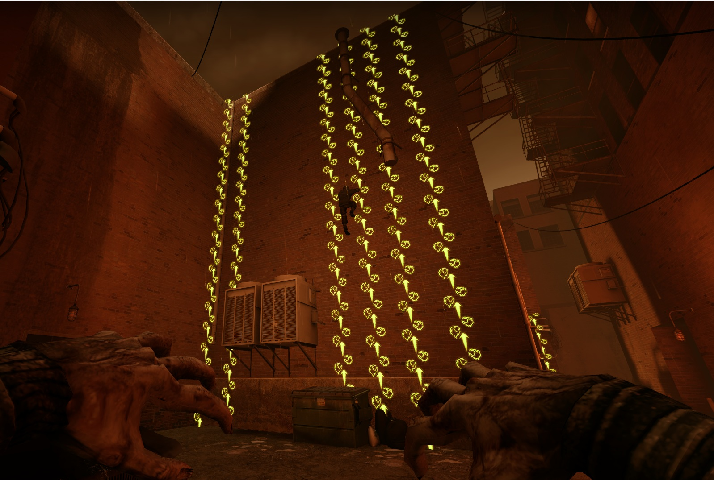
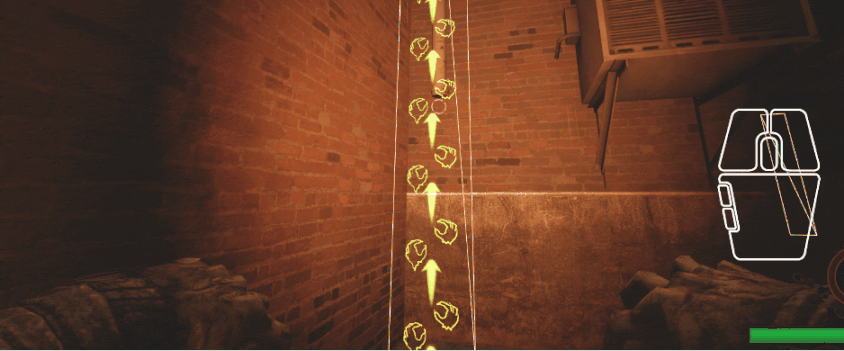
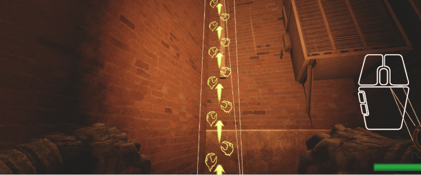
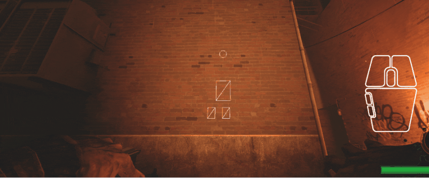
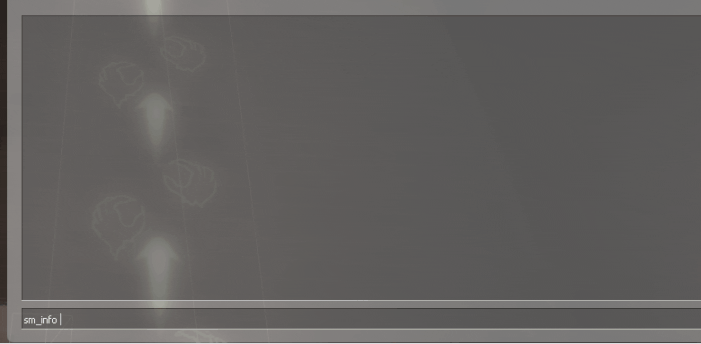
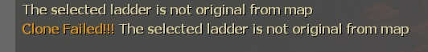

# Description | 內容
Clone and move special infected/survivor ladders.

* Apply to | 適用於
	```
	L4D1
	L4D2
	```

* [Video | 影片展示](https://youtu.be/txMMvSED-Ig)

* Image | 圖示
<br/>

* Require | 必要安裝
    1. [[INC] Multi Colors](https://github.com/fbef0102/L4D1_2-Plugins/releases/tag/Multi-Colors)
    2. [Install Stripper:Source](https://github.com/fbef0102/Game-Private_Plugin/tree/main/Tutorial_教學區/English/Server/Install_Other_File#stripper): Save ladders permanently
		* [安裝Stripper:Source](https://github.com/fbef0102/Game-Private_Plugin/tree/main/Tutorial_教學區/Chinese_繁體中文/Server/安裝其他檔案教學#安裝stripper): 永久保存梯子於地圖上

* <details><summary>How to use</summary>

	* **Prepare**
		1. Type in server console
			```c
			sm_cvar sv_cheats 1
			sm_cvar mp_gamemode versus
			sm_cvar sb_all_bot_game 1;sm_cvar sb_all_bot_team 1
			sm_cvar sb_stop 1
			sm_cvar god 1;
			director_stop
			```
		2. Go to infected team, type ```z_spawn Hunter``` in game console to get an alive hunter
		3. Type ```r_drawbrushmodels 2``` in game console to view all ladder brush models on the map
		4. Type ```!edit``` in chatbox to enter edit mode
		<br/>
	* **Clone Ladder**
        1. Aim the map original infected ladder, press left mouse to select ladder
		<br/>
		2. Type ```!clone``` or middle mouse to clone ladder
		<br/>

	* **Move Ladder**
        1. Aim the new ladder, press left mouse to select ladder
		2. Find a wall you want to place new ladder, press right mouse to place ladder on the wall
		<br/>
		3. Keys to use
			*  ```A,D,W,S```: Move the ladder
			* Shift: Rotate the ladder
			* Use: Raise the ladder
			* Reload: Lower the ladder
			* ```!kill```: Remove the ladder
		4. When done, type ```!edit``` to exit edit mode, this will free the selected ladder

	* **Save Ladder**
        1. Aim the ladder and open game console, type ```sm_info```, the func_simpleladder entity all information print in your game console
		<br/>

		2. Copy and past to your ```addons\stripper\maps\xxxxx.cfg```
			* xxxx is map name
			* For example it should be like this
				```c
				add:
				{
					"classname" "func_simpleladder"
					"origin" "332.45 9.46 -109.98"
					"angles" "0.00 0.00 0.00"
					"model" "*29"        
					"normal.x" "0.00"
					"normal.y" "-1.00"
					"normal.z" "0.00"
					"team" "2"
				}
				```

		3. In stripper file, you can change [func_simpleladder](https://developer.valvesoftware.com/wiki/Func_simpleladder) ```"team"``` Keyvalues to decide which team can climb the ladder
			```c
			// Team that can climb this ladder.
			// 0 : Any team
			// 1 : Survivors
			// 2 : Infected 
			team "x"
			```
</details>

* <details><summary>Q&A</summary>

	* Q1: Why I can't clone the ladder ?
		* A1: You must select the original ladder from the map
		<br/>	

	* Q2: Why some ladders become invisible when I rotate ladder?
		* A2: Model and map problem, nothing I can help, rotate ladder carefully

	* Q3: What should I clone new ladder if there is no any ladders on the map?
		* A3: Give up
</details>

* <details><summary>ConVar | 指令</summary>

	* cfg\sourcemod\l4d2_ladder_editor.cfg
		```php
		// 0=Plugin off, 1=Plugin on.
		l4d2_ladder_editor_enable "1"

		// If 1, Freeze player when entering edit mode.
		l4d2_ladder_editor_freeze "0"

		// If 1, Use Tab key to enter edit mode.
		l4d2_ladder_editor_tab "0"
		```
</details>

* <details><summary>Command | 命令</summary>

	* **Toggle edit mode**
		```php
		sm_edit
		```

	* **Number of units to move when moving ladders in edit mode.**
		```php
		sm_step <size>
		```

	* **Select the ladder you are aiming at.**
		```php
		sm_select
		```

	* **Clone the selected ladder.**
		```php
		sm_clone
		```

	* **Move the selected ladder to the given coordinate on the map.**
		```php
		sm_move <x> <y> <z>
		```

	* **Move the selected ladder relative to its current position.**
		```php
		sm_nudge <x> <y> <z>
		```

	* **Rotate the selected ladder.**
		```php
		sm_rotate <x> <y> <z>
		```

	* **Remove the selected ladder.**
		```php
		sm_kill
		```

	* **Display info about the selected ladder entity on console.**
		```php
		sm_info
		```

	* **Toggle selected ladder info HUD on or off.**
		```php
		sm_togglehud
		```

	* **Change team the ladder can used by**
		```php
		// 0: Any team, 1: Survivor, 2: Infected
		sm_team <TeamNum>
		```

	* **Find func_simpleladder by model**
		```php
		// example: sm_flbm "*28"
		sm_flbm <model_name>
		```

	* **Find func_simpleladder by hammerid**
		```php
		sm_flbh <hammerid>
		```

	* **Change func_simpleladder normal.x normal.y normal.z**
		```php
		// 1 = <1.0> <0.0> <0.0>
		// 2 = <-1.0> <0.0> <0.0>
		// 3 = <0.0> <1.0> <0.0>
		// 4 = <0.0> <-1.0> <0.0>
		// 5 = <0.0> <0.0> <1.0>
		// 6 = <0.0> <0.0> <-1.0>
		sm_cln <1~6>
		sm_cln <x> <y> <z>
		```
</details>

* <details><summary>Related Plugin | 相關插件</summary>

	1. [Ladder List Height Info](https://forums.alliedmods.net/showthread.php?t=348968): Output a table to the console with the current map original ladders list with their respective heights
		* 打印地圖上所有的梯子資訊到控制台
</details>

* <details><summary>Changelog | 版本日誌</summary>

	* v1.0 (2025-10-7)
		* Add more informations about func_simpleladder
		* Add cmds to change func_simpleladder
		* Add cmds to find func_simpleladder by model and hammerid quickly
		* Add messages to warn if ladder is not original
		* Update cvars, cmds
		* Optimize code and improve performance

	* v2.0
        * [Original Post by devilesk](https://github.com/devilesk/rl4d2l-plugins/blob/master/l4d2_ladder_editor.sp)
</details>

- - - -
# 中文說明
複製並創造新的特感梯子或倖存者梯子

* <details><summary>如何使用?</summary>

	* **準備作業**
		1. 在伺服器後台依序輸入以下指令
			```c
			sm_cvar sv_cheats 1
			sm_cvar mp_gamemode versus
			sm_cvar sb_all_bot_game 1;sm_cvar sb_all_bot_team 1
			sm_cvar sb_stop 1
			sm_cvar god 1;
			director_stop
			```
		2. 回到遊戲中，切換到特感隊伍，遊戲控制台輸入```z_spawn Hunter```，將自己變成活著的特感
		3. 遊戲控制台輸入 ```r_drawbrushmodels 2```，看到地圖上所有梯子渲染
		4. 聊天框輸入 ```!edit``` 進入編輯模式
		<br/>
	* **複製梯子**
        1. 準心指向一個地圖上原有的特感梯子，按下滑鼠左鍵選擇該梯子
		<br/>
		2. 輸入 ```!clone``` 或按一下滑鼠滾輪鍵，複製梯子
		<br/>

	* **移動梯子**
        1. 準心指向複製的新梯子，按下滑鼠左鍵選擇該梯子
		2. 找到一個牆壁，按下滑鼠右鍵即可放置
		<br/>
		3. 其他按鍵使用
			*  ```A,D,W,S```: 移動梯子
			* Shift: 旋轉90度
			* E鍵: 上升梯子
			* R鍵: 下降梯子
			* ```!kill```: 移除梯子
		4. 完成後，輸入 ```!edit``` 離開編輯模式

	* **Save Ladder**
        1. 準心指向梯子，開啟遊戲控制台，輸入```sm_info```，func_simpleladder 梯子實體的資訊將會打印在上面
		<br/>

		2. 複製並貼到 ```addons\stripper\maps\xxxxx.cfg```
			* xxxx 是地圖英文名
			* 舉例:
				```c
				add:
				{
					"classname" "func_simpleladder"
					"origin" "332.45 9.46 -109.98"
					"angles" "0.00 0.00 0.00"
					"model" "*29"        
					"normal.x" "0.00"
					"normal.y" "-1.00"
					"normal.z" "0.00"
					"team" "2"
				}
				```

		3. 在地圖文件當中，可以修改[func_simpleladder](https://developer.valvesoftware.com/wiki/Func_simpleladder)的```"team"``` 屬性，決定誰可以爬梯子
			```c
			// 哪個隊伍可以爬梯子
			// 0 : 任何人
			// 1 : 倖存者
			// 2 : 特感 
			team "x"
			```
</details>

* <details><summary>Q&A</summary>

	* Q1: 為什麼我無法複製一些梯子?
		* A1: 必須先選擇地圖的原始梯子才可以複製
		<br/>	

	* Q2: 為甚麼梯子旋轉後看不見?
		* A2: 模型與地圖問題，問就自己做地圖

	* Q3: 如果地圖都沒有原始梯子，該怎麼辦?
		* A3: 沒有梯子能複製，只能放棄
</details>

* <details><summary>指令中文介紹 (點我展開)</summary>

	* cfg\sourcemod\l4d2_ladder_editor.cfg
		```php
		// 0=關閉插件, 1=啟動插件
		l4d2_ladder_editor_enable "1"

		// 為1時，玩家進入梯子編輯模式時不能移動
		l4d2_ladder_editor_freeze "0"

		// 為1時，可以按tab鍵進入梯子編輯模式
		l4d2_ladder_editor_tab "0"
		```
</details>

* <details><summary>命令中文介紹 (點我展開)</summary>

	* **進入或離開梯子編輯模式**
		```php
		sm_edit
		```

	* **上升或下降梯子時的速度**
		```php
		sm_step <size>
		```

	* **選擇準心指向的梯子**
		```php
		sm_select
		```

	* **複製梯子**
		```php
		sm_clone
		```

	* **移動梯子到指定的位置上**
		```php
		sm_move <x> <y> <z>
		```

	* **移動梯子到相對的位置**
		```php
		sm_nudge <x> <y> <z>
		```

	* **旋轉梯子**
		```php
		sm_rotate <x> <y> <z>
		```

	* **移除梯子**
		```php
		sm_kill
		```

	* **控制台打印梯子的資訊**
		```php
		sm_info
		```

	* **打開hud顯示目前的梯子資訊**
		```php
		sm_togglehud
		```

	* **改變準心指向的梯子，哪個隊伍可以爬**
		```php
		// 0: 任何人, 1: 倖存者, 2: 特感
		sm_team <TeamNum>
		```

	* **透過模型找出 func_simpleladder 實體**
		```php
		// 舉例: sm_flbm "*28"
		sm_flbm <model_name>
		```

	* **透過hammerid找出 func_simpleladder 實體**
		```php
		sm_flbh <hammerid>
		```

	* **改變 func_simpleladder 實體的normal.x normal.y normal.z**
		```php
		// 1 = <1.0> <0.0> <0.0>
		// 2 = <-1.0> <0.0> <0.0>
		// 3 = <0.0> <1.0> <0.0>
		// 4 = <0.0> <-1.0> <0.0>
		// 5 = <0.0> <0.0> <1.0>
		// 6 = <0.0> <0.0> <-1.0>
		sm_cln <1~6>
		sm_cln <x> <y> <z>
		```
</details>