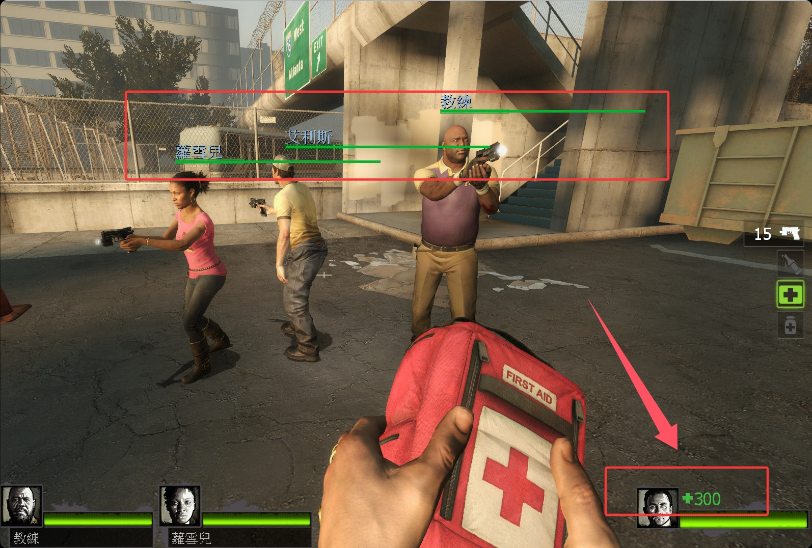

This plugin was made by 豆瓣酱な

# Description | 內容
Custom maximum survivor health 

* Apply to | 適用於
	```
	L4D2
	```

* Image | 圖示
    <br/>
    <br/>

* <details><summary>How does it work?</summary>

	* You can set the maximum health
	* Player can use healing items, go idle and switch team normally without any bugs
</Chargedetails>

* Require | 必要安裝
<br/>None

* <details><summary>ConVar | 指令</summary>

	* cfg/sourcemod/l4d2_max_health.cfg
		```php
        // Percent of injuries to heal with a first aid kit (def: 0.8, 0=Game default)
        // Override official cvar "first_aid_heal_percent"
        l4d2_first_aid_heal_percent "0.8"

        // Temporary health with an adrenaline shot (def: 25, 0=Game default)
        // Override official cvar "adrenaline_health_buffer"
        l4d2_adrenaline_health_buffer "50"

        // Max. survivor health set (def: 100, 0=Game default)
        // Override official cvar "first_aid_kit_max_heal"
        l4d2_first_aid_kit_max_heal "300"

        // Temporary health with a pain pill (def: 50, 0=Game default)
        // Override official cvar "pain_pills_health_value"
        l4d2_pain_pills_health_value "100"

        // How much health does a respawned survivor get if revived by a defibrillator or rescued in the closet (def: 50, 0=Game default)
        // Override official cvar "z_survivor_respawn_health"
        l4d2_z_survivor_respawn_health "100"

        // How much temp health you get if revived from incapacitated. (def: 30, 0=Game default)
        // Override official cvar "survivor_revive_health"
        l4d2_survivor_revive_health "60"
		```
</details>

* <details><summary>Changelog | 版本日誌</summary>

    * Credit
        * [Original Plugin by 豆瓣酱な]
</details>

- - - -
# 中文說明
自定義生還者最大血量

* 原理
	* 可以設置倖存者的最大血量
    * 不會因為閒置、換隊、打包、吃藥導致血量出現bug

* <details><summary>指令中文介紹 (點我展開)</summary>

	* cfg/sourcemod/l4d2_max_health.cfg
		```php
        // 醫療包恢复百分比 (默認:0.8, 0=遊戲預設)
        // 覆蓋官方指令 _first_aid_heal_percent
        l4d2_first_aid_heal_percent "0.8"

        // 腎上腺素能獲得的臨時血量 (默認: 25, 0=遊戲預設)
        // 覆蓋官方指令 _adrenaline_health_buffer
        l4d2_adrenaline_health_buffer "50"

        // 設置倖存者的最大血量 (默認: 100, 0=遊戲預設)
        // 覆蓋官方指令 _first_aid_kit_max_heal
        l4d2_first_aid_kit_max_heal "300"

        // 止痛藥丸能獲得的臨時血量 (默認: 50, 0=遊戲預設)
        // 覆蓋官方指令 _pain_pills_health_value
        l4d2_pain_pills_health_value "100"

        // 電擊器或救援門復活的血量 (默認: 50, 0=遊戲預設)
        // 覆蓋官方指令 _z_survivor_respawn_health
        l4d2_z_survivor_respawn_health "100"

        // 倖存者從倒地狀態被救起後恢復的臨時血量. (默認: 30, 0=遊戲預設)
        // 覆蓋官方指令 _survivor_revive_health
        l4d2_survivor_revive_health "60"
		```
</details>

