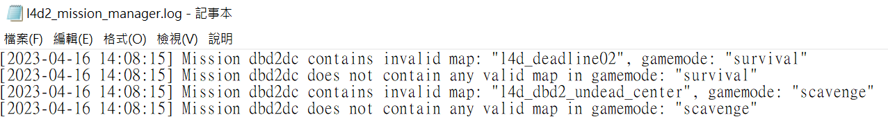

# Description | 內容
Mission manager for L4D2, provide information about map orders for other plugins

> __Note__
<br/>🟥Dedicated Server Only
<br/>🟥只能安裝在Dedicated Server

* Apply to | 適用於
    ```
    L4D2 Dedicated Server
    ```

* <details><summary>How does it work?</summary>

    * Provides a set of APIs which allows other plugins to access the third-party mission/map list
        * e.g. which map comes after the current one. Coop, versus, scavenge and survival modes are currently supported.
        * For better description, read [this](https://github.com/rikka0w0/l4d2_mission_manager#function-description)
    * Install only when other plugin requires this plugin
    * It requires some time to initialize map list at first time server launch. (20 - 60 sec, and < 2 sec. next times)
    * The plugin would auto-generate mission file in left4dead2\missions.cache folder
</details>

* Require | 必要安裝
	1. [left4dhooks](https://forums.alliedmods.net/showthread.php?t=321696)
	2. [[INC] localizer](https://github.com/dragokas/SM-Localizer/)

* FAQ
    1. <details><summary>Why there are erros in logs\l4d2_mission_manager.log?</summary>

        * Analysis: This plugin checks third-party map mission files. When format errors, missing levels, or similar issues are detected, error reports are written to logs\l4d2_mission_manager.log.
         
        * Cause: Mission files define a map's level order, names, game modes, and more. They are usually written by the map author, but some third-party map authors write them carelessly, resulting in incorrect formats and related issues.
        * Solution 1: The problem lies entirely with the map. Please contact or complain to the map author.
        * Solution 2: Try reading the error messages and manually editing the map’s mission file in left4dead2\missions.cache\, then save it. Repeat until no errors are reported.
        * Solution 3: 🟥 This error report does not affect the server in any way and can be safely ignored.
    </details>

* <details><summary>ConVar | 指令</summary>

	* cfg/sourcemod/l4d2_mission_manager.cfg
		```php
        // If 1, write error message in logs/l4d2_mission_manager.log when parsing mission files
        l4d2_mission_manager_log_message "1"
		```
</details>

* <details><summary>Command | 命令</summary>

	* **List all installed maps on the server (ADMFLAG_ROOT)**
        ```c
        sm_lmm_list [<coop|versus|scavenge|survival>]
        ```

	* **Give you a list of maps that cannot be recognized in "mission.cache" folder (ADMFLAG_ROOT)**
        ```c
        sm_lmm_list invalid
        ```
</details>

* <details><summary>API | 串接</summary>

    * [l4d2_mission_manager.inc](scripting/include/l4d2_mission_manager.inc)
        ```php
        library name: l4d2_mission_manager
        ```
</details>

* Translation Support | 支援翻譯
	```
	translations/maps.phrases.txt
    translations/missions.phrases.txt
	```

* <details><summary>Related Plugin | 相關插件</summary>

	1. [sm_l4d_mapchanger](https://github.com/fbef0102/Game-Private_Plugin/tree/main/L4D_插件/Map_%E9%97%9C%E5%8D%A1/sm_l4d_mapchanger): Force change to next mission when current mission(final stage) end + Force change to next level when survivors wipe out + Vote to next map (Apply to Versus/Survival/Scavenge).
        > 最後一關結束時自動換圖 + 滅團N次後自動切換到下一個關卡 + 玩家投票下一張地圖 (生存/對抗/清道夫模式也適用)
</details>

* <details><summary>Changelog | 版本日誌</summary>

    * v1.5h (2026-3-7)
        * Fixed error when parsing mission file "survival", "scavenge"

    * v1.4h (2026-2-9)
    * v1.3h (2026-2-6)
    * v1.2h (2026-2-4)
        * Update api
        * Add cvars
        * Optimize code

    * v1.1h (2026-1-20)
        * Update API and add native to get "DisplayTitle" of mission file
        * Official translation support

    * v1.0h (2023-11-15)
        * Fix memory leak

    * v1.0.4 (2023-6-20)
        * Require lef4dhooks v1.33 or above

    * v1.0.3 (2023-4-18)
        * Optimize code

    * v1.0.2 (2023-4-17)
        * Get correct gamemode

	* v1.0.1 (2023-4-16)
        * Check if mission/map name translation phrase exists to prevent error
        * Do not check some missions.cache files if there are no corresponding map.
        * Separate error log, save error into logs\l4d2_mission_manager.log.
        * Reduce some annoying error
        * Replace Gamedata with left4dhooks

	* v1.0.0
        * [Original Plugin by rikka0w0](https://github.com/rikka0w0/l4d2_mission_manager)
</details>

- - - -
# 中文說明
地圖管理器，提供給其他插件做依賴與API串接

* 原理
    * 能自動抓取官方圖與三方圖所有的地圖名與關卡名，掃描資料夾missions與maps並複製其內容到mission.cache資料夾裡
        * mission.cache 是插件創立的資料夾，伺服器本身並沒有這個資料夾
    * 這插件只是一個輔助插件，等其他插件真需要的時候再安裝
        * 🟥白話點說，你不是源碼開發者也沒有插件需要依賴這個插件就不要亂裝

* 功能
    * 給開發者使用，提供許多API串接 
    * 所有關於地圖mission文件的錯誤報告都寫在logs\l4d2_mission_manager.log
    * 第一次啟動伺服器時，插件需要花30~60秒讀取分析地圖，因此伺服器卡住是正常的現象，請等待插件跑完
    * 每當安裝新的三方圖時，left4dead2\missions.cache\會有新的.txt檔案產生，是三方圖對應的mission文件備份

* FAQ
    1. <details><summary>為甚麼logs\l4d2_mission_manager.log會有一堆錯誤訊息</summary>

        * 分析：這個插件會分析並檢查三方地圖mission文件，當格式錯誤或者關卡不存在等等，會將錯誤報告寫在logs\l4d2_mission_manager.log
         
        * 原因：Mission文件是決定地圖的關卡順序、名稱、遊戲模式等等，通常是由地圖作者撰寫，但是有的三方圖作者會亂寫，放飛自我，導致地圖格式不正確等等問題
        * 解決方式法一：所以鍋都是地圖問題，請去跟地圖作者抱怨
        * 解決方式法一：嘗試閱讀錯誤並修改left4dead2\missions.cache\ 的地圖mission文件然後儲存，直到沒有錯誤報告為止
        * 解決方式法三：🟥這份錯誤報告不會對伺服器產生任何影響，可以選擇忽略
    </details>
        
* <details><summary>指令中文介紹 (點我展開)</summary>

	* cfg/sourcemod/l4d2_mission_manager.cfg
		```php
        // 為1時，分析並檢查三方地圖mission文件，將錯誤報告寫在logs\l4d2_mission_manager.log
        l4d2_mission_manager_log_message "1"
		```
</details>

* <details><summary>命令中文介紹 (點我展開)</summary>

	* **列出遊戲模式可支援的地圖列表 (權限: ADMFLAG_ROOT)**
        ```c
        sm_lmm_list [<coop|versus|scavenge|survival>]
        ```

	* **在"mission.cache"資料夾內無法被分析或不合法的地圖列表 (權限: ADMFLAG_ROOT)**
        ```c
        sm_lmm_list invalid
        ```
</details>