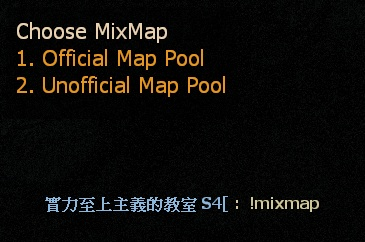
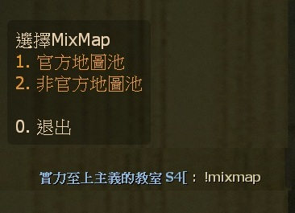

# Description | 內容
Randomly select five maps for versus/coop/realism. Adding for fun

* Image | 圖示
	<br/>

* Apply to | 適用於
	```
	L4D1
	L4D2
	```

* <details><summary>How does it work?</summary>

	* Type ```!mixmap``` or ```!mixmap <xxxxx>``` to vote to start a mixmap
	* After vote passed, the plugin will randomly select five maps from map pool -> switch to first mix map.
	* (Versus) After second round ends, switch to next mix map
	* (Coop/Realism) After survivors have made it on end safe room, switch to next mix map
		* 🟥 The weapons, items and health will not be saved to next mix map in Coop/Realism mode, don't ask.
	* To stop mix map, type ```!stopmixmap```
	* If L4D2, Add mix map pool you want in [cfg/l4d2_mixmap/l4d2](cfg/l4d2_mixmap/l4d2)
	* If L4D1, Add mix map pool you want in [cfg/l4d2_mixmap/l4d1](cfg/l4d2_mixmap/l4d1)
</details>

* Require | 必要安裝
	1. [left4dhooks](https://forums.alliedmods.net/showthread.php?t=321696)
	2. [[INC] Multi Colors](https://github.com/fbef0102/L4D1_2-Plugins/releases/tag/Multi-Colors)
	3. [builtinvotes](https://github.com/fbef0102/Game-Private_Plugin/releases/tag/builtinvotes)

* <details><summary>ConVar | 指令</summary>

	* cfg/sourcemod/l4d2_mixmap.cfg
		```php
		// If 1, show what the next map will be
		l4d2mm_nextmap_print "1"

		// Determine how many maps of one campaign can be selected; 0 = no limits;
		l4d2mm_max_maps_num "2"

		// If 1, auto force start mixmap in the end of finale in coop/realism mode (When mixmap is alreaedy on)
		l4d2mm_finale_end_coop "0"

		// If 1, auto force start mixmap in the end of finale in versus mode (When mixmap is alreaedy on)
		l4d2mm_finale_end_verus "0"
		```
</details>

* <details><summary>Command | 命令</summary>

	* **Vote to start a mixmap**
		```php
		// load 'default' maps pool
		// If l4d2, execute cfg/l4d2_mixmap/l4d2/default.cfg
		// If l4d1, execute cfg/l4d2_mixmap/l4d1/default.cfg
		sm_mixmap

		// load 'xxxx' maps pool
		// If l4d2, execute cfg/l4d2_mixmap/l4d2/xxxx.cfg
		// If l4d1, execute cfg/l4d2_mixmap/l4d1/xxxx.cfg
		sm_mixmap <xxxx>
		```

	* **Vote to Stop a mixmap**
		```php
		sm_stopmixmap
		```

	* **Show the mix map list**
		```php
		sm_mixmaplist
		```

	* **Start mixmap with specified maps (Adm required: ADMFLAG_ROOT)**
		```php
		// map_name1 is map 1
		// map_name2 is map 2
		// map_name3 is map 3
		// ... etc
		sm_manualmixmap <map_name1> <map_name2> <map_name3>......
		```

	* **Force start mixmap (Adm required: ADMFLAG_ROOT)**
		```php
		// load 'default' maps pool
		// If l4d2, execute cfg/l4d2_mixmap/l4d2/default.cfg
		// If l4d1, execute cfg/l4d2_mixmap/l4d1/default.cfg
		sm_fmixmap

		// load 'xxxx' maps pool
		// If l4d2, execute cfg/l4d2_mixmap/l4d2/xxxx.cfg
		// If l4d1, execute cfg/l4d2_mixmap/l4d1/xxxx.cfg
		sm_fmixmap <xxxx>
		```

	* **Force stop a mixmap (Adm required: ADMFLAG_ROOT)**
		```php
		sm_fstopmixmap
		```

	* **(Server Console) Add a chatper and tag**
		```php
		sm_addmap <map_name> <tag>
		```

	* **(Server Console) Define <tag> map order, number starting from 0**
		```php
		sm_tagrank <tag> <number>
		```
</details>

* <details><summary>API | 串接</summary>

	* [l4d2_mixmap.inc](addons\sourcemod\scripting\include\l4d2_mixmap.inc)
		```php
		library name: l4d2_mixmap
		```
</details>

* <details><summary>Related Plugin | 相關插件</summary>

	1. [readyup](https://github.com/fbef0102/Game-Private_Plugin/tree/main/L4D_%E6%8F%92%E4%BB%B6/Server_%E4%BC%BA%E6%9C%8D%E5%99%A8/readyup): Ready-up plugin
		> 所有玩家準備才能開始遊戲的插件
	2. [l4d2_fix_changelevel](https://github.com/Target5150/MoYu_Server_Stupid_Plugins/tree/master/The%20Last%20Stand/l4d2_fix_changelevel): Fix issues due to forced changelevel.
		> 修復手動更換地圖會遇到的問題
	3. [l4d2_transition_info_fix](https://forums.alliedmods.net/showpost.php?p=2810276&postcount=12): Fix issues after map transitioned, transition info is still retaining when changed new map by other ways.
		> 修復中途換地圖的時候(譬如使用Changelevel指令)，會遺留上次的過關保存設定，導致滅團後倖存者被傳送到安全室之外或死亡
	4. [l4d2_ty_saveweapons](https://github.com/fbef0102/L4D2-Plugins/tree/master/l4d2_ty_saveweapons): L4D2 coop save weapon when map transition if more than 4 players
		* 當伺服器有5+以上玩家遊玩戰役、寫實時，保存他們過關時的血量以及攜帶的武器、物資
</details>

* <details><summary>Changelog | 版本日誌</summary>

	* v1.0h (2024-12-25)
		* Fixed warnings in sm1.11 or above
		* Improve code
		* Prevent server console spam error: Most gross danger! Cannot find Landmark named xxxxx! in versus
		* Support L4D1
		* Support Coop/Realism mode
		* Update translation
		* Add API and include file
		* Fixed huge memory leak

	* Original
		* [By honghl5](https://gitee.com/honghl5/open-source-plug-in/tree/main/l4d2_mixmap)
</details>

- - - -
# 中文說明
隨機抽取五個關卡組成一張地圖，適用於戰役/對抗/寫實，依一定順序切換地圖來進行遊戲，增加遊戲的趣味性

* 圖示
	<br/>

* 原理
	* 輸入 ```!mixmap``` 或 ```!mixmap <xxxxx>``` 投票啟用Mixmap
	* 投票通過後，插件從地圖池隨機選擇五個關卡 -> 切換到Mixmap列表的第一關
	* (對抗) 當第二個回合結束後 -> 切換到Mixmap列表的下一關
	* (戰役/寫實) 當倖存者抵達安全室之後 -> 切換到Mixmap列表的下一關
		* 🟥 不會保存武器、物資、血量，別問
	* 輸入 ```!stopmixmap``` 可停止Mixmap
	* (L4D2) 自由新增地圖池: [cfg/l4d2_mixmap/l4d2](cfg/l4d2_mixmap/l4d2)
	* (L4D1) 自由新增地圖池: [cfg/l4d2_mixmap/l4d1](cfg/l4d2_mixmap/l4d1)

* <details><summary>指令中文介紹 (點我展開)</summary>

	* cfg/sourcemod/l4d2_mixmap.cfg
		```php
		// 為1時，顯示剩餘的關卡名稱
		l4d2mm_nextmap_print "1"

		// 同一張地圖最多能被抽取幾次？; 0 = 無限制;
		l4d2mm_max_maps_num "2"

		// (戰役/寫實) 為1時，最後一關上救援之後自動選擇下一個Mixmap列表 (當Mix map開啟的時候)
		l4d2mm_finale_end_coop "0"

		// (對抗) 為1時，最後一關的第二回合結束之後自動選擇下一個Mixmap列表 (當Mix map開啟的時候)
		l4d2mm_finale_end_verus "0"
		```
</details>

* <details><summary>Command | 命令</summary>

	* **投票啟用Mixmap**
		```php
		// 載入 'default' 地圖池
		// (l4d2) cfg/l4d2_mixmap/l4d2/default.cfg
		// (l4d1) cfg/l4d2_mixmap/l4d1/default.cfg
		sm_mixmap

		// 載入 'xxxx' 地圖池
		// (l4d2) execute cfg/l4d2_mixmap/l4d2/xxxx.cfg
		// (l4d1) execute cfg/l4d2_mixmap/l4d1/xxxx.cfg
		sm_mixmap <xxxx>
		```

	* **投票停止Mixmap**
		```php
		sm_stopmixmap
		```

	* **顯示Mixmap地圖池一覽**
		```php
		sm_mixmaplist
		```

	* **管理員自己輸入地圖池 (權限: ADMFLAG_ROOT)**
		```php
		// 地圖名1 為關卡1
		// 地圖名2 為關卡2
		// 地圖名3 為關卡3
		// ... 依此類推
		sm_manualmixmap <地圖名1> <地圖名2> <地圖名3>......
		```

	* **管理員強制載入Mixmap地圖池 (權限: ADMFLAG_ROOT)**
		```php
		// 載入 'default' 地圖池
		// (l4d2) cfg/l4d2_mixmap/l4d2/default.cfg
		// (l4d1) cfg/l4d2_mixmap/l4d1/default.cfg
		sm_fmixmap

		// 載入 'xxxx' 地圖池
		// (l4d2) execute cfg/l4d2_mixmap/l4d2/xxxx.cfg
		// (l4d1) execute cfg/l4d2_mixmap/l4d1/xxxx.cfg
		sm_fmixmap <xxxx>
		```

	* **管理員強制停止Mixmap (權限: ADMFLAG_ROOT)**
		```php
		sm_fstopmixmap
		```

	* **(伺服器後台專用) 新增關卡名稱與標記**
		```php
		sm_addmap <地圖名> <標記>
		```

	* **(伺服器後台專用) 決定標記的地圖順序, 數字從0開始**
		```php
		sm_tagrank <標記> <數字>
		```
</details>

