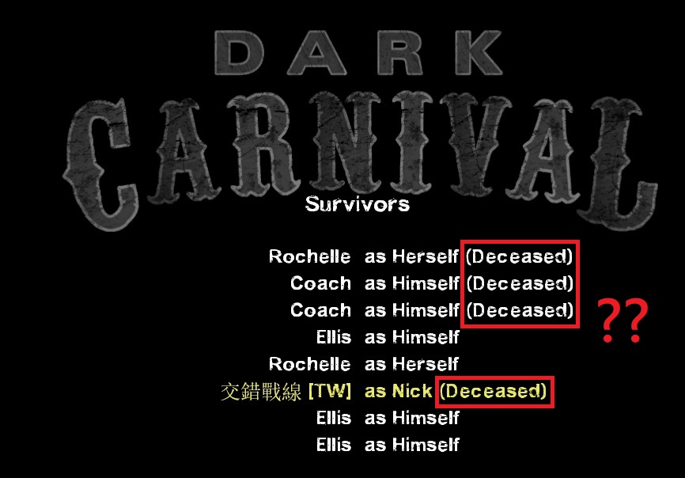
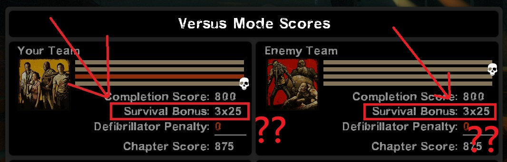
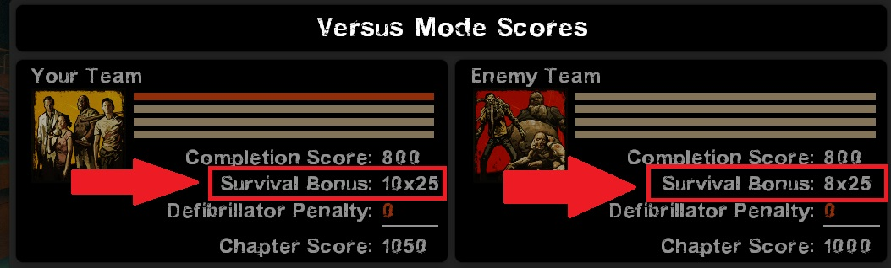

# Description | 內容
Try to fix extra 5+ survivors bug after finale rescue leaving, such as: die, fall down, not count as alive, versus score bug

* Apply to | 適用於
	```
	L4D1
	L4D2
	```

* Image | 圖示
	| Before (裝此插件之前)  			| After (裝此插件之後) |
	| -------------|:-----------------:|
	| ||
	| ||
	| ||

* <details><summary>How does it work?</summary>

	* (Before) Extra 5+ survivors bug after finale rescue leaving
		1. 5+ survivors are left behind and die.
		2. (Coop) 5+ survivors not count alive on campaign credit
		3. (L4D2) (Versus) 5+ survivors not count alive when calculate score
	* (After) Try to fix
		1. 5+ survivors can leave with vehicle.
		2. (Coop) 5+ survivors display alive on campaign credit
		3. (L4D2) (Versus) calculate 5+ survivors alive count
		4. (Versus) Kills survivors before the score is calculated so player won't get full distance if is incapped as the rescue vehicle leaves.
	* How to set up 5 survivors?
		* Read [8+_Survivors_In_Coop](https://github.com/fbef0102/Game-Private_Plugin/tree/main/Tutorial_%E6%95%99%E5%AD%B8%E5%8D%80/English/Game/L4D2/8%2B_Survivors_In_Coop)
</details>

* Require | 必要安裝
	1. [left4dhooks](https://forums.alliedmods.net/showthread.php?t=321696)

* <details><summary>Changelog | 版本日誌</summary>

	* v1.0h (2025-1-13)
		* Initial Release

	* Original
		* [By sorallll](https://forums.alliedmods.net/showthread.php?t=325263)
		* [By edshot99](https://forums.alliedmods.net/showthread.php?t=350059)
		* [By V10](https://forums.alliedmods.net/showthread.php?t=121945)
		* [SirPlease/L4D2-Competitive-Rework](https://github.com/SirPlease/L4D2-Competitive-Rework/blob/master/addons/sourcemod/scripting/finalefix.sp)
</details>

- - - -
# 中文說明
修正第五位以上的玩家無法上救援載具，統計顯示其死亡，無法列入對抗分數

* 原理
	* (裝此插件之前) 第五位以上的玩家上救援載具之後的bug
		1. 留下來，並且死亡
		2. (戰役) 戰役計算時顯示其死亡
		3. (L4D2) (對抗) 無法列入對抗活著分數
	* (裝此插件之後) 嘗試修正
		1. 第五位以上的玩家可以跟著載具離開
		2. (戰役) 戰役計算時顯示第五位以上的玩家活著 (成功逃出)
		3. (L4D2) (對抗) 第五位以上的玩家列入對抗活著分數
		4. (對抗) 倒地的倖存者自動處死，避免倒地的玩家獲得對抗距離分數
	* 如何設置5+多人倖存者?
		* 請閱讀這篇文章[8位玩家遊玩戰役模式](https://github.com/fbef0102/Game-Private_Plugin/tree/main/Tutorial_%E6%95%99%E5%AD%B8%E5%8D%80/Chinese_%E7%B9%81%E9%AB%94%E4%B8%AD%E6%96%87/Game/L4D2/8%E4%BD%8D%E7%8E%A9%E5%AE%B6%E9%81%8A%E7%8E%A9%E6%88%B0%E5%BD%B9%E6%A8%A1%E5%BC%8F)