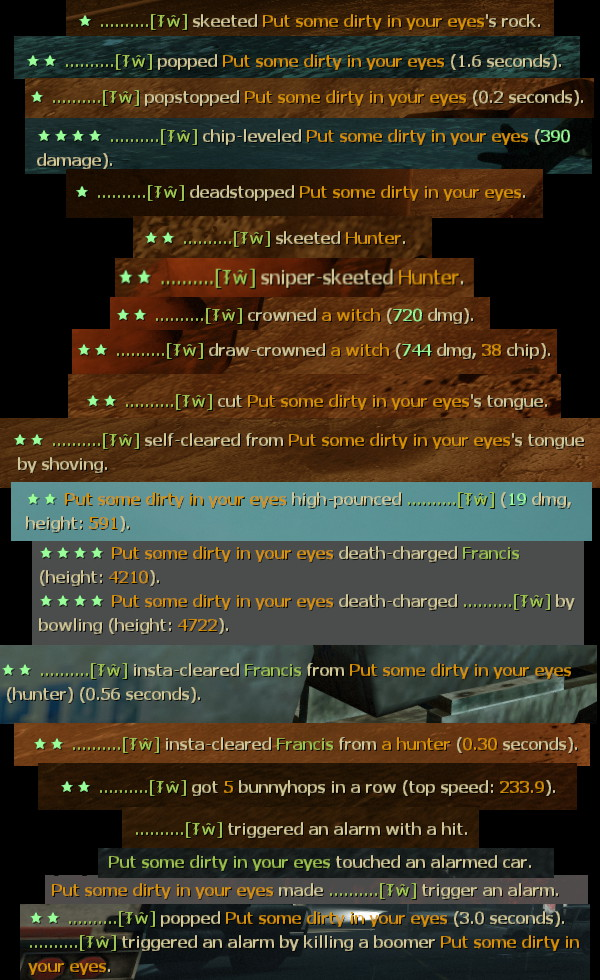
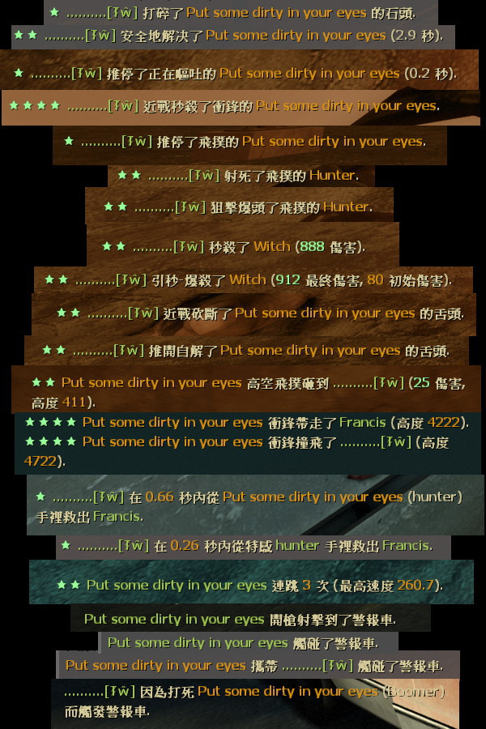

# Description | 內容
Detects and reports skeets, crowns, levels, highpounces, etc.

* Apply to | 適用於
    ```
    L4D1
    L4D2
    ```

* Image
    * Skill moment
    <br/>  

* <details><summary>How does it work?</summary>

    * Detects and reports skeets, crowns, levels, highpounces, etc. Also provide api functions
    * See "ConVar" for more details
</details>

* Require | 必要安裝
    1. [left4dhooks](https://forums.alliedmods.net/showthread.php?t=321696)
    2. [[INC] Multi Colors](https://github.com/fbef0102/L4D1_2-Plugins/releases/tag/Multi-Colors)
    3. [Actions](https://forums.alliedmods.net/showthread.php?t=336374)

* <details><summary>Support | 支援插件</summary>

    1. [l4d_ai_hunter_skeet_dmg_fix](/l4d_ai_hunter_skeet_dmg_fix): Makes AI Hunter take damage like human SI while pouncing.
        * 對AI Hunter(正在飛撲的途中) 造成的傷害數據跟真人玩家一樣

    2. [charging_takedamage_patch](/charging_takedamage_patch): Makes AI Charger take damage like human SI while charging.
        * 移除AI Charger的衝鋒減傷
</details>

* Directory Structure | 檔案結構
    ```php
	/
	├── plugins/
	│	└── l4d2_skill_detect.smx			# Compiled plugin | 已編譯的插件
	├── scripting/
	│	├── include/ 
	│	│	└── l4d2_skill_detect.inc		# API | 給會寫插件的人
	│	└── l4d2_skill_detect.sp			# Source code | 源碼
	└── translations/
		└── l4d2_skill_detect.phrases.txt	# Multi-language translation | 翻譯多國語言
	```

* <details><summary>ConVar | 指令</summary>

    * cfg/sourcemod/l4d2_skill_detect.cfg
        ```php
        // Whether to report in chat.
        sm_skill_report_enable "1"

        // Enable hunter/jockey skeet reporting.
        sm_skill_report_skeet "1"

        // Enable hunter/jockey hurt-skeet reporting.
        sm_skill_report_hurtskeet "1"

        // Enable level reporting.
        sm_skill_report_level "1"

        // Enable hurt-level reporting.
        sm_skill_report_hurtlevel "1"

        // Enable crow reporting.
        sm_skill_report_crow "1"

        // Enable draw-crow reporting.
        sm_skill_report_drawcrow "1"

        // Enable tongue-cut reporting.
        sm_skill_report_tonguecut "1"

        // Enable self clear reporting.
        sm_skill_report_sc "1"

        // Enable self clear Shove reporting.
        sm_skill_report_scs "1"

        // Enable rock-skeet reporting.
        sm_skill_report_rockskeet "1"

        // Enable Tank name reporting.
        sm_skill_report_rockname "0"

        // Enable deadstop reporting.
        sm_skill_report_deadstop "1"

        // Enable pop reporting.
        // 1. Kill the real Boomer player without anyone getting vomited.
        // 2. Kill the AI Boomer quickly while it is spraying, without anyone getting vomited. 
        // 3. Kill the AI Boomer quickly within 5 seconds once it gets close, without anyone getting vomited. 
        sm_skill_report_pop "1"

        // Enable shove reporting.
        sm_skill_report_shove "0"

        // Enable hunter DP reporting.
        sm_skill_report_hunterdp "1"

        // Enable jockey DP reporting.
        sm_skill_report_jockeydp "0"

        // Enable deadcharger reporting.
        sm_skill_report_deadcharger "1"

        // Enable instan-clear reporting.
        sm_skill_report_instanclear "1"

        // Enable bhop streak reporting.
        sm_skill_report_bhop "1"

        // Enable car alarm reporting.
        sm_skill_report_caralarm "1"

        // Enable pop stop reporting.
        // (Shove Boomer while it is spraying, without anyone getting vomited)
        sm_skill_report_pop_stop "1"

        // Enable Boomer Perfect Vomit reporting
        // (Vomit 4+ survivors)
        sm_skill_report_vomit_perfect "1"

        // Hunter/Jockey team skeet assist report.
        sm_skill_report_teamskeet "0"

        // Whether to count/forward shotgun skeets.
        sm_skill_skeet_shotgun "1"

        // Whether to count/forward magnum pistol skeets.
        sm_skill_skeet_magnum "1"

        // Whether to count/forward melee skeets.
        sm_skill_skeet_melee "1"

        // Whether to count/forward sniper skeets.
        sm_skill_skeet_sniper "1"

        // Whether to count/forward direct grenade launcher hits as skeets.
        sm_skill_skeet_grenade_launcher "1"

        // Whether to count/forward chainsaw skeets.
        sm_skill_skeet_chainsaw "1"

        // How much damage a survivor must at least do in the final shot for it to count as a drawcrown.
        sm_skill_drawcrown_damage "500"

        // How much damage a survivor must at least do to a smoker for him to count as self-clearing.
        sm_skill_selfclear_damage "200"

        // Minimum height of hunter pounce for it to count as a DP.
        sm_skill_hunterdp_height "400"

        // How much height distance a jockey must make for his 'DP' to count as a reportable highpounce.
        sm_skill_jockeydp_height "300"

        // If set, any damage done that exceeds the health of a victim is hidden in reports.
        sm_skill_hidefakedamage "1"

        // How much height distance a charger must take its victim for a deathcharge to be reported.
        sm_skill_deathcharge_height "400"

        // A clear within this time (in seconds) counts as an insta-clear.
        sm_skill_instaclear_time "0.75"

        // The lowest bunnyhop streak that will be reported.
        sm_skill_bhopstreak "3"

        // The minimal speed of the first jump of a bunnyhopstreak (0 to allow 'hops' from standstill).
        sm_skill_bhopinitspeed "150"

        // The minimal speed at which hops are considered succesful even if not speed increase is made.
        sm_skill_bhopkeepspeed "300"

        // How many survivors a boomer must at least vomit to count as wonderful-vomit.
        sm_skill_vomit_number "4"
        ```
</details>

* <details><summary>Changelog | 版本日誌</summary>

    * v2.7h (2026-10-4)
        * Update API, cvars
        * Fix some official cvars not working
        * Fix smoker self-clear
        * Use left4dhooks and actions to detect if boomer is popped without anyone getting vomited on
        * Improve hunter skeets and change api
        * Add chainsaw-skeet

    * v2.6h (2026-9-30)
        * Thanks to Volence
        * Bugs fixed for L4D1, some fields in events do not exist in L4D1.
        * Fix "OnSkeet", "Self-clear" codes
        * Update translation

    * v2.5h (2026-9-29)
        * Fix cvars not working
        * Update translations
        * Rewrite "pop a boomer" logic

    * v2.4h (2026-9-28)
        * Skeet assists are counted even when sm_skill_report_enable is 0
        * Update cvars

    * v2.3h (2026-8-28)
        * Support L4D1
        * Convert code to latest syntax
        * Fix warnings when compiling above SourceMod 1.12 

    * v2.2h (2026-1-7)
        * Update API
        * Rename OnWitchDrawCrown function to OnWitchCrownHurt

    * v2.1h (2025-8-6)
        * Update API
        * Add hunter skeet assist report

    * v1.9h (2024-12-20)
        * Compatible with with l4d2_kills_manager_remake by Harry

    * v1.8h (2024-8-6)
        * Update API

    * v1.8h (2024-4-30)
        * Update translation
        * Fixed wrong car alarm notify

    * v1.7h (2024-4-25)
        * Update API

    * v1.6h (2024-4-19)
        * Add inc file, use GetEngineTime() instead of GetGameTime()

    * v1.5h (2023-9-20)
        * Add Shotugn, magnum skeet cvars and api

    * v1.4h (2023-5-26)
        * Safely check client id when pass by timer

    * v1.3h (2023-4-28)
        * Add More Api

    * v1.2h (2023-3-24)
        * Separate translation for the jockey and hunter
        * Fixed Self clear, fast clear smoker tongue in versus/survival/cavenge
        * New Skill Reqport, "boomer vomits all survivors"

    * v1.1h (2022-12-16)
        * Translation Support

    * v0.9.20 fork
        * [By zonde306](https://github.com/zonde306/l4d2sc/blob/master/l4d2_skill_detect.sp)

    * v0.9.20
        * [SirPlease/l4d2_skill_detect](https://github.com/SirPlease/L4D2-Competitive-Rework/blob/master/addons/sourcemod/scripting/l4d2_skill_detect.sp)
</details>

- - - -
# 中文說明
顯示人類與特感各種花式技巧 (譬如推開特感、速救隊友、一槍爆頭、近戰砍死、高撲傷害等等)

* 圖示
    * 大佬裝B的瞬間
    <br/>  

* 原理
    * 每當有高手展現實力，打印在聊天視窗
    * 戰役/對抗/寫實/生存都適用
    * 查看"指令中文介紹"選擇打印哪些花式技巧

* <details><summary>指令中文介紹 (點我展開)</summary>

    * cfg/sourcemod/l4d2_skill_detect.cfg
        ```php
        // 為1時，打印大佬裝B的各種特殊技巧
        sm_skill_report_enable "1"

        // 為1時，打印: 一人空爆或多人合力空爆 hunter/jockey"
        sm_skill_report_skeet "1"

        // 為1時，打印: 一人空爆或多人合力空爆 hunter/jockey (傷害較低)
        sm_skill_report_hurtskeet "1"

        // 為1時，打印: 近戰砍死衝鋒的Charger
        sm_skill_report_level "1"

        // 為1時，打印: 近戰砍死衝鋒的Charger (傷害較低)
        sm_skill_report_hurtlevel "1"

        // 為1時，打印: 一槍殺死Witch並無人受傷
        sm_skill_report_crow "1"

        // 為1時，打印: 兩槍以上殺死Witch並無人受傷
        sm_skill_report_drawcrow "1"

        // 為1時，打印: 砍斷Smoker的舌頭
        sm_skill_report_tonguecut "1"

        // 為1時，打印: 自解Smoker的舌頭
        sm_skill_report_sc "1"

        // 為1時，打印: 推開自解Smoker的舌頭
        sm_skill_report_scs "1"

        // 為1時，打印: 打碎Tank石頭
        sm_skill_report_rockskeet "1"

        // 為1時，打印: 打碎Tank石頭時顯示Tank玩家的名稱
        sm_skill_report_rockname "0"

        // 為1時，打印: 推停飛撲的hunter/jockey
        sm_skill_report_deadstop "1"

        // 為1時，打印: 安全地殺死Boomer，沒有人被嘔吐
        // 1. 解決真人Boomer，沒有人被嘔吐
        // 2. 解決正在嘔吐的AI Boomer，沒有人被嘔吐
        // 3. 五秒內解決靠近倖存者的AI Boomer，沒有人被嘔吐
        sm_skill_report_pop "1"

        // 為1時，打印: 推開特感
        sm_skill_report_shove "0"

        // 為1時，打印: Hunter高撲傷害
        sm_skill_report_hunterdp "1"

        // 為1時，打印: Jockey高空騎到人類
        sm_skill_report_jockeydp "0"

        // 為1時，打印: Charger衝鋒帶走人類墬樓
        sm_skill_report_deadcharger "1"

        // 為1時，打印: 快速拯救隊友
        sm_skill_report_instanclear "1"

        // 為1時，打印: 連跳
        sm_skill_report_bhop "1"

        // 為1時，打印: 警報車
        sm_skill_report_caralarm "1"

        // 為1時，打印: 推開正在噴人的Boomer，沒有人被嘔吐
        sm_skill_report_pop_stop "1"

        // 為1時，打印: Boomer 完美嘔吐
        // (一次吐到4位倖存者以上)
        sm_skill_report_vomit_perfect "1"

        // 為1時，打印: 打印多人合力空爆hunter/jockey的協力者 (非擊殺者)
        sm_skill_report_teamskeet "0"

        // 為1時，打印 散彈槍空爆 hunter/jockey 並輸出API
        sm_skill_skeet_shotgun "1"

        // 為1時，打印 手槍麥格農空爆 hunter/jockey 並輸出API
        sm_skill_skeet_magnum "1"

        // 為1時，打印 近戰武器砍死飛撲中的 hunter/jockey 並輸出API
        sm_skill_skeet_melee "1"

        // 為1時，打印 狙擊槍空爆 hunter/jockey 並輸出API
        sm_skill_skeet_sniper "1"

        // 為1時，打印 榴彈發射器空爆 hunter/jockey 並輸出API
        sm_skill_skeet_grenade_launcher "1"

        // 為1時，打印 電鋸砍死飛撲中的 hunter/jockey 並輸出API
        sm_skill_skeet_chainsaw "1"

        // 超過多少傷害才算 "一槍殺死Witch"
        sm_skill_drawcrown_damage "500"

        // 超過多少傷害才算 "倖存者自解特感"
        sm_skill_selfclear_damage "200"

        // 超過多少高度才算 "Hunter高撲"
        sm_skill_hunterdp_height "400"

        // 超過多少高度才算 "Jockey高空騎到人類"
        sm_skill_jockeydp_height "300"

        // 為1時，隱藏超過特感血量的傷害
        sm_skill_hidefakedamage "1"

        // 超過多少高度才算 "Charger衝鋒帶走人類墬樓"
        sm_skill_deathcharge_height "400"

        // 從被特感抓到的0.75秒內拯救隊友才算 "快速拯救隊友"
        sm_skill_instaclear_time "0.75"

        // 跳超過幾次才算 "連跳"
        sm_skill_bhopstreak "3"

        // 跳躍起始速度超過多少才算 "連跳"
        sm_skill_bhopinitspeed "150"

        // 跳躍中途速度超過多少才算 "連跳"
        sm_skill_bhopkeepspeed "300"

        // Boomer一次吐到4位倖存者以上才算 "Boomer 完美嘔吐"
        sm_skill_vomit_number "4"
        ```
</details>