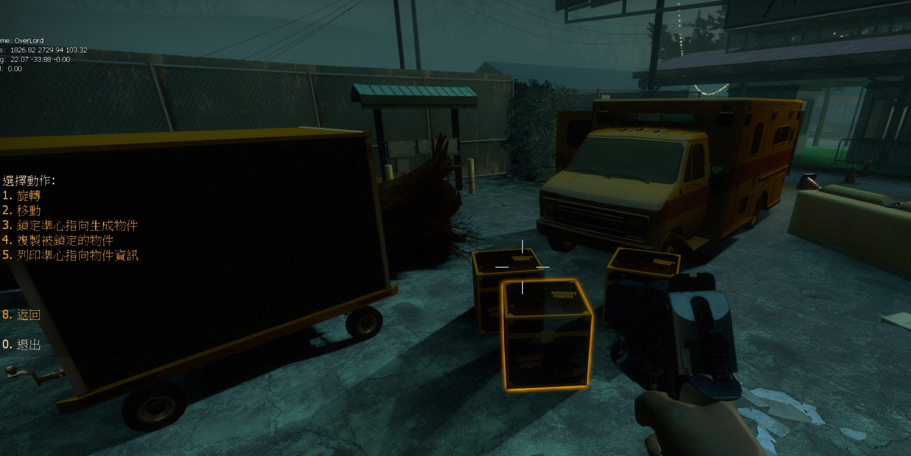

# Description | 內容
Let admins spawn any kind of objects and saved to cfg

* Apply to | 適用於
	```
	L4D1
	L4D2
	```

* Video | 影片展示
	* [Demonstration](https://youtu.be/AQ_JZa2u434)
    * [Unlimited Map C8 by Harry](https://youtu.be/I_-QSn8F8Cs)
    * [L4D2-Unlimited-Map](https://github.com/fbef0102/L4D2-Unlimited-Map)

* <details><summary>Image | 圖示</summary>

	<br/>
	<br/>
	<br/>
	<br/>
	<br/>
	<br/>
	<br/>
	<br/>
	<br/>
</details>

* Require | 必要安裝
    1. [left4dhooks](https://forums.alliedmods.net/showthread.php?t=321696)
	2. [[INC] Multi Colors](https://github.com/fbef0102/L4D1_2-Plugins/releases/tag/Multi-Colors)
    3. [Install Stripper:Source](https://github.com/fbef0102/Game-Private_Plugin/tree/main/Tutorial_教學區/English/Server/Install_Other_File#stripper): Save objects/items permanently
		* [安裝Stripper:Source](https://github.com/fbef0102/Game-Private_Plugin/tree/main/Tutorial_教學區/Chinese_繁體中文/Server/安裝其他檔案教學#安裝stripper): 永久保存障礙物與物品於地圖上

* <details><summary>How to use</summary>

	* Type ```!admin``` to call adm menu and you will see "Spawn Objects" option
	* **Create Object**
        1. Admin types !admin in chat->Spawn Objects->Spawn Objects->Select the spawn method
        2. Physics（affected by gravity），Non-solid（you can go through it），Solid（won't be affected by gravity），Items&Weapons（Guns, Melees, Supplies, Throwables, etc.）
			* Not all objects can be Physics
			* Not all objects can be Non-solid
			* Not all objects can be Solid (Go ask Valve)

	* **Save Object**
        1. Admin types ```!admin``` in chat->Spawn Objects->Save Objects->Save Stripper File
		2. All Spawned objects will be saved into ```addons\stripper\maps\xxxxx.cfg```
			* xxxx is map name
			* Auto-generate xxxxx.cfg if file not exist
		3. Restart Map

	* **Delete Object**
        1. Modify file: ```addons\stripper\maps\xxxxx.cfg```
			* xxxx is map name
		2. Find the object you want to delete by classname, origin, angles
		3. Delete code {}，for example:
			```php
			{
				"solid" "6"
				"origin" "2408 -140 0"
				"angles" "0 93 0"
				"model"	 "models/props/cs_militia/boxes_frontroom.mdl"
				"classname"	"prop_dynamic"
			}
			```
	* Auto save the objects when map change or round ends. For people who always forget to save objects :(
</details>

* <details><summary>Q&A</summary>

	* Why I can't read object names in the menu?
		* The [data/l4d2_spawn_props_models.txt](data/l4d2_spawn_props_models.txt) is Chinese language
		* Delete file and Use [data/l4d2_spawn_props_models_english.txt](data/l4d2_spawn_props_models_english.txt), rename to ```data/l4d2_spawn_props_models.txt```

	* How to add more models?
		* Modify ```data/l4d2_spawn_props_models.txt```
</details>

* <details><summary>ConVar | 指令</summary>

	* cfg/sourcemod/l4d2_spawn_props.cfg
		```php
        // Enable the Decorative category
        l4d2_spawn_props_category_decorative "1"

        // Enable the Exterior category
        l4d2_spawn_props_category_exterior "1"

        // Enable the Foliage category
        l4d2_spawn_props_category_foliage "1"

        // Enable the Interior category
        l4d2_spawn_props_category_interior "1"

        // Enable the Misc category
        l4d2_spawn_props_category_misc "1"

        // Enable the Vehicles category
        l4d2_spawn_props_category_vehicles "1"

        // Enable the Dynamic (Non-solid) Objects in the menu
        l4d2_spawn_props_dynamic "1"

        // Enable the Items & Weapons Objects in the menu
        l4d2_spawn_props_items "1"

        // Log if an admin spawns an object?
        l4d2_spawn_props_log_actions "0"

        // Enable the Physics Objects in the menu
        l4d2_spawn_props_physics "1"

        // Enable the Static (Solid) Objects in the menu
        l4d2_spawn_props_static "1"
		```
</details>

* <details><summary>Command | 命令</summary>

	* **Spawns an object with the given information, sm_spawnprop <model> [static | dynamic | physics] [cursor | origin] (Adm required: ADMFLAG_UNBAN)**
		```php
		sm_spawnprop
		```

	* **Save all the spawned object in a stripper file, path: addons/stripper/maps/XXXX.cfg (XXXX is map name) (Adm required: ADMFLAG_UNBAN)**
		```php
		sm_savemap
		```

	* **Rotates the looking spawned object with the desired angles, Usage: sm_prop_rotate <axys> <angles> [EX: !prop_rotate x 30] (Adm required: ADMFLAG_UNBAN)**
		```php
		sm_prop_rotate
		```

	* **Remove last spawned object (Adm required: ADMFLAG_UNBAN)**
		```php
		sm_prop_removelast
		```

	* **Remove the looking object (Adm required: ADMFLAG_UNBAN)**
		```php
		sm_prop_removelook
		```

	* **Remove all spawned objects (Adm required: ADMFLAG_UNBAN)**
		```php
		sm_prop_removeall
		```

	* **Move the looking spawned object with the desired movement type, Usage: sm_prop_move <axys> <distance> [EX: !prop_move x 30] (Adm required: ADMFLAG_UNBAN)**
		```php
		sm_prop_move
		```

	* **Forces the looking spawned object angles, Usage: sm_prop_setang <X Y Z> [EX: !prop_setang 30 0 34] (Adm required: ADMFLAG_UNBAN)**
		```php
		sm_prop_setang
		```

	* **Sets the looking spawned object position, Usage: sm_prop_setpos <X Y Z> [EX: !prop_setpos 505 -34 17 (Adm required: ADMFLAG_UNBAN)**
		```php
		sm_prop_setpos
		```

	* **Locks the looking spawned object, Use for move and rotate (Adm required: ADMFLAG_UNBAN)**
		```php
		sm_prop_lock
		```

	* **Clone the last spawned object (Adm required: ADMFLAG_UNBAN)**
		```php
		sm_prop_clone
		```

	* **Print the looking object information (Adm required: ADMFLAG_UNBAN)**
		```php
		sm_prop_print
		```
</details>

* Translation Support | 支援翻譯
	```
	translations/l4d2_spawn_props.phrases.txt
	```

* <details><summary>Changelog | 版本日誌</summary>

	* v4.3 (2025-10-7)
		* Update translation

	* v4.2 (2025-5-23)
		* Suppprt float number

	* v4.1 (2024-3-24)
		* Fixed error

	* v4.0 (2023-2-21)
		* Support stripper cvar to save map.cfg
			```c
			// Stripper Config Path
			stripper_cfg_path "addons/stripper"
			```

	* v3.9 (2023-1-5)
        * Fixed Item Position Menu Error.

	* v3.8 (2022-11-3)
        * Remake Code
        * Translation Support
        * some menu has back button
        * menu won't be disappeared if I spawn an object
        * Add more options
        * More objects
        * New Spawn Method: Items&Weapons, you can spawn Guns, Melees, Supplies, Throwables, etc.
        * Remove routing, cache, only stripper save method

	* v2.0
        * [Original Post by honorcode23](https://forums.alliedmods.net/showthread.php?t=127418)
</details>

- - - -
# 中文說明
創造屬於自己風格的地圖，製作迷宮與障礙物

* <details><summary>如何使用?</summary>

	* 如何創造物件?
		1. 管理員輸入```!admin```->生成物件->生成物件->選擇其中一項
		2. 動態（會受重力影響），穿透（擺好看），固態（不受重力影響），物品（槍械、近戰、醫療物品、投擲物品、彈藥堆、雷射裝置）
			* 非所有模型都能變成動態
			* 非所有模型都能變成穿透
			* 非所有模型都能變成固態 (去問Valve，認真你就輸了)

	* 如何儲存物件?
		1. 管理員輸入```!admin```->生成物件->儲存物件
		2. 生成的物件會儲存於```addons\stripper\maps\xxxxx.cfg```
			* xxxx是地圖名
			* 沒有此cfg也會自動產生
		3. 重啟地圖

	* 如何刪除已經儲存的物件?
		1. 編輯檔案 ```addons\stripper\maps\xxxxx.cfg```
			* xxxx是地圖名
		2. 透過 ```"model" "origin" "angles"```關鍵字查找你要刪除的物件
			* origin: 位置
			* angles: 角度
			* model: 模組
		3. 刪除整段上下{}，譬如
			```php
			{
				"solid" "6"
				"origin" "2408 -140 0"
				"angles" "0 93 0"
				"model"	 "models/props/cs_militia/boxes_frontroom.mdl"
				"classname"	"prop_dynamic"
			}
			```
	* 回合結束或切換地圖時, 自動保存尚未儲存的物件 (因為玩家容易忘記儲存物件)
</details>

* <details><summary>Q&A</summary>

	* 如何增加更多模組?
		* 編輯檔案 [data/l4d2_spawn_props_models.txt](data/l4d2_spawn_props_models.txt)
</details>


