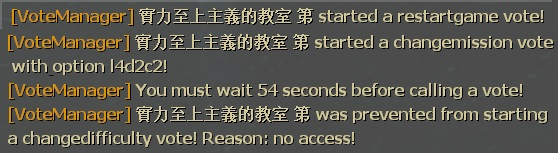
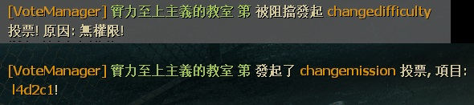

# Description | 內容
Unable to call valve vote if player does not have access

* Video | 影片展示
<br/>None

* Image
    <br/>

* <details><summary>How does it work?</summary>

    * Prevent player from calling the valve vote in "ESC->Call a vote" if player does not have access
    * Admin has immune to be kicked
    * All vote records are in ```logs/l4d2_vote_manager3.txt```
</details>

* Require | 必要安裝
    1. [[INC] Multi Colors](https://github.com/fbef0102/L4D1_2-Plugins/releases/tag/Multi-Colors)
    2. [builtinvotes](https://github.com/fbef0102/Game-Private_Plugin/releases/tag/builtinvotes)

* <details><summary>ConVar | 指令</summary>

    * cfg/sourcemod/l4d2_vote_manager3.cfg
        ```php
        // 0=Cooldown is shared 1=Cooldown is independant
        l4d2_vote_manager3_cooldown_mode "0"

        // Clients can call votes again after this many seconds
        l4d2_vote_manager3_cooldown "60.0"

        // Tanks have immunity against kick votes
        l4d2_vote_manager3_tank_immunity "0"

        // Respect admin immunity levels in kick votes (Only work when admin tries to kick admin)
        l4d2_vote_manager3_respect_immunity "1"

        // 1=Log vote info to files 2=Log vote info to server; 3=Both
        l4d2_vote_manager3_log "3"

        // Players with these flags can use !veto to force veto the current vote (Empty = Everyone, -1: Nobody)
        l4d2_vote_manager3_veto_flag "z"

        // Players with these flags can use !pass to forece pass the current vote (Empty = Everyone, -1: Nobody)
        l4d2_vote_manager3_pass_flag "z"

        // Players with these flags can ignore Cooldown and start the new vote (Empty = Everyone, -1: Nobody)
        l4d2_vote_manager3_cooldown_immunity_flag "-1"

        // Players with these flags can see the notify (Empty = Everyone, -1: Nobody)
        l4d2_vote_manager3_notify_flag ""

        // Players with these flags can call a vote "Return To Lobby" from ESC (Empty = Everyone, -1: Nobody)
        l4d2_vote_manager3_returntolobby_flag "z"

        // Players with these flags can call a vote "Restart Chapter/Restart Campaign" from ESC (Empty = Everyone, -1: Nobody)
        l4d2_vote_manager3_restartgame_flag "z"

        // Players with these flags can call a vote "Change Diffciulty" from ESC (Empty = Everyone, -1: Nobody)
        l4d2_vote_manager3_changedifficulty_flag "z"

        // Players with these flags can call a vote "Start New Campaign" from ESC (Empty = Everyone, -1: Nobody)
        l4d2_vote_manager3_changemission_flag "z"

        // Players with these flags can call a vote "Change Chapter" from ESC (Empty = Everyone, -1: Nobody)
        // Doesn't work, It is blocked by default
        l4d2_vote_manager3_changechapter_flag "z"

        // Players with these flags can call a vote "Change All Talk" from ESC (Empty = Everyone, -1: Nobody)
        l4d2_vote_manager3_changealltalk_flag "z"

        // Players with these flags can call a vote "Kick Player" from ESC (Empty = Everyone, -1: Nobody)
        l4d2_vote_manager3_kick_flag "z"

        // Players with these flags are immune to be kicked (Empty = Everyone, -1: Nobody)
        l4d2_vote_manager3_kick_immunity_flag "z"
        ```
</details>

* <details><summary>Command | 命令</summary>

    * **Force pass a current vote**
        ```php
        sm_pass
        ```

    * **Force veto a current vote**
        ```php
        sm_veto
        ```
</details>

* Apply to | 適用於
    ```
    L4D1
    L4D2
    ```

* <details><summary>Translation Support | 支援翻譯</summary>

    ```
    English
    繁體中文
    简体中文
    Russian
    ```
</details>

* <details><summary>Related | 相關插件</summary>

    1. [l4d_vote_block](https://github.com/fbef0102/Game-Private_Plugin/tree/main/Plugin_%E6%8F%92%E4%BB%B6/Server_%E4%BC%BA%E6%9C%8D%E5%99%A8/l4d_vote_block): Unable to call valve vote depending on gamemode and difficulty.
        > 根據遊戲模式和難度禁止使用Esc->發起投票
    2. [kickthevoter](https://github.com/fbef0102/Game-Private_Plugin/tree/main/Plugin_%E6%8F%92%E4%BB%B6/Anti_Griefer_%E9%98%B2%E6%83%A1%E6%84%8F%E8%B7%AF%E4%BA%BA/kickthevoter): Make It So The Person Calling The Vote Gets Kicked!
        > 使用Esc->發起投票的人將會被反踢出去伺服器
</details>

* <details><summary>Changelog | 版本日誌</summary>

    ```php
    //McFlurry @ 2011
    //HarryPotter @ 2024
    ```
    * v1.2h (2024-9-30)
        * Fixed vote not working if player using "callvote" in game console
        * Update translation

    * v1.1h (2024-2-7)
        * Fixed kick immunity not working

    * v1.0h (2024-1-28)
        * Update Cvars
        * Require builtinvotes
        * Remake code, convert code to latest syntax
        * Fix warnings when compiling on SourceMod 1.11.
        * Optimize code and improve performance
        * Chinese Translation Support
        * Fixed player can not call a vote if previous vote failed for some reasons
        * Use Cvars to control access, no need to write admin_overrides.cfg

    * v1.3.0 rc2
        * [Original Post by McFlurry](https://forums.alliedmods.net/showthread.php?t=170445)
</details>

- - - -
# 中文說明
沒有權限的玩家不能隨意發起官方投票

* 圖示
    <br/>

* 原理
    * 當玩家從ESC->發起投票時，如果沒有權限則擋住
    * 管理員免疫被踢出去
    * 無論是成功或是被擋住都會有紀錄，位於```logs/l4d2_vote_manager3.txt```

* 用意在哪?
    * 禁止白癡路人進來亂投票搗亂伺服器

* <details><summary>指令中文介紹 (點我展開)</summary>

    * cfg/sourcemod/l4d2_vote_manager3.cfg
        ```php
        // 0=冷卻時間是共享的 1=冷卻時間是各別玩家的
        l4d2_vote_manager3_cooldown_mode "0"

        // 玩家必須等待60秒後才能發起新投票
        l4d2_vote_manager3_cooldown "60.0"

        // Tank玩家免疫被踢
        l4d2_vote_manager3_tank_immunity "0"

        // 投票踢人時 玩家的權限免疫力如果小於對方玩家，則不能踢出 (只有當管理員踢出管理員才會運作)
        l4d2_vote_manager3_respect_immunity "1"

        // 1=記錄到logs/l4d2_vote_manager3.txt檔案 2=記錄到sourcemod的log檔案; 3=兩者都是
        l4d2_vote_manager3_log "3"

        // 擁有這些權限的玩家，才可以輸入 !veto 強制通過投票 (留白 = 任何人都能, -1: 無人)
        l4d2_vote_manager3_veto_flag "z"

        // 擁有這些權限的玩家，才可以輸入 !pass 強制通過投票 (留白 = 任何人都能, -1: 無人)
        l4d2_vote_manager3_pass_flag "z"

        // 擁有這些權限的玩家，可以忽略冷卻時間直接開始新投票 (留白 = 任何人都能, -1: 無人)
        l4d2_vote_manager3_cooldown_immunity_flag "-1"

        // 擁有這些權限的玩家，可以看到聊天框的投票提示狀態 (留白 = 任何人都能, -1: 無人)
        l4d2_vote_manager3_notify_flag ""

        // 擁有這些權限的玩家，可以發起『返回大廳』 (留白 = 任何人都能, -1: 無人)
        l4d2_vote_manager3_returntolobby_flag "z"

        // 擁有這些權限的玩家，可以發起『重新開始戰役/章節』 (留白 = 任何人都能, -1: 無人)
        l4d2_vote_manager3_restartgame_flag "z"

        // 擁有這些權限的玩家，可以發起『變更難度』 (留白 = 任何人都能, -1: 無人)
        l4d2_vote_manager3_changedifficulty_flag "z"

        // 擁有這些權限的玩家，可以發起『開始新戰役』 (留白 = 任何人都能, -1: 無人)
        l4d2_vote_manager3_changemission_flag "z"

        // 擁有這些權限的玩家，可以發起『選擇戰役章節』 (留白 = 任何人都能, -1: 無人)
        // 無作用，官方預設關閉此投票項目
        l4d2_vote_manager3_changechapter_flag "z"

        // 擁有這些權限的玩家，可以發起『更變為全體交談』 (留白 = 任何人都能, -1: 無人)
        l4d2_vote_manager3_changealltalk_flag "z"

        // 擁有這些權限的玩家，可以發起『踢掉玩家』 (留白 = 任何人都能, -1: 無人)
        l4d2_vote_manager3_kick_flag "z"

        // 投票『踢掉玩家』選項裡，擁有這些權限的玩家不會被踢 (留白 = 所有人都不可以被踢, -1: 任何人都可以被踢)
        l4d2_vote_manager3_kick_immunity_flag "z"
        ```
</details>

* <details><summary>命令中文介紹 (點我展開)</summary>

    * **強制通過目前的投票項目**
        ```php
        sm_pass
        ```

    * **強制否決目前的投票項目**
        ```php
        sm_veto
        ```
</details>
