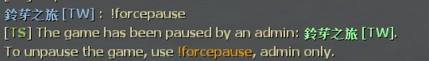

# Description | 內容
Allows admins to force the game to pause, only adm can unpause the game.

* Video | 影片展示
<br/>None

* Image | 圖示
	* Admin force the game to pause (管理員強制暫停遊戲)
	<br/>
	<br/>

* Require | 必要安裝
	1. [[INC] Multi Colors](https://github.com/fbef0102/L4D1_2-Plugins/releases/tag/Multi-Colors)

* <details><summary>ConVar | 指令</summary>

	* cfg/sourcemod/l4d2pause.cfg
		```php
		// Only allow the game to be paused by the forcepause command(Admin only).
		l4d2pause_forceonly "1"
		```
</details>

* <details><summary>Command | 命令</summary>

	* **Adm forces the game to pause/unpause (Adm required: ADMFLAG_ROOT)**
		```php
		sm_forcepause
		```
</details>

* Apply to | 適用於
	```
	L4D1
	L4D2
	```

* <details><summary>Related Plugin | 相關插件</summary>

	1. [lfd_noTeamSay](/lfd_noTeamSay): Redirecting all 'say_team' messages to 'say'
		> 沒有團隊聊天頻道只有公開聊天頻道
</details>

* <details><summary>Changelog | 版本日誌</summary>

	```php
	//pvtschlag @ 2009
	//HarryPotter @ 2019-2023
	```
	* v1.5 (2023-5-22)
		* The game would be unpaused if admin disconnects.

	* v1.4 (2023-3-14)
		* Optimize code

	* v1.3
		* Remake code
		* Only Adm can pause and unpause the gmae
		* Chat Color during pause
		* Fixed compatibility with plugin "lfd_noTeamSay" v2.2+ by HarryPotter

	* v0.2.1
		* [Original plugin by pvtschlag](https://forums.alliedmods.net/showthread.php?t=110029)
</details>

- - - -
# 中文說明
管理員可以強制暫停遊戲，也只有管理員能解除暫停

* 原理
	* 管理員輸入 !forcepause 強制暫停遊戲
	* 管理員輸入 !forcepause 解除暫停
	* 當發動暫停的管理員離開伺服器時，遊戲會自動解除暫停


