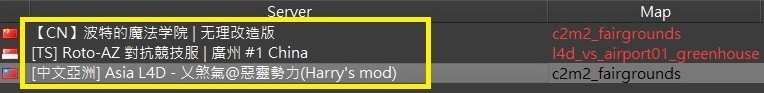
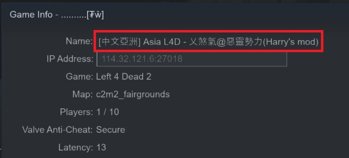
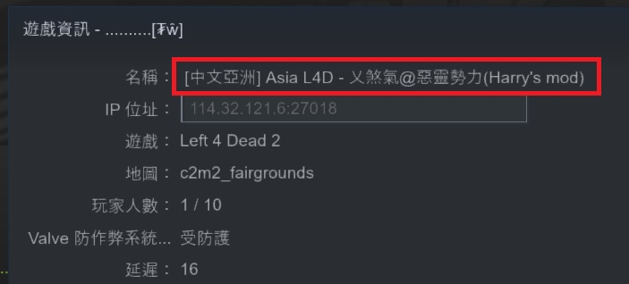

# Description | 內容
Server name with txt file (Support any language)

* Video | 影片展示
<br/>None

* Image | 圖示
	* Dynamic Host Name (Support any language)
        > 可以有中文房名
        <br/>

* Apply to | 適用於
	```
	L4D1
	L4D2
	```

* <details><summary>Changelog | 版本日誌</summary>

	* v1.7
        * By HarryPotter
</details>

* Require | 必要安裝
<br/>None

* <details><summary>ConVar | 指令</summary>

	* No cfg generated
		```php
		// League notice displayed on server name
		l4d_current_mode ""
		```
</details>

* <details><summary>Command | 命令</summary>

	None
</details>

* How to Modify Server Host Name
    1. Modify ```configs\hostname\server_hostname.txt```
        ```php
        [中文亞洲] Asia L4D - 乂煞氣@惡靈勢力
        ```
    2. Write down convar in cfg/server.cfg
        ```php
        //League notice displayed on server name (Empty=Disable)
        l4d_current_mode "Harry's mod"
        ```
    3. The Server name will change on map change or restart server
        ```php
        [中文亞洲] Asia L4D - 乂煞氣@惡靈勢力 (Harry's mod)
        ```
        

- - - -
# 中文說明
伺服器房名可以寫中文的插件

* 原理
	* 伺服器房名只能寫英文，裝上這個插件之後，伺服器房名可以寫中文

* 步驟
    1. 打開文件 ```configs\hostname\server_hostname.txt``` 並輸入房名 (可以寫中文)
        ```php
        [中文亞洲] Asia L4D - 乂煞氣@惡靈勢力
        ```
    2. 以下指令寫入 cfg/server.cfg
        ```php
        //房名之後的模式介紹，不可以寫中文 (可以留白)
        l4d_current_mode "Harry's mod"
        ```
    3. 等待伺服器重啟或換圖之後，房名會變成
        ```php
        [中文亞洲] Asia L4D - 乂煞氣@惡靈勢力 (Harry's mod)
        ```
        