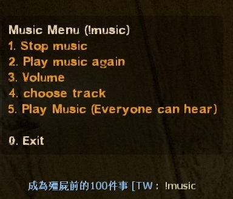
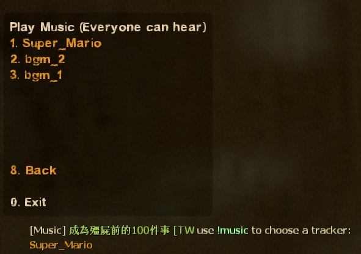
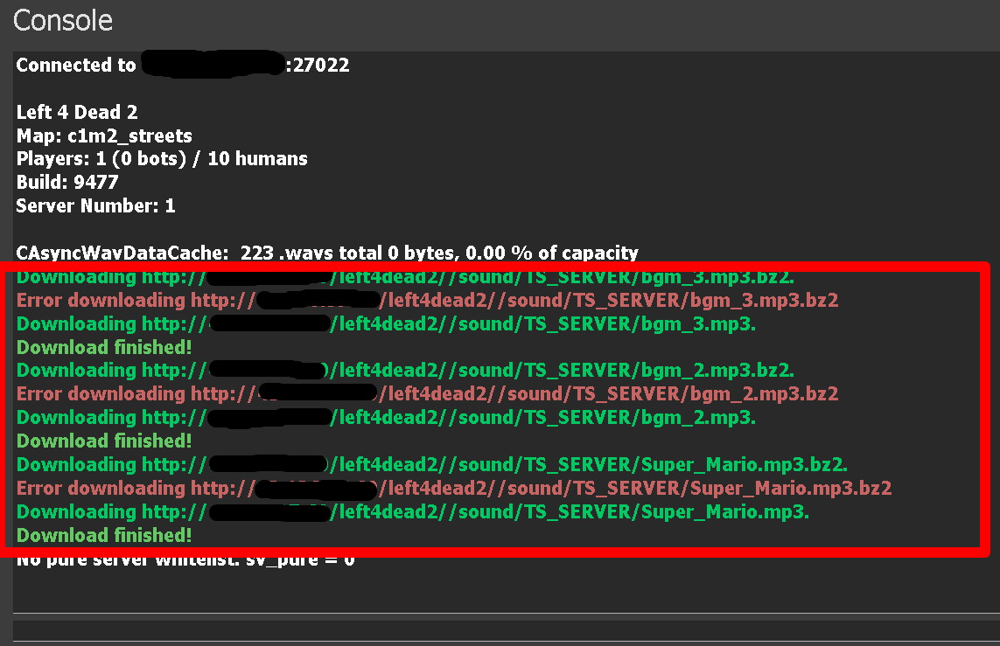
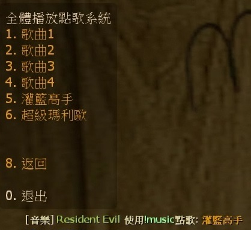
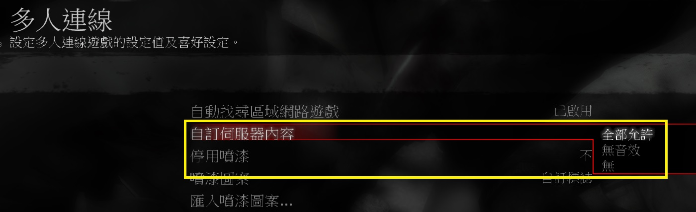

# Description | 內容
Download and play custom music in game

* Apply to | 適用於
	```
	L4D1
	L4D2
	```

* [Video | 影片展示](https://youtu.be/PqnBI-G-kOk)

* Image
	<br/>
	<br/>

* <details><summary>How does it work?</summary>

	* Play custom music when player joins server
	* Play custom music on new round starts.
	* Type ```!music``` to play custom music
</details>

* Require | 必要安裝
	1. 🟥 Prepare [your content-server for FastDL](https://developer.valvesoftware.com/wiki/FastDL), othersie this plugin will not work 
		* 🟥 需[自備網空且支援FastDL](https://developer.valvesoftware.com/wiki/Zh/FastDL)，否則此插件會無效 (不知道什麼是FastDL請自行Google)
	2. [[INC] Multi Colors](https://github.com/fbef0102/L4D1_2-Plugins/releases/tag/Multi-Colors)

* <details><summary>Support | 支援插件</summary>

	1. [l4d_force_client_custom_download](https://github.com/fbef0102/Game-Private_Plugin/tree/main/L4D_%E6%8F%92%E4%BB%B6/Player_%E7%8E%A9%E5%AE%B6/l4d_force_client_custom_download): Force player to download your server's custom content
		* 強制玩家打開設置下載伺服器自製的檔案
</details>

* <details><summary>ConVar | 指令</summary>

    * cfg/sourcemod/l4d_MusicMapStart.cfg
		```php
		// Delay (in sec.) playing the music to client after player joins server.
		l4d_music_mapstart_delay_joinserver "3.0"

		// Delay (in sec.) playing the music on round starts.
		l4d_music_mapstart_delay_roundstart "1.0"

		// How many random music files to download from 'data/music_mapstart.txt' each map. [0 - all at once]
		l4d_music_mapstart_download_number "3"

		// Enable plugin. (1 - On / 0 - Off)
		l4d_music_mapstart_enable "1"

		// Play the music to client after player joins server? (1 - Yes, 0 - No)
		l4d_music_mapstart_play_joinserver "1"

		// Play the music to everyone on round starts. (1 - Yes, 0 - No)
		l4d_music_mapstart_play_roundstart "1"

		// Players with these flags have access to play music that everyone can hear. (Empty = Everyone, -1: Nobody)
		l4d_music_mapstart_playmusic_access_flag ""

		// Time in seconds all players can not play music everyone can hear agagin from !music menu. (0=off)
		l4d_music_mapstart_playmusic_cooldown "3.0"

		// Show !music menu after player joins server? (1 - Yes, 0 - No)
		l4d_music_mapstart_showmenu_joinserver "0"

		// Show !music menu on round start? (1 - Yes, 0 - No)
		l4d_music_mapstart_showmenu_roundstart "1"
		```
</details>

* <details><summary>Command | 命令</summary>
    
	* **Music menu**
		```php
		sm_music
		```

	* **Turn off music when round start/join server**
		```php
		mp3off
		```

	* **Turn on music when round start/join server**
		```php
		mp3on
		```

	* **Update music list from config (Adm required: ADMFLAG_BAN)**
		```php
		sm_music_update
		```
</details>

* <details><summary>Data Example</summary>

	* [addons/sourcemod/data/music_mapstart.txt](addons/sourcemod/data/music_mapstart.txt)
		```php
		// "TS_SERVER/SLAM_DUNK.mp3" is the path of the MP3, relative to "sound" folder.
		// "SLAM_DUNK" is the song Name whatever you want
		TS_SERVER/SLAM_DUNK.mp3 TAG- SLAM_DUNK
		```
</details>

* <details><summary>How do I add music</summary>

	1. Preparation of mp3 files
		* File names
			* Ensure no file has space or special characters like "long dash" (–) or so.
		* Sample rate
			* All MP3 files must be encoded in 44100 Hz sample rate, otherwise it may not play at all.
			* To ensure, you can download [MP3 Quality Modifier tool](https://mp3-quality-modifier.en.softonic.com/download) and re-encode all files at once.

		* File size
			* Next, it is recommended every file will not be > 5 MB. in size (to improve download speed).
			* To decrease the size, sort all your files by size, send the files > 5 MB to above tool and re-encode them in 128 (or 192) Kbit/s bitrate (select "constant" mode first).

	2. Preparation the list
		* Download all files(addons and sound).
		* Put them in your game folder
    		* If L4D1, ```Left 4 Dead Dedicated Server/left4dead```
    		* If L4D2, ```Left 4 Dead 2 Dedicated Server/left4dead2```
		* Copy YOUR MP3 files to sound/TS_SERVER folder.
		* Add the path of the MP3 to the main config file [addons/sourcemod/data/music_mapstart.txt](addons/sourcemod/data/music_mapstart.txt). The path has to be put relative to the sound folder.
		* Prepare [your content-server for FastDL](https://developer.valvesoftware.com/wiki/FastDL), if you don't know what "FastDL" is, please google it

	3. Setup server to work with downloadable content
		* Write down in your ```cfg/server.cfg```:
			* If you are L4D1
				```php
				sm_cvar sv_allowdownload "1"
				sm_cvar sv_downloadurl "http://your-content-server.com/left4dead/"
				```
			* If you are L4D2
				```php
				sm_cvar sv_allowdownload "1"
				sm_cvar sv_downloadurl "http://your-content-server.com/left4dead2"	
				```

	4. Uploading files to server.
		* Upload "sound" folder to content-server
			* If you are L4D1, ```your-content-server.com/left4dead/sound/``` 
			* If you are L4D2, ```your-content-server.com/left4dead2/sound/```
		* Upload "sound" folder to your dedicated server.
    		* If you are L4D1, ```Left 4 Dead Dedicated Server/left4dead/sound/```
    		* If you are L4D2, ```Left 4 Dead 2 Dedicated Server/left4dead2/sound/```
		* Upload "sound" folder to your client's game folder (for test).
    		* If you are L4D1, ```left 4 dead/left4dead/sound/```
    		* If you are L4D2, ```Left 4 Dead 2/left4dead2/sound/```

	5. Start the server and test
		* Launch your game, Options-> Multiplayer -> CUSTOM SERVER CONTENT -> Allow All
		<br/>
		* Connect to server. 
		* Type ```!music``` in chatbox.

	6. Players should download dance files when connecting to your server (They need to set Options-> Multiplayer -> CUSTOM SERVER CONTENT -> Allow All)
		<br/>
</details>

* Translation Support | 支援翻譯
	```
	translations/MusicMapStart.phrases.txt
	```

* <details><summary>Changelog | 版本日誌</summary>

    * 1.5h (2024-1-8)
		* Improve Code

    * 1.4h (2022-11-16)
	    * Add new convars.
	    * say !mp3off to turn off round start music
	    * say !mp3on to turn on round start music
	    * list all songs in menu and you can play specific song.
	    * only one song will be downloaded to client each map or download all at once
	    * play song to client when joining server.
	    * player can choose a tracker from music menu(!music), all players can hear it.
		* Name your songs in data

    * v1.3
	    * [original plugin by Dragokas](https://forums.alliedmods.net/showthread.php?p=2644771)
</details>

- - - -
# 中文說明
回合開始播放音樂，使用!music點歌系統，可播放自製的音樂

* Image | 圖示
	<br/>
	<br/>

* 原理
    * 播放MP3歌曲，可以播放自製的音樂
	* 也可以輸入```!music```使用點歌系統，全體玩家能聽到

* <details><summary>指令中文介紹 (點我展開)</summary>

    * cfg/sourcemod/l4d_MusicMapStart.cfg
		```php
		// 玩家連線伺服器之後過多少秒才播放音樂
		l4d_music_mapstart_delay_joinserver "3.0"

		// 回合開始之後過多少秒才播放音樂
		l4d_music_mapstart_delay_roundstart "1.0"

		// 介面顯示的音樂歌曲數量 [0 - 介面顯示全部的音樂歌曲]
		// 每張關卡下載的音樂歌曲數量 [0 - 下載全部的音樂歌曲]
		l4d_music_mapstart_download_number "3"

		// 開啟此插件. (1 - 開啟 / 0 - 關閉)
		l4d_music_mapstart_enable "1"

		// 玩家連線伺服器之後播放音樂? (1 - 播放, 0 - 不播放)
		l4d_music_mapstart_play_joinserver "1"

		// 回合開始之後播放音樂? (1 - 播放, 0 - 不播放)
		l4d_music_mapstart_play_roundstart "1"

		// 有這些權限的人能使用點歌系統. (空白 = 任何人能使用, -1 = 無人能使用)
		l4d_music_mapstart_playmusic_access_flag ""

		// 點歌系統冷卻時間 (0=無冷卻時間)
		l4d_music_mapstart_playmusic_cooldown "3.0"

		// 玩家連線伺服器之後顯示!music介面? (1 - 顯示, 0 - 不顯示)
		l4d_music_mapstart_showmenu_joinserver "0"

		// 回合開始之後顯示!music介面? (1 - 顯示, 0 - 不顯示)
		l4d_music_mapstart_showmenu_roundstart "1"
		```
</details>

* <details><summary>命令中文介紹 (點我展開)</summary>

	* **顯示!music音樂介面**
		```php
		sm_music
		```

	* **關閉回合開始與連線音樂**
		```php
		mp3off
		```

	* **開啟回合開始與連線音樂**
		```php
		mp3on
		```

	* **刷新音樂列表Data文件 (管理員權限: ADMFLAG_BAN)**
		```php
		sm_music_update
		```
</details>

* <details><summary>Data設定範例</summary>
	
	* [addons/sourcemod/data/music_mapstart.txt](addons/sourcemod/data/music_mapstart.txt)
		```php
		// "TS_SERVER/SLAM_DUNK.mp3" 是MP3檔案路徑，不能有中文，相對於 "sound" 資料夾
		// "灌籃高手" 是歌曲名，可自己命名寫中文
		TS_SERVER/SLAM_DUNK.mp3 TAG- 灌籃高手
		```
</details>

* <details><summary>如何添加新音樂</summary>

	1. MP3文件的準備
		* 文件名
			* 確保沒有文件有空格或特殊字符，如"長破折號"(–) 等。
			* 不能有中文

		* 採樣率
			* 所有 MP3 文件必須以 44100 Hz 採樣率編碼，否則可能根本無法播放。
			* 為了確保，您可以下載 [MP3 質量修改器工具](https://mp3-quality-modifier.en.softonic.com/download) 並一次重新編碼所有文件。

		* 文件大小
			* 接下來，建議每個文件不要> 5 MB。大小（以提高下載速度）。
			* 要減小大小，請按大小對所有文件進行排序，將大於 5 MB 的文件發送到上述工具並以 128（或 192）Kbit/s 比特率重新編碼（首先選擇"恆定"模式）。

	2. 準備清單
		* 下載所有文件（addons和sound資料夾）。
		* 將它們放在伺服器資料夾中
    		* 如果你是 L4D1，```Left 4 Dead Dedicated Server/left4dead```
    		* 如果你是 L4D2，```Left 4 Dead 2 Dedicated Server/left4dead2```
		* 將您的 MP3 文件複製到 ```sound/TS_SERVER``` 資料夾。
		* 將音樂檔案的路徑添加到主配置文件[addons/sourcemod/data/music_mapstart.txt](addons/sourcemod/data/music_mapstart.txt)。路徑必須相對於sound資料夾，需寫上副檔名。
		* 準備[你的網空並可以支援FastDL](https://developer.valvesoftware.com/wiki/Zh/FastDL), 不知道什麼是FastDL請自行Google

	3. 設置服務器以處理可下載的內容
		* 寫入以下內容到```cfg/server.cfg```
			* 如果你是 L4D1
				```php
				sm_cvar sv_allowdownload "1"
				sm_cvar sv_downloadurl "http://your-content-server.com/left4dead/"
				```
			* 如果你是 L4D2
				```php
				sm_cvar sv_allowdownload "1"
				sm_cvar sv_downloadurl "http://your-content-server.com/left4dead2"	
				```

	4. 上傳文件到服務器
		* 將"sound" 資料夾上傳到網空服務器
			* 如果你是 L4D1，```your-content-server.com/left4dead/sound/```
			* 如果你是 L4D2，```your-content-server.com/left4dead2/sound/```
		* 將"sound" 資料夾上傳到您的伺服器資料夾。
    		* 如果你是 L4D1，```Left 4 Dead Dedicated Server/left4dead/sound/```
    		* 如果你是 L4D2，```Left 4 Dead 2 Dedicated Server/left4dead2/sound/```
		* 將"sound" 資料夾上傳到您的遊戲資料夾（用於測試）。
    		* 如果你是 L4D1，```left 4 dead/left4dead/sound/```
    		* 如果你是 L4D2，```Left 4 Dead 2/left4dead2/sound/```

	5. 啟動服務器並測試
		* 打開你的遊戲，選項->多人連線->自訂伺服器內容->全部允許
		<br/>
		* 連線到伺服器
		* 在聊天視窗輸入```!music```

	6. 玩家加入伺服器時，會自動下載自製的音樂檔案 (玩家必須自己打開選項->多人連線->自訂伺服器內容->全部允許)
		<br/>
</details>

> __Warning__ 切勿使用版權音樂以免觸法，請尊重智慧財產權，一切後果自負

