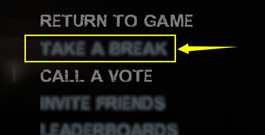
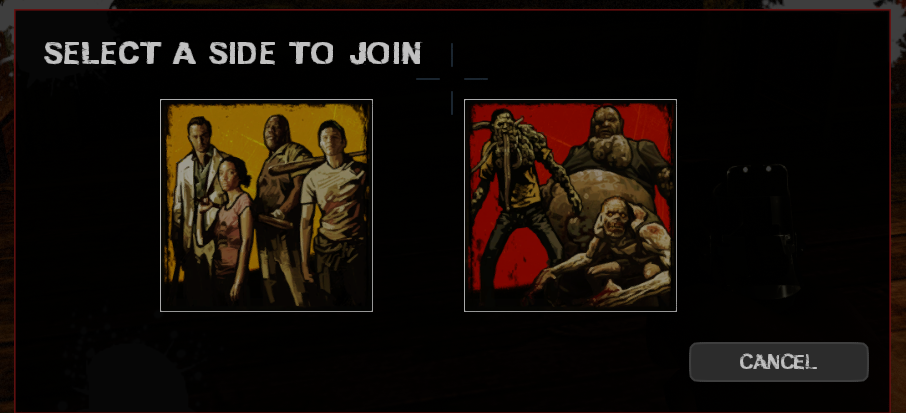
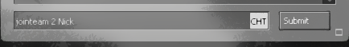
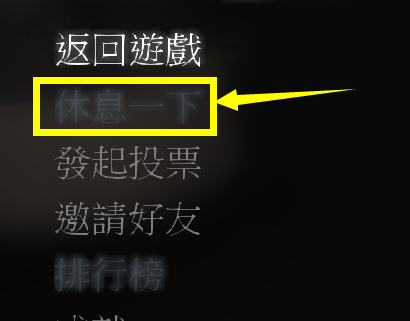
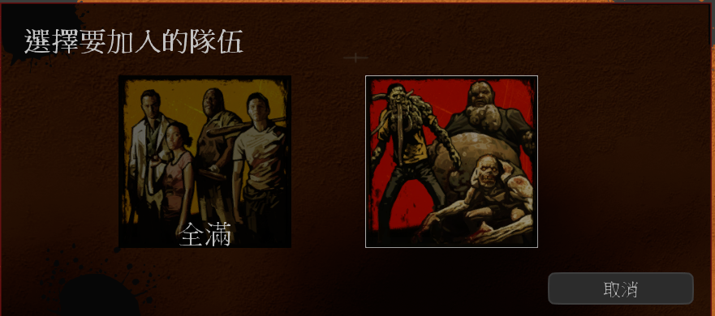
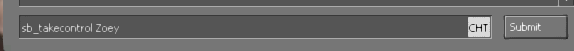

# Description | 內容
Adds commands to let the player spectate and join team. (!afk, !survivors, !infected, etc.), but no change team abuse.

* Video | 影片展示
<br>None

* <details><summary>Image</summary>

	* Control and block switch team behavior
		1. ESC->TAKE A BREAK
		<br/>
		2. Press M to switch team
		<br/>
		3. Type ```jointeam 2 <Nick|Ellis|Rochelle|Coach|Bill|Zoey|Francis|Louis>``` in game console
		<br/>
		4. Type ```sb_takecontrol <Nick|Ellis|Rochelle|Coach|Bill|Zoey|Francis|Louis>``` in game console
		<br/>
</details>

* <details><summary>How does it work?</summary>

	* Provide lots of command for players to switch team or spectate
	* Restrict the following actions
		1. ESC->Take a break
		2. Press M to choose team in versus/scavenge mode
		3. Type ```jointeam 2 <Nick|Ellis|Rochelle|Coach|Bill|Zoey|Francis|Louis>``` in server console
		4. Type ```sb_takecontrol <Nick|Ellis|Rochelle|Coach|Bill|Zoey|Francis|Louis>``` in server console
	* Player can not go idle or use command to switch team if the following situation, otherwise force to be spectator
		1. Startle witch or witch attacks you.
		2. Capped by special infected.
		3. Dead survivor.
		4. Player can not switch team after players have left start safe area for at least X seconds. (set time by convar)
		5. Cold Down Time in seconds a player can not change team again after he switches team.
		6. Cold Down Time in seconds a player can not change team after he ignites molotov, gas can, firework crate or barrel fuel.
		7. Cold Down Time in seconds a player can not change team after he throws molotov, pipe bomb or boomer juice.
		8. Reloading the weapon.
		9. Infected player can not change team when he has pounced/ridden/charged/smoked a survivor.
		10. Cold Down Time in seconds an infected player can not change team after he is spawned as a special infected.
		11. Team is unbalance in Versus/Scavenge Mode.
		12. Getting up or staggering animation.
		13. Firing the grenade launcher
		14. Covered with bile
	* 🟥 Start all 'block' limits once survivor has left the saferoom or survival/scavenge begins
</details>

* Require | 必要安裝
	1. [left4dhooks](https://forums.alliedmods.net/showthread.php?t=321696)
	2. [[INC] Multi Colors](https://github.com/fbef0102/L4D1_2-Plugins/releases/tag/Multi-Colors)
	3. [Actions](https://forums.alliedmods.net/showthread.php?t=336374)

* <details><summary>ConVar</summary>

	* cfg/sourcemod/l4d_afk_commands.cfg
		```php
		// Cold Down Time in seconds a player can not change team again after switches team. (0=off)
		l4d_afk_commands_changeteam_cooltime_block "10.0"

		// If 1, Dead Survivor player can not switch team.
		l4d_afk_commands_deadplayer_block "1"
		
		// Player can not switch team after players have left stat safe area for at least x seconds (0=off).
		l4d_afk_commands_during_game_seconds_block "0"

		// If 1, Player can not change team while capped by special infected.
		l4d_afk_commands_infected_attack_block "1"

		// If 1, Player can not change team if startles witch or while being attacked by witch.
		l4d_afk_commands_witch_attack_block "1"

		// Allow alive survivor player suicide by using '!zs' afte joining survivor team for at least X seconds. 
		// 0=Disable !zs
		l4d_afk_commands_suicide_allow_second "30.0"

		// If 1, Player can not change team while reloading the weapon.
		l4d_afk_commands_weapon_reload_block "1"

		// If 1, Player can not change team while getting up or staggering.
		l4d_afk_commands_getup_stagger_block "1"

		// If 1, Player can not change team while covered in bile.
		l4d_afk_commands_get_vomit_block "1"

		// If 1, Player can not change team after throwing molotov, pipe bomb or boomer juice. (0=off).
		l4d_afk_commands_throwable_block "1"

		// (L4D2) If 1, Player can not change team after firing the grenade launcher (0=off).
		l4d_afk_commands_grenade_block "1"

		// Cold Down Time in seconds a player can not change team after ignites molotov, gas can, firework crate or barrel fuel. (0=off).
		l4d_afk_commands_igniteprop_cooltime_block "15.0"

		// If 1, Block player from using 'jointeam' command in consoe. (This also blocks player from switching team by choosing team menu)
		l4d_afk_commands_pressM_block "1"

		// If 1, Block player from using 'go_away_from_keyboard' comand in console. (This also blocks player from going idle with 'esc->take a break')
		l4d_afk_commands_takeabreak_block "0"

		// If 1, Block player from using 'sb_takecontrol' command in console.
		l4d_afk_commands_takecontrol_block "1"

		// If 1, Infected player can not change team while pouncing/ridding/charging/pulling a survivor.
		l4d_afk_commands_infected_cap_block "1"

		// Cold Down Time in seconds an infected player can not change team after spawned alive (Not ghost, 0=off).
		l4d_afk_commands_infected_spawn_cooltime_block "10.0"
		
		// Players with these flags have immune to all 'block' limit(Empty = Everyone, -1: Nobody)
		l4d_afk_commands_immune_block_flag "-1"
		
		// Players with these flags have access to use command to spctator team. (Empty = Everyone, -1: Nobody)
		l4d_afk_commands_spec_access_flag ""
		
		// Players with these flags have access to use command to inected team. (Empty = Everyone, -1: Nobody)
		l4d_afk_commands_infected_access_flag ""
		
		// Players with these flags have access to use command to suvivor team. (Empty = Everyone, -1: Nobody)
		l4d_afk_commands_survivor_access_flag ""
		
		// Players with these flags have access to use command to be an observer. (Empty = Everyone, -1: Nobody)
		l4d_afk_commands_observer_access_flag "z"
		
		// If 1, Check team balance when player tries to use commandto join survivor/infected team in versus/scavenge.\nIf team is unbanlance, will fail to join team!
		l4d_afk_commands_versus_teams_balance_enable "1"
		
		// Teams are unbalanced when one team has this many more players than the other team in versus/scavenge.
		l4d_afk_commands_versus_teams_unbalance_limit "2"
		```
</details>

* <details><summary>Command</summary>
	
	* **Change team to Spectate**
		```php
		sm_afk
		sm_s
		sm_away
		sm_idle
		sm_spectate
		sm_spec
		sm_spectators
		sm_joinspectators
		sm_joinspectator
		sm_jointeam1
		sm_js
		```

	* **Change team to Survivor**
		```php
		sm_join
		sm_bot
		sm_jointeam
		sm_survivors
		sm_survivor
		sm_sur
		sm_joinsurvivors
		sm_joinsurvivor
		sm_jointeam2
		sm_jg
		sm_takebot
		sm_takeover
		```

	* **Change team to Infected**
		```php
		sm_infected
		sm_inf
		sm_joininfected
		sm_joininfecteds
		sm_jointeam3
		sm_zombie
		```

	* **Switch team to fully an observer**
		```php
		sm_observer
		sm_ob
		sm_observe
		```

	* **Survivor Player Suicides**
		```php
		sm_zs
		```

	* **Adm force player to change team (Adm Required: ADMFLAG_BAN)**
		* teamnum is 1,2,3. 1=Spectator, 2=Survivor, 3=Infected
			```php
			sm_swapto <player1> [player2] ... [playerN] <teamnum> - swap all listed players to <teamnum> (1,2, or 3)
			```
</details>

* Apply to | 適用於
	```
	L4D1
	L4D2
	```

* <details><summary>Translation Support | 支援翻譯</summary>

	```
	English
	繁體中文
	简体中文
	Russian
	Hungarian
	```
</details>

* <details><summary>Related Plugin | 相關插件</summary>

	1. [l4d_team_unscramble](https://github.com/fbef0102/Game-Private_Plugin/tree/main/Plugin_%E6%8F%92%E4%BB%B6/Versus_%E5%B0%8D%E6%8A%97%E6%A8%A1%E5%BC%8F/l4d_team_unscramble): Puts players on the right team after map/campaign change and provides API.
		* 換圖或者換關卡之後，將玩家還原到上次所在的隊伍
</details>

* <details><summary>Changelog | 版本日誌</summary>

	* v5.4 (2024-10-10)
		* Block team switch when survivor is coverd with bile
		* Update translation
		* Update cvars

	* v5.3 (2024-10-9)
		* Block team switch when QueuedPummel

	* v5.2 (2024-4-30)
		* Update translation

	* v5.1 (2023-11-25)
		* Fixed go_away_from_keyboard (esc -> take a break) not working

	* v5.0 (2023-9-19)
		* Block team switch when firing the grenade launcher
		* Can not switch team if player have stumbled witch or witch have touched player

	* v4.9 (2023-8-23)
		* Update left4dhooks v1.135 or above

	* v4.8 (2023-5-22)
		* Support l4d2 all mutation mode

	* v4.7 (2023-5-7)
		* Player can not change team while he is getting up or staggering.

	* v4.6 (2023-5-6)
		* Add more cvars
			```php
			// If 1, Check team balance when player tries to use command to join survivor/infected team in versus/scavenge.
			// If team is unbanlance, will fail to join team!
			l4d_afk_commands_versus_teams_balance_enable "1"

			// Teams are unbalanced when one team has this many more players than the other team in versus/scavenge.
			l4d_afk_commands_versus_teams_unbalance_limit "2"
			```
		* Update Translation files

	* v4.5 (2022-12-28)
		* Add 1 cvar "l4d_afk_commands_weapon_reload_block". Player can not change team when he is reloading the weapon.

	* v4.4
		* [AlliedModder Post](https://forums.alliedmods.net/showpost.php?p=2719702&postcount=32)
		* Remake Code
		* Add translation support.
		* Update L4D2 "The Last Stand" gamedata, credit to [Lux](https://forums.alliedmods.net/showthread.php?p=2714236)
		* Add more convar and limit to prevent players from changing team abuse.
		* Add more commands
		* No change team abuse
		* Player can go idle even if alone in server
		* Allow alive survivor player suicides by using '!zs'
		* Adm Command ```sm_swapto <player> <team>```, Adm forces player to swap team
		* Compatible with [r2comp_unscramble](https://forums.alliedmods.net/showthread.php?t=327711)
		* Remove gamedata

	* v1.2
		* [Original Plugin By MasterMe](https://forums.alliedmods.net/showthread.php?p=1130434)
</details>

- - - -
# 中文說明
提供多種命令轉換隊伍陣營 (譬如: !afk, !survivors, !infected), 但不可濫用.

* 原理
	* 提供加入倖存者陣營、特感陣營、旁觀者陣營的命令
	* 此插件會禁止玩家濫用閒置的bug，譬如
		1. 導致witch失去目標
		2. 省略裝子彈時間、硬直狀態、起身動畫
		3. 逃避特感抓住造成的傷害
		4. 特感故意切換旁觀省略下次的靈魂特感復活時間
		5. 死亡倖存者玩家跳隊重新拿到活著的倖存者Bot
		6. 遊戲開始後故意跳隊到對面擾亂對方隊伍
		7. 玩家頻繁換隊洗頻伺服器
	* 在對抗/清道夫模式中，檢查雙方隊伍的真人玩家數量，如果雙方隊伍數量不平衡則切換隊伍會失敗

* <details><summary>注意事項</summary>

	* 此插件會限制玩家切換隊伍的行為包括
		1. ESC->休息一下
		<br/>
		2. 對抗模式下按M切換隊伍
		<br/>
		3. 控制台輸入```jointeam 2 <Nick|Ellis|Rochelle|Coach|Bill|Zoey|Francis|Louis>```
		<br/>
		4. 控制台輸入```sb_takecontrol <Nick|Ellis|Rochelle|Coach|Bill|Zoey|Francis|Louis>```
		<br/>
	* 盡量不要安裝其他也有換隊指令的插件，否則換隊衝突後果自負
	* 有以下情況不能使用命令換隊，否則強制旁觀
		1. 嚇到Witch或者Witch正在攻擊你
		2. 被特感抓住的期間
		3. 你已經是死亡的倖存者
		4. 離開安全區域或是生存模式計時開始一段時間之後 (查看指令設置的時間)
		5. 換隊之後短時間內不能換第二次
		6. 點燃汽油桶、煙火盒、燃油桶一段時間內
		7. 丟出火瓶、土製炸彈、膽汁瓶一段時間內
		8. 武器正在裝子彈
		9. 特感抓住倖存者的期間
		10. 特感剛復活的時候
		11. 對抗/清道夫模式下檢查雙方隊伍的玩家數量，隊伍不平衡則不能換隊
		12. 起身或硬直狀態中禁止換隊
		13. 玩家發射榴彈期間禁止換隊
		14. 膽汁淋在身上 (防止略過被噴的綠色螢幕)
	* 🟥 遊戲開始之後所有關於切換隊伍的限制才會生效
		* 離開安全區域
		* 生存模式計時開始
</details>

* <details><summary>指令中文介紹 (點我展開)</summary>

	* cfg/sourcemod/l4d_afk_commands.cfg
		```php
		// 切換換隊成功之後的10秒內不能隨意切換隊伍，否則強制旁觀 (0=關閉這項功能)
		l4d_afk_commands_changeteam_cooltime_block "10.0"

		// 為1時，死亡的倖存者玩家不可以切換隊伍
		l4d_afk_commands_deadplayer_block "1"

		// 倖存者離開安全室超過X秒之後，所有玩家不能隨意切換隊伍 (0=關閉這項功能).
		l4d_afk_commands_during_game_seconds_block "0"

		// 為1時，當倖存者被特感抓住期間禁止換隊
		l4d_afk_commands_infected_attack_block "1"

		// 為1時，倖存者驚嚇Witch或被Witch攻擊期間不可切換隊伍
		l4d_afk_commands_witch_attack_block "1"

		// 加入倖存者30秒之後才能使用指令!zs自殺
		// 0=禁止使用指令!zs自殺
		l4d_afk_commands_suicide_allow_second "30.0"

		// 為1時，倖存者裝彈期間不可切換隊伍
		l4d_afk_commands_weapon_reload_block "1"

		// 為1時，起身或硬直狀態中禁止換隊
		l4d_afk_commands_getup_stagger_block "1"

		// 為1時，倖存者被膽汁淋在身上時禁止換隊
		l4d_afk_commands_get_vomit_block "1"

		// 為1時，倖存者投擲火瓶、土製炸彈、膽汁瓶期間禁止換隊
		l4d_afk_commands_throwable_block "1"

		// (僅限L4D2) 為1時，發射榴彈發射器期間，禁止換隊
		l4d_afk_commands_grenade_block "1"

		// 倖存者點燃火瓶、汽油桶、煙火盒、燃油桶的15秒內不能隨意切換隊伍，否則強制旁觀 (0=關閉這項功能).
		l4d_afk_commands_igniteprop_cooltime_block "15.0"

		// 為1時，禁止玩家在控制台輸入 'jointeam' 指令. (同時禁用玩家使用M按鍵換隊)
		l4d_afk_commands_pressM_block "1"

		// 為1時，禁止玩家在控制台輸入 'go_away_from_keyboard' 指令. (同時禁用玩家使用 ESC-休息一下)
		l4d_afk_commands_takeabreak_block "0"

		// 為1時，禁止玩家在控制台輸入 'sb_takecontrol' 指令
		l4d_afk_commands_takecontrol_block "1"

		// 為1時，當特感抓住倖存者期間禁止換隊
		l4d_afk_commands_infected_cap_block "1"

		// 特感復活後的10秒內不能隨意切換隊伍，否則強制旁觀. (0=關閉這項功能)
		l4d_afk_commands_infected_spawn_cooltime_block "10.0"

		// 擁有這些權限的管理員不會受到此插件的換隊限制影響 (留白 = 任何人都不會受到限制, -1: 所有人都會受到限制)
		l4d_afk_commands_immune_block_flag "-1"

		// 擁有這些權限的管理員可以使用指令切換到旁觀者陣營. (留白 = 任何人都可以切換, -1: 禁止所有人切換)
		l4d_afk_commands_spec_access_flag ""

		// 擁有這些權限的管理員可以使用指令切換到特感陣營. (留白 = 任何人都可以切換, -1: 禁止所有人切換)
		l4d_afk_commands_infected_access_flag ""

		// 擁有這些權限的管理員可以使用指令切換到倖存者陣營. (留白 = 任何人都可以切換, -1: 禁止所有人切換)
		l4d_afk_commands_survivor_access_flag ""

		// 擁有這些權限的管理員可以使用指令成為完全旁觀者. (留白 = 任何人都可以切換, -1: 禁止所有人切換)
		l4d_afk_commands_observer_access_flag "z"

		// 為1時，在對抗/清道夫模式中，檢查雙方隊伍的真人玩家數量並平衡
		// 如果雙方隊伍數量不平衡則切換隊伍會失敗
		l4d_afk_commands_versus_teams_balance_enable "1"

		// 在對抗/清道夫模式中，雙方隊伍的真人玩家數量差距超過2位以上時，則視為不平衡
		l4d_afk_commands_versus_teams_unbalance_limit "2"
		```
</details>

* <details><summary>命令中文介紹 (點我展開)</summary>
	
	* **切換到旁觀者陣營 (戰役模式下會變成閒置狀態)**
		```php
		sm_afk
		sm_s
		sm_away
		sm_idle
		sm_spectate
		sm_spec
		sm_spectators
		sm_joinspectators
		sm_joinspectator
		sm_jointeam1
		sm_js
		```

	* **切換到倖存者陣營 (戰役模式下會變成閒置狀態)**
		```php
		sm_join
		sm_bot
		sm_jointeam
		sm_survivors
		sm_survivor
		sm_sur
		sm_joinsurvivors
		sm_joinsurvivor
		sm_jointeam2
		sm_jg
		sm_takebot
		sm_takeover
		```

	* **切換到特感陣營**
		```php
		sm_infected
		sm_inf
		sm_joininfected
		sm_joininfecteds
		sm_jointeam3
		sm_zombie
		```

	* **成為完全旁觀者 (倖存者玩家如果要成為旁觀者而非閒置狀態則輸入這些指令)**
		```php
		sm_observer
		sm_ob
		sm_observe
		```

	* **倖存者自殺，可以使用指令關閉這項功能**
		```php
		sm_zs
		```

	* **管理員強制該位玩家切換到指定的隊伍 (權限: ADMFLAG_BAN)**
		```php
		// <隊伍數字>請寫1或2或3
		// 1=旁觀者，2=倖存者，3=特感
		sm_swapto <玩家名稱> <隊伍數字>
		```

		或

		```php
		// 一次將這些玩家切換到指定的隊伍
		sm_swapto <玩家1 名稱> <玩家2 名稱> ... <玩家N 名稱> <隊伍數字>
		```
</details>