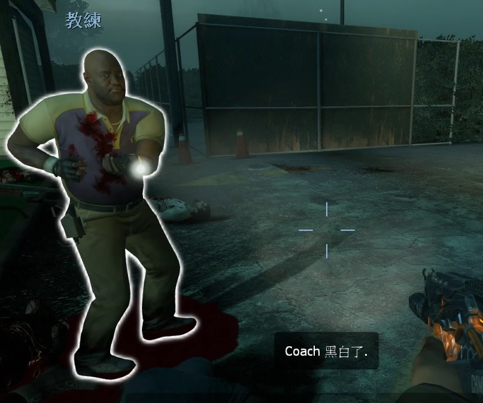

# Description | 內容
Notify people when player is black and white.

* Video | 影片展示
<br/>None

* Image | 圖示
	* display who is black and white
	> 顯示哪個玩家黑白
	<br/>

* Apply to | 適用於
```
L4D1
L4D2
```

* <details><summary>Changelog | 版本日誌</summary>

    ```php
	//DarkNoghri @ 2009-2010
	//Harry @ 2022
    ```
	* v1.7 (2022-11-03)
        * Remake Code
        * Rmove white glow when player is not black and white
        * Add Glow cvars
	
    * v1.31
        * [By DarkNoghri](https://forums.alliedmods.net/showthread.php?p=951787)
</details>

* Require | 必要安裝
<br/>None

* Similar Plugin | 相似插件
	1. [LMC_Black_and_White_Notifier](https://github.com/fbef0102/L4D2-Plugins/tree/master/LMC_Black_and_White_Notifier): Notifies selected team(s) when someone is on final strike and add glow
		> 顯示誰是黑白狀態，有更多的提示與支援LMC模組

* <details><summary>ConVar | 指令</summary>

	* cfg/sourcemod/l4d_blackandwhite.cfg
	```php
    // (L4D2 only) 0=turns black&white glow off, 1=turns glow on.
    l4d_bandw_glow "0"

    // 0 turns notifications off, 1 notifies survivors, 2 notifies all, 3 notifies infected.
    l4d_bandw_notice "1"

    // 0 prints to chat, 1 displays hint box.
    l4d_bandw_type "1"

    // (L4D2 only) color of black&white glow, split up with 
    thirdstrike_glow_color "255 255 255"

    // (L4D2 only) max black&white glow range 
    thirdstrike_glow_range "1600"
	```
</details>

* <details><summary>Command | 命令</summary>
	None
</details>

- - - -
# 中文說明
誰是黑白狀態(最後一條生命)

* 原理
	* 救起玩家之後判定玩家是否為黑白狀態
    * 支援其他恢复玩家血量的插件

* 功能
	* 可設置光圈顏色與範圍 (只有二代才能)