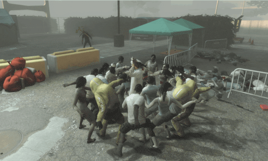
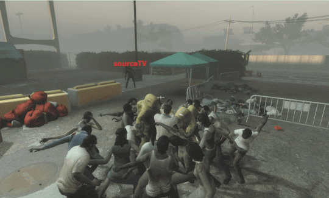
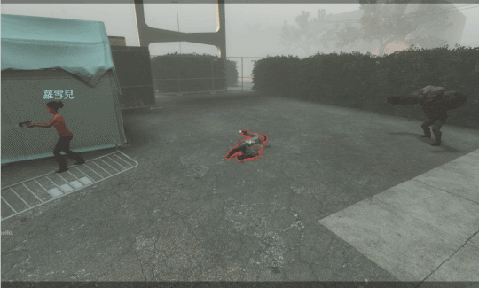
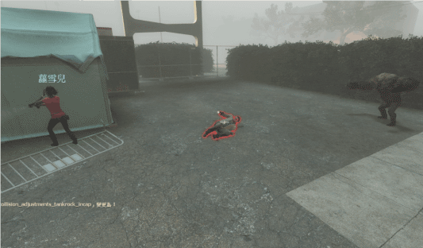
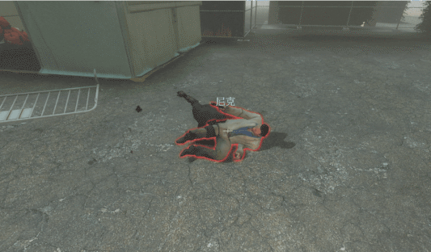
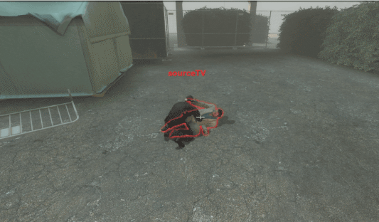
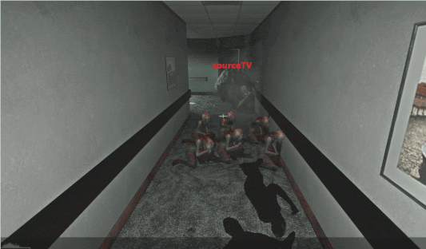
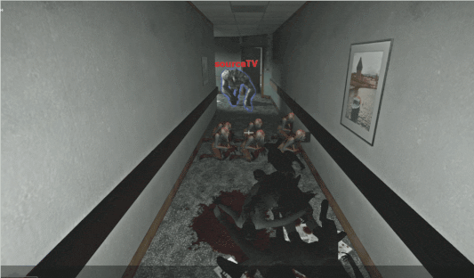
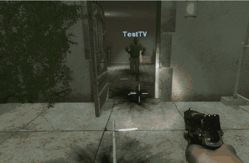
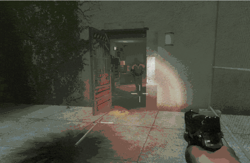

# Description | 內容
No collisions to fix a handful of silly collision bugs in l4d

* Apply to | 適用於
    ```
    L4D1
    L4D2
    ```

* [Video | 影片展示](https://youtu.be/Jj04A73AYk0)

* Image | 圖示
    | Before (裝此插件之前)  			| After (裝此插件之後) |
    | -------------|:-----------------:|
    | ||
    | ||
    | ||
    | || 
    | || 

* Require | 必要安裝
    1. [left4dhooks](https://forums.alliedmods.net/showthread.php?t=321696)
    2. [collisionhook](https://github.com/fbef0102/Collisionhook/releases)

* <details><summary>How does it work?</summary>

    * Remove collision
        1. Rocks can go through Common Infected (and also kill them)
        2. Pulled Survivors can go through Common Infected
        3. Rocks can go through Incapacitated Survivors (Won't go through new incaps caused by the Rock)
        4. Hunter can go through incapacitated survivor (Prevent hunter stuck inside incapacitated survivor, still can pounce them)
        5. Special infected and Tank can go through witch (Prevent stuck and stagger)
        6. (L4D1) Commons can go through Witch (Prevent commons from pushing witch)
        7. To fix the bug where survivor and special infected can push pipebomb projectiles
</details>

* <details><summary>ConVar | 指令</summary>

    * cfg/sourcemod/l4d_collision_adjustments.cfg
        ```php
        // If 1, Hunter can go through incapacitated survivor (Prevent hunter stuck inside incapacitated survivor, still can pounce them)
        l4d_collision_adjustments_hunter_incap "1"

        // If 1, Special infected and Tank can go through witch (Prevent stuck and stagger)
        l4d_collision_adjustments_si_witch "1"

        // If 1, Pulled Survivors can go through Common Infected
        l4d_collision_adjustments_smoker_common "1"

        // If 1, Rocks can go through Common Infected (and also kill them) instead of possibly getting stuck on them
        l4d_collision_adjustments_tankrock_common "1"

        // If 1, Rocks can go through Incapacitated Survivors? (Won't go through new incaps caused by the Rock)
        l4d_collision_adjustments_tankrock_incap "1"

        // (L4D1) If 1, Commons can go through Witch (Prevent commons from pushing witch in l4d1)
        l4d_collision_adjustments_common_witch "1"

        // If 1, Fix the bug where survivor and special infected can push pipebomb projectiles
        l4d_collision_adjustments_client_pipebomb "1"
        ```
</details>

* <details><summary>Changelog | 版本日誌</summary>

    * v1.1h (2026-2-11)
        * Update cvars
        * Add a fix: Fix the bug where survivor and special infected can push pipebomb projectiles

    * v1.0h (2025-7-25)
        * Update cvars
        * Removed more silly collisions  

    * Original
        * Credit: [SirPlease/L4D2-Competitive-Rework](https://github.com/SirPlease/L4D2-Competitive-Rework/blob/master/addons/sourcemod/scripting/l4d2_collision_adjustments.sp)
</details>

- - - -
# 中文說明
改善一些愚蠢的實體碰撞造成的問題

* 原理
    * 移除碰撞改善以下
        1. Hunter剛起身飛撲的時候不會與倒地的倖存者卡住
        2. 特殊感染者與Tank可以穿越Witch (不會擋路)
        3. 被Smoker拉走的倖存者不會被小殭屍擋路
        4. Tank的石頭可以穿透小殭屍 (依然殺死他們)
        5. Tank的石頭可以穿透倒地的倖存者
        6. (限L4D1) 小殭屍可以穿越Witch (不會擋路)
        7. 修復玩家走路就能推擠地上的土製炸彈

* <details><summary>指令中文介紹 (點我展開)</summary>

    * cfg/sourcemod/l4d_collision_adjustments.cfg
        ```php
        // 為1時，Hunter剛起身飛撲的時候不會與倒地的倖存者卡住
        l4d_collision_adjustments_hunter_incap "1"

        // 為1時，特殊感染者與Tank可以穿越Witch (不會擋路)
        l4d_collision_adjustments_si_witch "1"

        // 為1時，被Smoker拉走的倖存者不會被小殭屍擋路
        l4d_collision_adjustments_smoker_common "1"

        // 為1時，Tank的石頭可以穿透小殭屍 (依然殺死他們)
        l4d_collision_adjustments_tankrock_common "1"

        // 為1時，Tank的石頭可以穿透倒地的倖存者
        l4d_collision_adjustments_tankrock_incap "1"

        // (L4D1) 為1時，小殭屍可以穿越Witch (不會擋路)
        l4d_collision_adjustments_common_witch "1"

        // 為1時，修復玩家走路就能推擠地上的土製炸彈
        l4d_collision_adjustments_client_pipebomb "1" 
        ```
</details>
