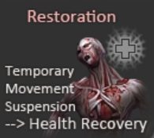

# Description | 內容
The zombies have grown stronger, now they are able to heal their injuries by standing still without receiving any damage.

* [Video | 影片展示](https://youtu.be/nlPU6Xz0xWQ)

* Image | 圖示
    * Idea comes from [Counter Strike Online Zombie Regeneration](https://cso.fandom.com/wiki/Zombie_2:_Mutation#Regeneration)
    <br/>
    <br/>

* Require | 必要安裝
<br/>None

* <details><summary>ConVar | 指令</summary>

    * cfg\sourcemod\l4d_cso_zombie_regeneration.cfg
        ```php
        // 0=Plugin off, 1=Plugin on.
        l4d_cso_zombie_regeneration_allow "1"

        // Boomer recover hp per second. (0=off)
        l4d_cso_zombie_regeneration_boomer_hp "10"

        // Charger recover hp per second. (0=off)
        l4d_cso_zombie_regeneration_charger_hp "80"

        // Hunter recover hp per second. (0=off)
        l4d_cso_zombie_regeneration_hunter_hp "40"

        // Jockey recover hp per second. (0=off)
        l4d_cso_zombie_regeneration_jockey_hp "50"

        // Turn off the plugin in these maps, separate by commas (no spaces). (0=All maps, Empty = none).
        l4d_cso_zombie_regeneration_map_off ""

        // Turn on the plugin in these game modes, separate by commas (no spaces). (Empty = all).
        l4d_cso_zombie_regeneration_modes ""

        // Turn off the plugin in these game modes, separate by commas (no spaces). (Empty = none).
        l4d_cso_zombie_regeneration_modes_off ""

        // Turn on the plugin in these game modes. 0=All, 1=Coop, 2=Survival, 4=Versus, 8=Scavenge. Add numbers together.
        l4d_cso_zombie_regeneration_modes_tog "0"

        // Smoker recover hp per second. (0=off)
        l4d_cso_zombie_regeneration_smoker_hp "10"

        // CSO Zombie Regeneration - Self Healing file (relative to to sound/, empty=disable)
        l4d_cso_zombie_regeneration_soundfile "ui/beep07.wav"

        // Spitter recover hp per second. (0=off)
        l4d_cso_zombie_regeneration_spitter_hp "5"

        // Tank recover hp per second. (0=off)
        l4d_cso_zombie_regeneration_tank_hp "200"

        // Seconds needed to stand still before health recovering.
        l4d_cso_zombie_regeneration_wait_time "4"
        ```
</details>

* <details><summary>Command | 命令</summary>

    None
</details>

* Apply to | 適用於
    ```
    L4D1
    L4D2
    ```

* <details><summary>Related Plugin | 相關插件</summary>

    1. [l4d2_supply_woodbox](https://github.com/fbef0102/L4D2-Plugins/tree/master/l4d2_supply_woodbox): Supply boxes are dropped randomly in the map every certain seconds to provide support for the fight against the zombies.
        * 地圖上隨機出現補給箱，提供人類強力支援 (仿CSO惡靈降世 補給箱)

    2. [weapon_csgo_reload](https://github.com/fbef0102/L4D2-Plugins/tree/master/l4d2_weapon_csgo_reload): Weapon Quickswitch Reloading in L4D1+2
        * 將武器改成現代遊戲的裝子彈機制 (仿CS:GO切槍裝彈設定)

    3. [l4d2_cso_knockback](https://github.com/fbef0102/Game-Private_Plugin/tree/main/L4D_插件/Nothing_Impossible_無理改造版/l4d2_cso_knockback): Weapons and Melees now have knockback power like CSO
        * 槍械與近戰武器現在有擊退力 (仿CSO惡靈降世)
</details>

* <details><summary>Changelog | 版本日誌</summary>

    * v1.4 (2024-2-6)
        * Optimize Code

    * v1.3 (2022-7-17)
        * Game mode check

    * v1.2 (2022-6-10)
        * Fixed entity error when no map is running

    * v1.1 (2022-2-11)
        * Add Tank hp check in l4d1 versus mode

    * v1.0 (2021-8-29)
        * [Initial release](https://forums.alliedmods.net/showthread.php?t=334089)
</details>

- - - -
# 中文說明
殭屍變得更強大，他們只要站著不動便可以自癒傷勢　(仿CSO惡靈降世 殭屍技能)

* 原理
    * 只要特感不動三秒鐘之後，便能每秒恢复自身血量，一旦走動或受到傷害便會停止自癒
    * 靈感來自CSO 殭屍模式，在這款遊戲中殭屍可以自癒傷勢

* 功能
    * 可調整每個種類的特感恢复血量
    * 可調整自癒音效
