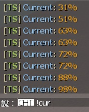

# Description | 內容
Print survivor progress in flow percents

* Apply to | 適用於
	```
	L4D1
	L4D2
	```

* Image | 圖示
	* Distances of the map [1%-100%] - 人類目前的地圖距離路程 [1%-100%]
	<br/>

* Require | 必要安裝
	1. [left4dhooks](https://forums.alliedmods.net/showthread.php?t=321696)
	2. [[INC] Multi Colors](https://github.com/fbef0102/L4D1_2-Plugins/releases/tag/Multi-Colors)

* <details><summary>Command | 命令</summary>

	* **Print survivor progress in flow percents only you can see**
		```php
		sm_cur
		sm_current
		```
</details>

* <details><summary>Related Plugin | 相關插件</summary>

	1. [versusbosses_ifier](https://github.com/fbef0102/Game-Private_Plugin/tree/main/L4D_插件/Versus_%E5%B0%8D%E6%8A%97%E6%A8%A1%E5%BC%8F/versusbosses_ifier): Sets a tank and witch spawn point on every map in versus + Makes Versus Boss Spawns obey cvars
		> 對抗模式下每一張地圖挑選隨機路程生成一隻Tank與一個Witch
	2. [coopbosses_ifier](https://github.com/fbef0102/Game-Private_Plugin/tree/main/L4D_插件/Versus_%E5%B0%8D%E6%8A%97%E6%A8%A1%E5%BC%8F/versusbosses_ifier): Sets a tank and witch spawn point on every map in coop mode
		> 戰役模式下每一張地圖挑選隨機路程生成一隻Tank與一個Witch
</details>

* <details><summary>Changelog | 版本日誌</summary>

	* v2.5
		* Optimize code

	* v2.4
		* Remake Code
		* Support coop/realism mode

	* v2.0.2
		* [From SirPlease/L4D2-Competitive-Rework](https://github.com/SirPlease/L4D2-Competitive-Rework/blob/master/addons/sourcemod/scripting/current.sp)
</details>

- - - -
# 中文說明
使用指令顯示人類目前的路程

* 原理
	* 地圖從起點安全室到終點安全室之間路程百分比
		* 0%代表人類目前在起點安全室
		* 95%代表人類快要到終點安全室
	* 最後一關則是從起點安全室到救援區域之間路程百分比
		* 0%代表人類目前在起點安全室
		* 95%代表人類快要到救援區域

* 功能
    * 輸入```!cur```顯示路程