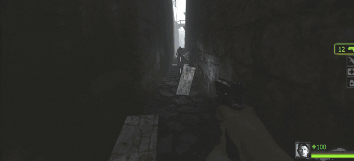
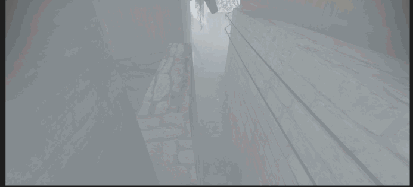

# Description | 內容
Survivors won't take any damage when server is playing map cutscenes

* Apply to | 適用於
	```
	L4D1
	L4D2
	```

* [Video | 影片展示](https://youtu.be/7cb02yta74w)

* Image | 圖示
	| Before (裝此插件之前)  			| After (裝此插件之後) |
	| -------------|:-----------------:|
	| ||

* <details><summary>How does it work?</summary>

	* During map cutscene
		* Survivors won't take any damage from common infected, special infected, witch and tank
		* All special infecteds are unable to pin survivors
		* No Firendly fire
		* Inlucde Intro cutscene, Mid-Game cutscene
	* You can disable this plugin in some custom maps, see [data/l4d_cutscene_nodamage.cfg](data/l4d_cutscene_nodamage.cfg)
		* Manual in this file, click for more details...
</details>

* Require | 必要安裝
	1. [left4dhooks](https://forums.alliedmods.net/showthread.php?t=321696)

* <details><summary>ConVar | 指令</summary>

	* cfg/sourcemod/l4d_cutscene_nodamage.cfg
		```php
		// 0=Plugin off, 1=Plugin on.
		l4d_cutscene_nodamage_enable "1"
		```
</details>

* <details><summary>Changelog | 版本日誌</summary>

	* v1.0 (2026-5-17)
		* Initial Release
</details>

- - - -
# 中文說明
播放地圖的過場動畫時，倖存者不會受傷

* 原理
	* 播放地圖的過場動畫時
		* 倖存者不會受到殭屍/Witch/Tank/特感的傷害
		* 特感無法控倖存者
		* 不會受到友傷
		* 含開頭動畫與中途的地圖動畫
	* 可以修改文件在三方圖關閉此插件: [data/l4d_cutscene_nodamage.cfg](data/l4d_cutscene_nodamage.cfg)
		* 內有中文說明，可點擊查看

* <details><summary>ConVar | 指令</summary>

	* cfg/sourcemod/l4d_cutscene_nodamage.cfg
		```php
		// 0=關閉插件, 1=啟動插件
		l4d_cutscene_nodamage_enable "1"
		```
</details>