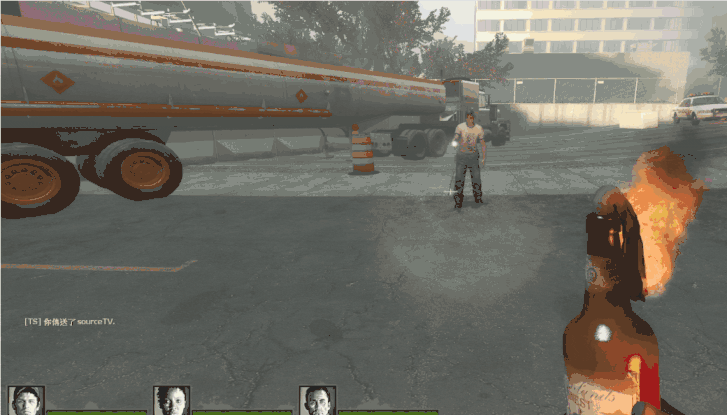

# Description | 內容
Block exploit damage by player, ex: throw molotov and change team to infected

* Apply to | 適用於
    ```
    L4D1
    L4D2
    ```

* [Video | 影片展示](https://youtu.be/_1styaS93Zc)

* Image | 圖示
    | Before (裝此插件之前)  			| After (裝此插件之後) |
    | -------------|:-----------------:|
    | ||

* Require | 必要安裝
    1. [left4dhooks](https://forums.alliedmods.net/showthread.php?t=321696)

* <details><summary>How does it work?</summary>

    * Block damage to survivor if
        1. Throw molotov and then change team to infected or disconnect from server
        2. Throw pipebomb and then change team to infected or disconnect from server
        3. Shoot the grenade launcher and then change team to infected or disconnect from server
    * Other Modify
        1. Spit damage will not belong to tank player while spitter takes over tank's control 
</details>

* <details><summary>ConVar | 指令</summary>

    * cfg/sourcemod/l4d_exploit_dmg_block.cfg
        ```php
        // 0=Plugin off, 1=Plugin on.
        l4d_exploit_dmg_block_enable "1"
        ```
</details>

* <details><summary>Changelog | 版本日誌</summary>

    * v1.0 (2025-7-25)
        * Initial Release
</details>

- - - -
# 中文說明
防止惡意玩家的友軍傷害

* 原理
    * 以下傷害，倖存者不會受傷
        1. 丟火瓶之後跑去特感隊伍或離開遊戲
        2. 丟土製炸彈之後跑去特感隊伍或離開遊戲
        3. 榴彈發射器發射之後跑去特感隊伍或離開遊戲
    * 其他修改
        1. 如果Spitter玩家吐出酸液之時變成Tank，酸液傷害不會計算給Tank

* <details><summary>指令中文介紹 (點我展開)</summary>

    * cfg/sourcemod/l4d_exploit_dmg_block.cfg
        ```php
        // 0=關閉插件, 1=啟動插件
        l4d_exploit_dmg_block_enable "1"
        ```
</details>
