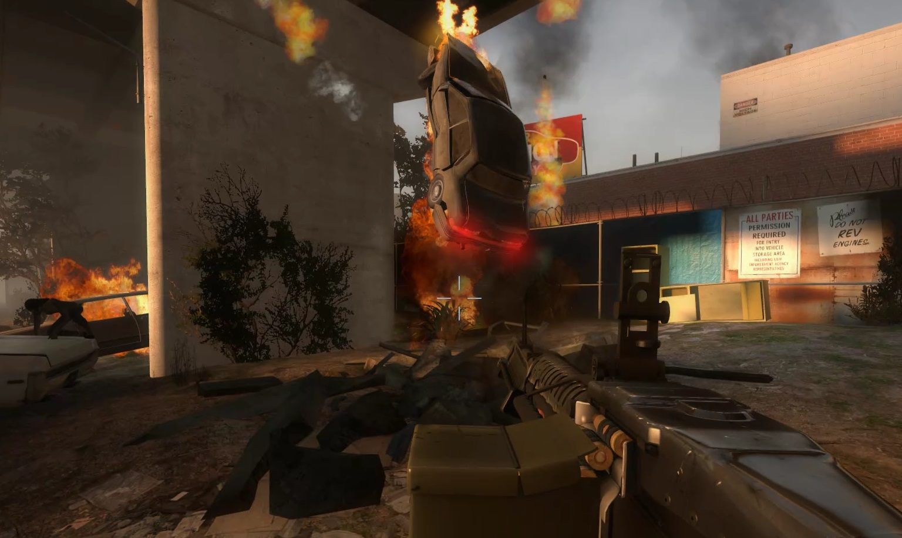

# Description | 內容
Cars explode after they take some damage

* [Video | 影片展示](https://youtu.be/B_-pOplOML4)

* Image
	* Cars Explosions
		> 車子連環爆
		<br/>

* Apply to | 適用於
    ```
    L4D1
    L4D2
    ```

* <details><summary>Changelog | 版本日誌</summary>

	```php
	//honorcode23 @ 2010-2011
	//HarryPotter @ 2021-2023
	```
	* v2.2 (2023-5-28)
		* Use ```z_spawn mob auto``` instead of L4D_ForcePanicEvent()
		
	* v2.1 (2023-2-14)
		* Support L4D1

	* v2.0
		* [AlliedModder post](https://forums.alliedmods.net/showpost.php?p=2751903&postcount=217)
		* Remake code
		* Replace left4downtown with left4dhooks
		* Remove car entity after it explodes
		* Fixed damage dealt to car
		* Safely create entity and safely remove entity
		* Safely explode cars between few secomds to prevent client from crash

    * v1.0.4
        * [Original Plugin by honorcode23](https://forums.alliedmods.net/showthread.php?p=1304463)
</details>

* Require | 必要安裝
	1. [left4dhooks](https://forums.alliedmods.net/showthread.php?t=321696)

* <details><summary>ConVar | 指令</summary>

	* cfg/sourcemod/l4d_explosive_cars.cfg
        ```php
		// Damage made by the explosion
		l4d_explosive_cars_damage "10"

		// Should cars get damaged by another car's explosion?
		l4d_explosive_cars_explosion_damage "1"

		// Maximum health of the cars
		l4d_explosive_cars_health "5000"

		// Should infected trigger the car explosion? (1: Yes 0: No)
		l4d_explosive_cars_infected "1"

		// Should the car explosion cause a panic event? (1: Yes 0: No)
		l4d_explosive_cars_panic "1"

		// Chance that the cars explosion might call a horde (1 / CVAR) [1: Always]
		l4d_explosive_cars_panic_chance "5"

		// (L4D2 only) Power of the explosion when the car explodes
		l4d_explosive_cars_power "300"

		// Maximum radius of the explosion
		l4d_explosive_cars_radius "420"

		// Time to wait before removing the exploded car in case it blockes the way. (0: Don't remove)
		l4d_explosive_cars_removetime "60"

		// How much damage do the tank deal to the cars? (0: Default, which is 999 from the engine)
		l4d_explosive_cars_tank "0"

		// Time before the fire trace left by the explosion expires
		l4d_explosive_cars_trace "25"

		// How often should the fire trace left by the explosion hurt?
		l4d_explosive_cars_trace_interval "0.4"

		// On which maps should the plugin disable itself? separate by commas (no spaces). (Example: c5m3_cemetery,c5m5_bridge)
		l4d_explosive_cars_unload "c5m3_cemetery,c5m5_bridge"
        ```
</details>

* <details><summary>Command | 命令</summary>

	None
</details>

- - - -
# 中文說明
車子爆炸啦!

* 原理
	* 地圖上可以移動的車子如果受到一定程度的傷害，將會爆炸，並震飛周圍的倖存者
    * 地圖上某些車子不能移動也就不能爆炸，認真你就輸了

* 功能
	* 可設置爆炸所產生的傷害
	* 可設置爆炸範圍
	* 可設置車子爆炸之後過一段時間自動移除 (避免擋住地圖路線)
	* 可設置爆炸威力 (倖存者飛得越遠)
	* 爆炸是否引發屍潮與機率
	* 可設置特定的地圖開關

