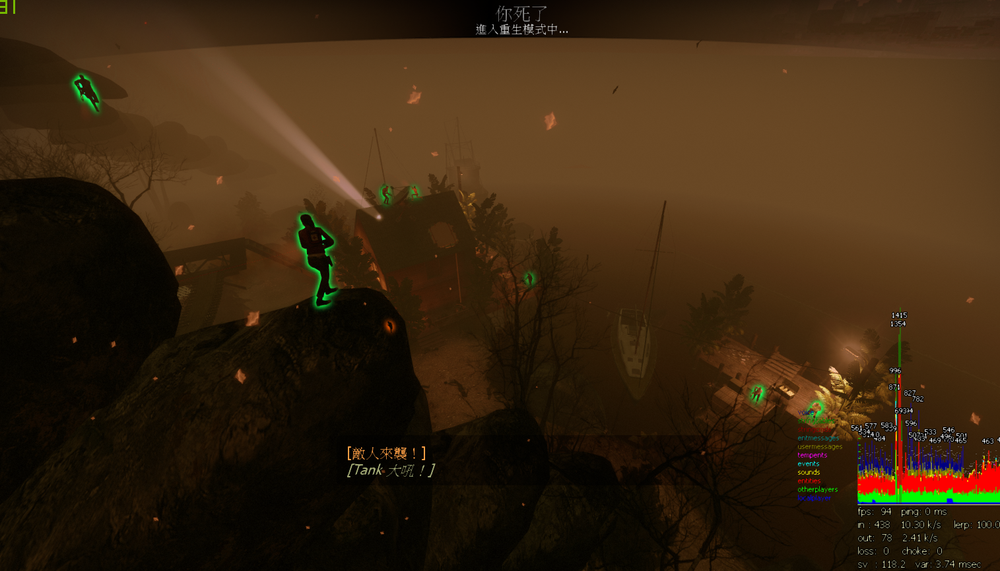

# Description | 內容
Set client gravity after final rescue starts just for fun.

* Video | 影片展示
<br/>None

* Image | 圖示
    <br/>
    <br/>
    <br/>
    <br/>

* Require | 必要安裝
<br/>None

* <details><summary>ConVar | 指令</summary>

    * cfg\sourcemod\l4d_final_rescue_gravity.cfg
        ```php
        // 0=Plugin off, 1=Plugin on.
        l4d_final_rescue_gravity_allow "1"

        // Turn on the plugin in these game modes, separate by commas (no spaces). (Empty = all).
        l4d_final_rescue_gravity_modes ""

        // Turn off the plugin in these game modes, separate by commas (no spaces). (Empty = none).
        l4d_final_rescue_gravity_modes_off ""

        // Turn on the plugin in these game modes. 0=All, 1=Coop, 2=Survival, 4=Versus, 8=Scavenge. Add numbers together.
        l4d_final_rescue_gravity_modes_tog "0"

        // Turn off the plugin in these maps, separate by commas (no spaces). (Empty = none).
        l4d_final_rescue_gravity_map_off "c5m5_bridge;c13m4_cutthroatcreek"

        // Set Gravity value. (1.0=Normal, >1.0=High, <1.0=Low)
        l4d_final_rescue_gravity_value "0.25"

        // 為1時，change all clients' gravity to normal when finale vehicle is coming.
        l4d_final_rescue_gravity_escape_ready_off "1"

        // (L4D2)Which zombie class can also obtain the gravity, 0=None, 1=Smoker, =Boomer, 4=Hunter, 8=Spitter, 16=Jockey, 32=Charger, 64=Tank. Add numbers together.
        l4d_final_rescue_gravity_infected_class "127"

        // (L4D1)Which zombie class can also obtain the gravity, 0=None, 1=Smoker, 2=Boomer, 4=Hunter, 8=Tank. Add numbers together.
        l4d_final_rescue_gravity_infected_class "15"

        // Interval (in sec.) to set gravity for client
        l4d_final_rescue_gravity_interval "2"
        ```
</details>

* <details><summary>Command | 命令</summary>

    None
</details>

* Apply to | 適用於
    ```
    L4D1
    L4D2
    ```

* <details><summary>Changelog | 版本日誌</summary>

    * v1.7 (2023-7-27)
        * Fix warnings when compiling on SourceMod 1.11.

    * v1.6 (2022-8-12)
        * Add finale_start, finale_radio_start, gauntlet_finale_start events

    * v1.5 (2022-2-1)
        * fix spectator gravity issue

    * v1.4 (2021-1-23)
        * fix "PostSpawnActivate"

    * v1.3 (2020-11-16)
        * replace event "finale_escape_start" with  event "finale_vehicle_ready"

    * v1.2 (2020-7-30)
        * add convar "l4d_final_rescue_gravity_interval"

    * v1.1 (2020-7-25)
        * improve code

    * v1.0 (2020-7-20)
        * Initial release
</details>

- - - -
# 中文說明
救援開始之後，所有人重力變低，可以跳很高

* 原理
    * 救援開始之後，人類與特感重力都變低，跳躍力變高
    * 可以跳到平常不能跳的地方守屍潮

* 用在意哪?
    * 好玩而創造的

* <details><summary>指令中文介紹 (點我展開)</summary>

    * cfg\sourcemod\l4d_final_rescue_gravity.cfg
        ```php
        // 0=關閉插件, 1=啟動插件.
        l4d_final_rescue_gravity_allow "1"

        // 什麼模式下啟動此插件, 逗號區隔 (無空白). (留白 = 所有模式)
        l4d_final_rescue_gravity_modes ""

        // 什麼模式下關閉此插件, 逗號區隔 (無空白). (留白 = 無)
        l4d_final_rescue_gravity_modes_off ""

        // 什麼模式下啟動此插件. 0=所有模式, 1=戰役, 2=生存, 4=對抗, 8=清道夫. 請將數字相加起來
        l4d_final_rescue_gravity_modes_tog "0"

        // 在這些地圖上關閉插件，逗號區隔 (無空白). (留白=無).
        l4d_final_rescue_gravity_map_off "c5m5_bridge;c13m4_cutthroatcreek"

        // 設定重力值. (1.0=正常, >1.0=超重力, <1.0=低重力)
        l4d_final_rescue_gravity_value "0.25"

        // 為1時，當救援載具來臨時，所有玩家重力回復正常
        l4d_final_rescue_gravity_escape_ready_off "1"

        // (L4D2) 那些特感能獲得重力, 0=無, 1=Smoker, =Boomer, 4=Hunter, 8=Spitter, 16=Jockey, 32=Charger, 64=Tank. 將數字相加起來
        l4d_final_rescue_gravity_infected_class "127"

        // (L4D1) 那些特感能獲得重力, 0=無, 1=Smoker, 2=Boomer, 4=Hunter, 8=Tank. 將數字相加起來
        l4d_final_rescue_gravity_infected_class "15"

        // 每兩秒檢查玩家的重力值狀態
        l4d_final_rescue_gravity_interval "2"
        ```
</details>


