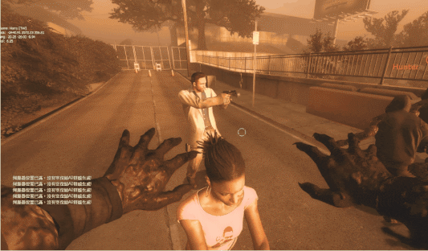
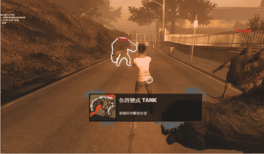

# Description | 內容
Fix bugs if not enough slots to spawn bots to take over + Kick Previously human-controlled SI bots

* Apply to | 適用於
    ```
    L4D1
    L4D2
    ```

* [Video | 影片展示](https://youtu.be/WBGd2RREg6s)

* Image | 圖示
    | Before (裝此插件之前)  			| After (裝此插件之後) |
    | -------------|:-----------------:|
    | ||
    | ||

* Require | 必要安裝
    1. [l4dtoolz](https://github.com/fbef0102/Game-Private_Plugin/tree/main/Tutorial_教學區/English/Server/Install_Other_File#l4dtoolz): To unlock more than 18 server slots limit
        * [l4dtoolz 中文安裝](https://github.com/fbef0102/Game-Private_Plugin/blob/main/Tutorial_教學區/Chinese_繁體中文/Server/安裝其他檔案教學#安裝l4dtoolz): 解鎖伺服器人數上限，有八位以上的玩家可以進入伺服器遊玩
    2. [left4dhooks](https://forums.alliedmods.net/showthread.php?t=321696)

* <details><summary>How does it work?</summary>

    * 🟦**Highly recommand to install this plugin if you are hosting 10v10 or 20+ players servers**
    * The following bugs ONLY happen when server slots reachs max limit
        1. Real survivor player changes team, but server is unable to spawn a bot to take over
            - (Bug) All weapons equipped disapper, survivor removed
            - (After fix) All weapons equipped dropped on the ground, survivor removed
        2. Real infected player changes team or become tank, but server is unable to spawn a bot to take over
            - (Bug) If the survivor was pinned by infected, he will get stuck and can't move forever, infected disapper
            - (After fix) Force infected suicide, release the pinned survivor, infected disapper
        3. Real tank player changes team or loses control, but server is unable to spawn a bot to take over
            - (Bug) Tank disapper
            - (After fix) Force tank to suicide
    * Kick infected bots after bots replace real infected player
        * To make server clear more slots
        * Won't kick tank bot
</details>

* <details><summary>ConVar | 指令</summary>

    * cfg/sourcemod/l4d_full_slot_bot_replace_fix.cfg
        ```php
        // 0=Plugin off, 1=Plugin on.
        l4d_full_slot_bot_replace_fix_enable "1"

        // How long should we wait before kicking infected bots after bots replace infected player ? (Won't kick tank bot)
        // 0: Don't Kick
        l4d_full_slot_bot_replace_fix_kick_delay "0"
        ```
</details>

* <details><summary>Changelog | 版本日誌</summary>

    * v1.1h (2025-11-8)
        * Drop hidden secondary weapon if survivor is incap

    * v1.0h (2025-7-25)
        * Initial Release
   
    * Thanks
        * [jensewe](https://github.com/jensewe): provides gamedata signature
</details>

- - - -
# 中文說明
修復伺服器客戶端已滿的狀態下無法生成Bot取代玩家所造成的嚴重問題

* 原理
    * 🟦**強烈推薦在多特感多玩家的伺服器下安裝此插件**
    * 以下情況只有在伺服器玩家人數已達上限的情況下發生
        1. 當真人玩家倖存者然後要切換陣營時，會有bot生成並取代倖存者，但因為伺服器滿位子，bot生成失敗
            - (Bug) 導致倖存者直接消失，連同身上的武器與物資直接消失
            - (插件修復) 倖存者依然消失，身上的武器與物資會掉落在地上
        2. 活著的特感然後要切換陣營或變成Tank時，會有bot生成並取代特感，但因為伺服器滿位子，bot生成失敗
            - (Bug) 導致特感直接消失，如果有控到倖存者，倖存者會卡住永遠無法動彈
            - (插件修復) 特感依然消失，如果有控到倖存者，則幫倖存者解除控制
        3. 作為活著的Tank失去控制權時，會有bot生成並取代Tank，但因為伺服器滿位子，bot生成失敗
            - (Bug) 導致Tank直接消失
            - (插件修復) Tank強制自殺
    * 當Bot成功取代真人特感之後，將AI特感踢出伺服器
        * 為了騰出伺服器位子空間
        * 不會踢AI Tank

* <details><summary>指令中文介紹 (點我展開)</summary>

    * cfg/sourcemod/l4d_full_slot_bot_replace_fix.cfg
        ```php
        // 0=關閉插件, 1=啟動插件
        l4d_full_slot_bot_replace_fix_enable "1"

        // AI Bot取代真人特感玩家之後延遲多久踢掉 ? (不會踢AI Tank)
        // 0: 不踢
        l4d_full_slot_bot_replace_fix_kick_delay "0"
        ```
</details>
