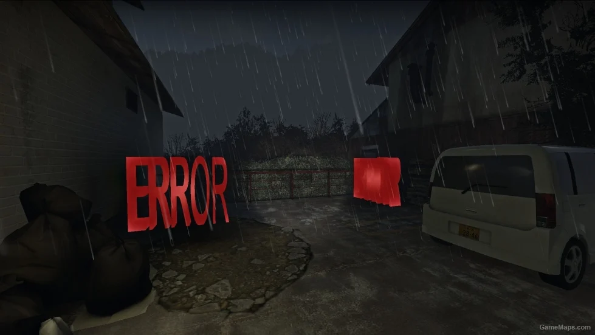

# Description | 內容
Precaches Game Files To Prevent Crashes. + Prevents late precache of specific models

* Video | 影片展示
<br>None

* Image | 圖示
	* Try to prevent crash "UTIL_SetModel": not precached" - 嘗試解決崩潰 "找不到模組"
    <br/>

* Require | 必要安裝
<br/>None

* <details><summary>ConVar | 指令</summary>

	None
</details>

* <details><summary>Command | 命令</summary>

	None
</details>

* Apply to | 適用於
	```
	L4D1
	L4D2
	```

* <details><summary>Related Plugin | 相關插件</summary>

	1. [Late Model Precacher by Psyk0tik](https://forums.alliedmods.net/showthread.php?p=2776517): Catches unprecached models and tries to precache them to prevent crashes.
    	* 在遊戲中途檢測缺失的模型並緩存載入
</details>

* <details><summary>Changelog | 版本日誌</summary>

	```php
	//cravenge @ 2016
	//HarryPotter @ 2022-2023
	```
	* v1.0h (2023-1-19)
        * Remake Code
		* Add More models and Precache 
		* Prevents late precache of specific models

	* v1.8
        * [Original Plugin by cravenge](https://forums.alliedmods.net/showthread.php?t=291408)
</details>

- - - -
# 中文說明
預先載入所有可能會缺失的模組避免伺服器崩潰

* 功能
    * 裝上這個插件後，每次切換地圖時，自動載入很多常用的模型
		1. 一二代倖存者模型、倖存者手臂模型
		2. 所有武器模型
		3. 所有近戰武器模型、近戰武器腳本
		4. 膽汁瓶、可樂、精靈小矮人模型
		5. 火焰包、高爆彈模型
		6. 特殊感染者模型、Tank模型、Witch模型(包含新娘)
		7. 特殊一般感染者模型
		8. 汽油桶、瓦斯罐、煙火盒模型
		9. 車子模型
		10. 子彈模型
		11. 物件碎片的模型(窗戶、木箱、木板、紙碎片、碎石頭)

* Q&A
	* <details><summary><b>甚麼是模組缺失，為甚麼伺服器會崩潰?</b></summary>

		
		* 在這款遊戲當中，地圖上生成特感、感染者、近戰武器、障礙物都必須要有外觀模型，如果這個模型沒有被地圖事先載入並緩存，伺服器將會崩潰，出現模型缺失的訊息
		* 在地圖載入的時候，如果地圖上有大量的物件要使用會載入很久
		* 每次切換地圖，所有緩存的模型會消失並需要重新載入模型
	</details>

	* <details><summary><b>何時會發生模型缺失的問題?</b></summary>

		* 三方圖作者忘記載入模型，譬如沒有載入小刀模型卻在地圖上生成小刀
		* 插件作者忘記載入模型，譬如安裝了不良的插件生成墮落生還者卻沒有載入墮落生還者的模型
		* 錯誤的模型或不存在，小刀的模型使用空白或不存在的檔案 (地圖出現Error)
		
		* 在[The passing官方地圖第一關](https://youtu.be/WvtBeYD6i24?t=88)當中，強制用作弊代碼生成witch會導致崩潰，原因是該關卡只有新娘Witch模型沒有普通的Witch模型(2019年大更新已修正) 
	</details>

	* <details><summary><b>把模型全部載入就不會缺失了吧?</b></summary>

		* 這款遊戲光是模型就有上萬種檔案，不可能一張地圖內載入所有模組並緩存，況且伺服器有限制的
		* 大量使用模型會導致地圖lag、卡頓
	</details>
