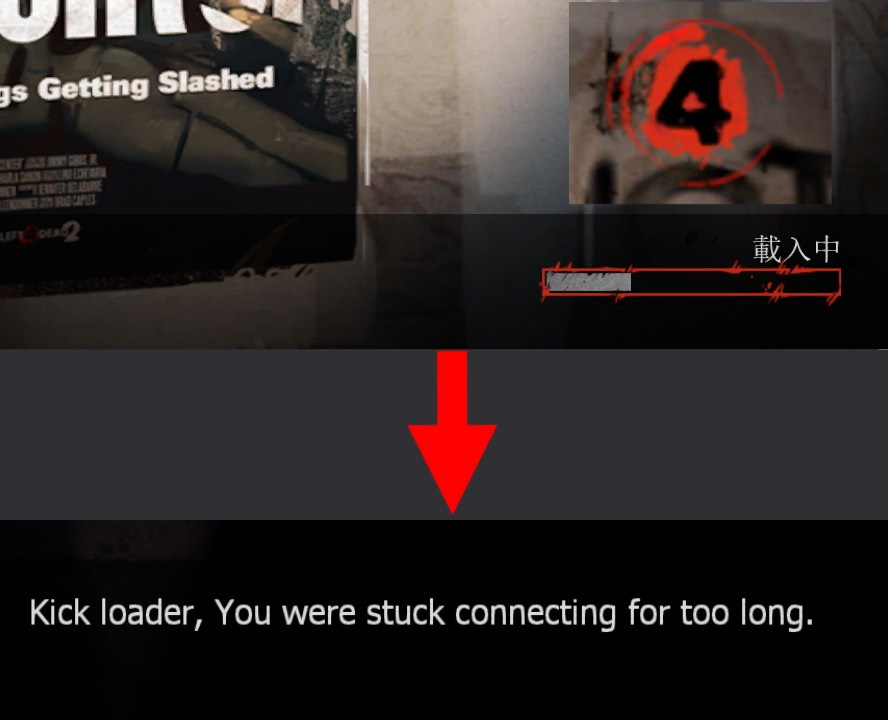

# Description | 內容
Kicks Clients that get stuck in server connecting state

* Video | 影片展示
<br/>None

* Image | 圖示
	* Kick slowass connecting players
        > 踢出loading太久的慢郎中
	    <br/>

* Apply to | 適用於
    ```
    L4D1
    L4D2
    ```

* <details><summary>Changelog | 版本日誌</summary>

	```php
	//AtomicStryker @ 2009-2012
	//HarryPotter @ 2022-2023
	```
	* v1.3 (2023-6-9)
		* Remake code, convert code to latest syntax
		* Fix warnings when compiling on SourceMod 1.11.
		* Optimize code and improve performance
		* Add cvars

	* v1.0.8
        * [Original Plugin by AtomicStryker](https://forums.alliedmods.net/showthread.php?t=103203)
</details>

* Require | 必要安裝
<br/>None

* <details><summary>ConVar | 指令</summary>

	* cfg/sourcemod/l4d_kickloadstuckers.cfg
        ```php
		// How long before a connected but not ingame player is kicked. (default 150) 
		l4d_kickloadstuckers_duration "150"

		// Players with these flags have immune to be kicked. (Empty = Everyone, -1: Nobody)
		l4d_kickloadstuckers_immune_access_flag "z"
		```
</details>

* <details><summary>Command | 命令</summary>

	* **Kicks everyone Connected but not ingame (Adm required: ADMFLAG_KICK)**
		```php
		sm_kickloading
		sm_kickloader
		```
</details>

- - - -
# 中文說明
踢出卡Loading連線中的玩家

* 原理
    * 當玩家連線伺服器時開始計時，超過150秒還在loading的玩家將會被視為慢郎中，立即踢出伺服器
    * 管理員不會被踢

* 用意在哪?
	* 即使是2009年的遊戲，依然會有玩家連線伺服器時載入地圖超久
	* 玩家換圖的時候崩潰，但是其steam帳號依然顯示在連線中
	* 連線中的玩家會佔用伺服器的位子，把這些烏龜都踢掉

* 功能
	* 可調整計時時間
	* 可設置免疫被踢的權限