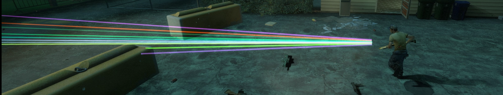

# Description | 內容
Shows a laser for straight-flying fired projectiles

* [Video | 影片展示](https://youtu.be/JnBM7GyYdGI)

* Image | 圖示
	* Laser when player shoots
        > 子彈光線
	    <br/>

* Apply to | 適用於
```
L4D1
L4D2
```

* <details><summary>Changelog | 版本日誌</summary>

	```php
	//Whosat @ 2010-2011
	//HarryPotter @ 2022
	```
	* v0.3 (2022-12-5)
        * Remake Code
		* Add Cvars to enable random colors
		* Support [Ready up plugin](https://github.com/fbef0102/Game-Private_Plugin/tree/main/Plugin_%E6%8F%92%E4%BB%B6/Server_%E4%BC%BA%E6%9C%8D%E5%99%A8/readyup), enable laser tag during ready-up

	* v0.2 (2021-8-29)
        * [Original Plugin by Whosat](https://forums.alliedmods.net/showthread.php?t=129050)
</details>

* Require | 必要安裝
<br/>None

* Related Plugin | 相關插件
	1. [l4d_dynamic_muzzle_flash](https://github.com/fbef0102/Game-Private_Plugin/tree/main/Plugin_%E6%8F%92%E4%BB%B6/Real_Realism_%E7%9C%9F%E5%AF%AB%E5%AF%A6%E6%A8%A1%E5%BC%8F/l4d_dynamic_muzzle_flash): Adds dynamic muzzle flash to gunfire
    * 槍口增加逼真的閃光

* <details><summary>ConVar | 指令</summary>

	* cfg\sourcemod\l4d_lasertag.cfg
		```php
		// Transparency (Alpha) of Laser
		l4d_lasertag_alpha "100"

		// Amount of Blue
		l4d_lasertag_blue "255"

		// Enable or Disable lasertagging for bots. 0=disable, 1=enable
		l4d_lasertag_bots "1"

		// Bots Laser - Transparency (Alpha) of Laser
		l4d_lasertag_bots_alpha "70"

		// Bots Laser - Amount of Blue
		l4d_lasertag_bots_blue "75"

		// Bots Laser - Amount of Green
		l4d_lasertag_bots_green "255"

		// If 1, Enable Random Color for Bot.
		l4d_lasertag_bots_random "1"

		// Bots Laser - Amount of Red
		l4d_lasertag_bots_red "0"

		// Enable or Disable Lasertagging in Coop / Realism. 0=disable, 1=enable
		l4d_lasertag_coop "1"

		// Turnon Lasertagging. 0=disable, 1=enable
		l4d_lasertag_enable "1"

		// Amount of Green
		l4d_lasertag_green "125"

		// Seconds Laser will remain
		l4d_lasertag_life "0.80"

		// Lasertag Offset
		l4d_lasertag_offset "36"

		// LaserTagging for Pistols. 0=disable, 1=enable
		l4d_lasertag_pistols "1"

		// If 1, Enable Random Color.
		l4d_lasertag_random "1"

		// Amount of Red
		l4d_lasertag_red "0"

		// LaserTagging for Rifles. 0=disable, 1=enable
		l4d_lasertag_rifles "1"

		// LaserTagging for Shotguns. 0=disable, 1=enable
		l4d_lasertag_shotguns "1"

		// LaserTagging for SMGs. 0=disable, 1=enable
		l4d_lasertag_smgs "1"

		// LaserTagging for Sniper Rifles. 0=disable, 1=enable
		l4d_lasertag_snipers "1"

		// Enable or Disable Lasertagging in Versus / Scavenge. 0=disable, 1=enable
		l4d_lasertag_vs "1"

		// Width of Laser
		l4d_lasertag_width "1.0"
		```
</details>

* <details><summary>Command | 命令</summary>

	None
</details>

- - - -
# 中文說明
開槍會有子彈光線

* 原理
    * 開槍會有光線軌跡
	* 地圖上的機槍砲台不會有光線
	* 榴彈發射器不會有光線

* 功能
    * 可控制每一種武器的光線開關
    * 可控制Bot是否也有光線
	* 可調整隨機光線顏色
	* 支援[Ready up插件](https://github.com/fbef0102/Game-Private_Plugin/tree/main/Plugin_%E6%8F%92%E4%BB%B6/Server_%E4%BC%BA%E6%9C%8D%E5%99%A8/readyup)，準備期間開啟光線功能
