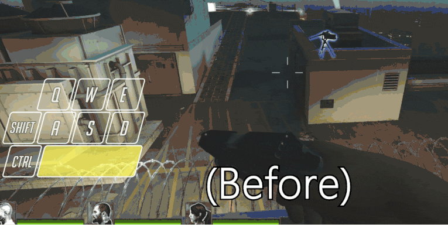
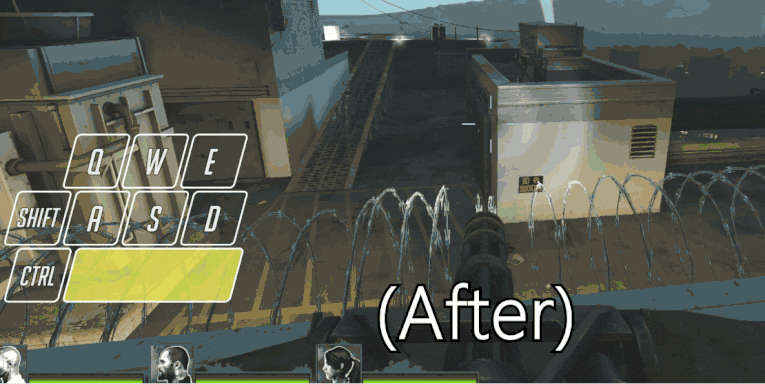

# Description | 內容
Fixes a glitch with a minigun that allows players to fly long distances

* Apply to | 適用於
    ```
    L4D1
    L4D2
    ```
* [Video | 影片展示](https://youtu.be/VDzOTLW5dUE)
	
* Image | 圖示
	| Before (裝此插件之前)  			| After (裝此插件之後) |
	| -------------|:-----------------:|
	| ||

* Require | 必要安裝
<br/>None

* <details><summary>How does it work?</summary>

	* How to reproduce the glitch
		1. Hold SPACE and press E to use minigun twice
		2. You fly away
</details>

* <details><summary>ConVar | 指令</summary>

    * cfg/sourcemod/l4d_minigun_fly_fix.cfg
        ```php
		// 0=Plugin off, 1=Plugin on.
		l4d_minigun_fly_fix_enable "1"
        ```
</details>

* <details><summary>Changelog | 版本日誌</summary>

	* v1.0 (2025-9-24)
		* Initial Release
</details>

- - - -
# 中文說明
修復倖存者利用地圖上的機關砲台飛上天空

* 原理
    * 如何重現這個Bug?
		1. 按住空白鍵，然後按E鍵使用機槍兩次
		2. 倖存者的人物模型會亂飛


* <details><summary>指令中文介紹 (點我展開)</summary>

    * cfg/sourcemod/l4d_minigun_fly_fix.cfg
        ```php
		// 0=關閉插件, 1=啟動插件
		l4d_minigun_fly_fix_enable "1"
        ```
</details>
