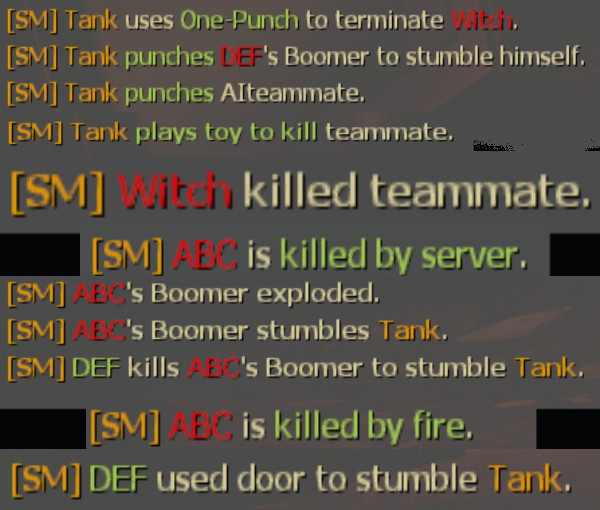
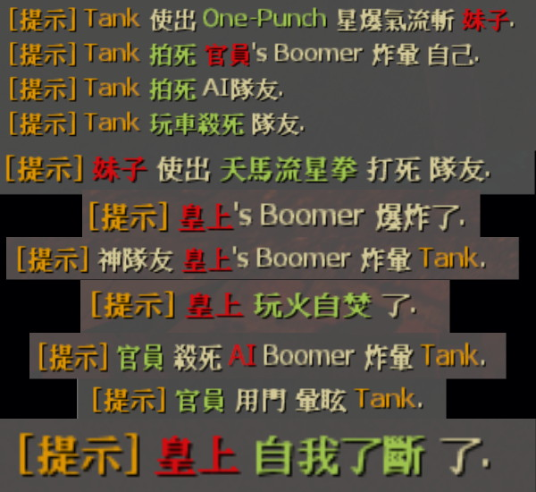

# Description | 內容
Show who is pig teammate in infected team

* Apply to | 適用於
	```
    L4D1
	L4D2
	```

* Image
	* Pig teammate moment
    <br/>  

* Require | 必要安裝
    1. [left4dhooks](https://forums.alliedmods.net/showthread.php?t=321696)
	2. [[INC] Multi Colors](https://github.com/fbef0102/L4D1_2-Plugins/releases/tag/Multi-Colors)

* <details><summary>ConVar | 指令</summary>

    * cfg/sourcemod/l4d_pig_infected_notify.cfg
        ```php
		// 0=Plugin off, 1=Plugin on.
		l4d_pig_infected_notify_enable "1"
        ```
</details>

* Translation Support | 支援翻譯
	```
	translations/l4d_pig_infected_notify.phrases.txt
	```

* <details><summary>Changelog | 版本日誌</summary>

    * v2.8 (2023-5-16)
        * Add more translation

    * v2.7 (2023-5-16)
        * Optimize Code

    * v2.6 (2023-4-6)
        * Translation Support

    * v1.0
        * Initial Release
</details>

- - - -
# 中文說明
顯示誰是豬隊友 (譬如推Tank拍死隊友、Boomer炸到Tank、Hunter跳樓自殺、Charger著火死亡等等)

* 圖示
	* 大佬裝B失敗的瞬間
    <br/>  

* 原理
	* 每當有特感做出愚蠢的操作時，打印在聊天視窗
    * 戰役/對抗/寫實/生存都適用
