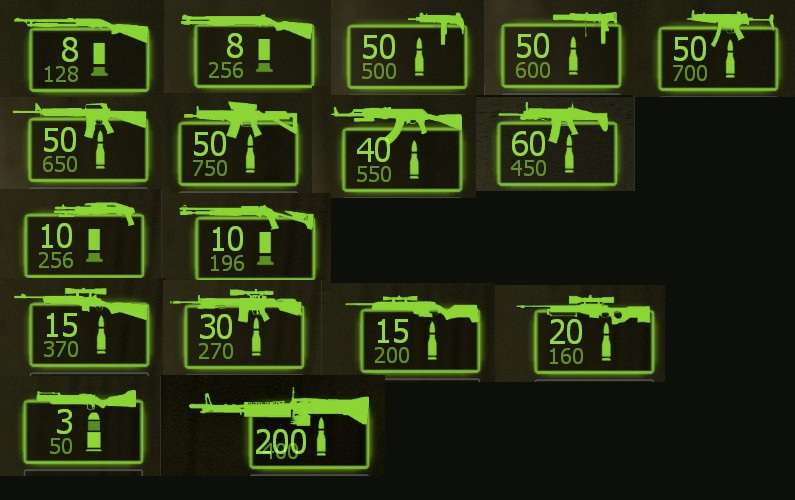

# Description | 內容
Individually control each weapons's reserve ammo

* Apply to | 適用於
	```
	L4D1
	L4D2
	```

* Image | 圖示
<br/>

* <details><summary>How does it work?</summary>

	* Individually control weapon reserve independent of "ammo_*" cvars in data: [data/l4d_reserve_ammo_control.cfg](data/l4d_reserve_ammo_control.cfg)
		* Manual in this file, click for more details...
	* Can refill with ammo pile (except for M60 an Grenade Launcher)
</details>

* Require | 必要安裝
	1. [l4d_transition_entity](/https://github.com/Target5150/MoYu_Server_Stupid_Plugins/tree/master/The%20Last%20Stand/l4d_transition_entity)
	2. [l4d_save_weapon_ammo](https://github.com/fbef0102/L4D1_2-Plugins/tree/master/l4d_save_weapon_ammo)

* <details><summary>ConVar | 指令</summary>

    * No available cfg and cvars
</details>

* <details><summary>Command | 命令</summary>
    
    * **Reload the reserve ammo data (Access: ADMFLAG_ROOT)**
        ```php
        sm_reserve_ammo_reload
        ```
</details>

* <details><summary>Changelog | 版本日誌</summary>

	* v1.0h (2026-5-16)
		* Remake code
		* Fix error: client not in game
		* Fix issue when ammo is not corrent when using "give" command and map transition
		* Use new detour to improve performance

	* Credit & Original
		* [Orinuse for original plugin](https://forums.alliedmods.net/showthread.php?t=334274): Reserve (Ammo) Control
		* [Psykotikism for signatures](https://github.com/Psykotikism/L4D1-2_Signatures/blob/main/l4d1/gamedata/l4d1_signatures.txt)
		* [blueblur0730 for better new detour](https://github.com/blueblur0730/modified-plugins/tree/main/source/l4d2_max_ammo): l4d2_max_ammo
</details>

- - - -
# 中文說明
控制每一種武器的後備彈藥數量 (手槍除外)

* 原理
	* 在data文件設置每一種主武器可攜帶的最大後備彈藥數量: [data/l4d_reserve_ammo_control.cfg](data/l4d_reserve_ammo_control.cfg)
		* 內有中文說明，可點擊查看
	* 可以透過彈藥推補充子彈 (M60與榴彈發射器除外)

* <details><summary>指令中文介紹 (點我展開)</summary>

    * 此插件沒有可用的cfg與cvars
</details>

* <details><summary>命令中文介紹 (點我展開)</summary>
    
    * **重新載入data文件 (權限: ADMFLAG_ROOT)**
        ```php
        sm_reserve_ammo_reload
        ```
</details>
