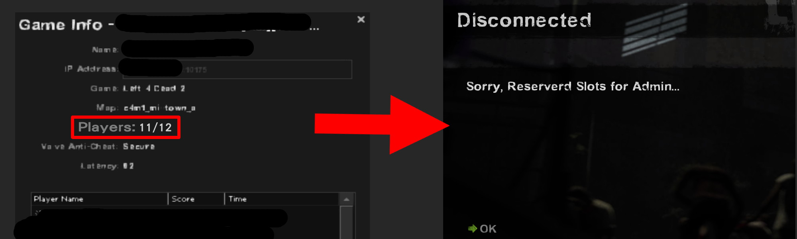
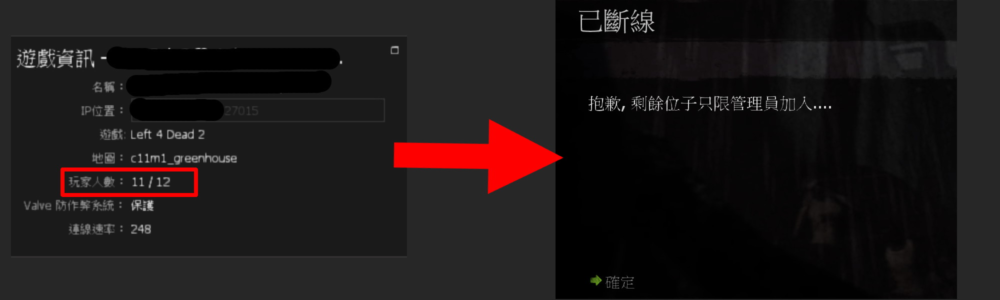

# Description | 內容
Admin Reserved Slots in L4D1/2 (Sorry, Reserverd Slots for Admin..)

* Video | 影片展示
<br/>None

* Image
	* Reserved Slots for Admin (Kick Message)
	<br/>

* Require
	1. [l4dtoolz](https://github.com/fbef0102/Game-Private_Plugin/tree/main/Tutorial_%E6%95%99%E5%AD%B8%E5%8D%80/English/Server/Install_Other_File#l4dtoolz): Unlock server slots limit

* <details><summary>ConVar | 指令</summary>

	* cfg/sourcemod/l4d_reservedslots.cfg
		```php
        // Reserved how many slots for Admin. (0=Off)
        l4d_reservedslots_adm "1"

        // Players with these flags have access to use admin reserved slots. (Empty = Everyone, -1: Nobody)
        l4d_reservedslots_flag "z"

        // If set to 1, reserved slots will be hidden (slot display = sv_maxplayers - l4d_reservedslots_adm)
        l4d_reservedslots_hide "0"
		```
</details>

* <details><summary>Command | 命令</summary>

	None
</details>

* Apply to | 適用於
	```
    L4D1 
	L4D2
	```

* <details><summary>Translation Support | 支援翻譯</summary>

	```
	English
	繁體中文
	简体中文
	```
</details>

* <details><summary>Changelog | 版本日誌</summary>
	
	* v1.6 (2023-8-17)
		* Fixed server kicks all players when map change

	* v1.5 (2023-7-1)
        * Require lef4dhooks v1.33 or above
		* Remake code, convert code to latest syntax
		* Fix warnings when compiling on SourceMod 1.11.
		* Optimize code and improve performance
		* Translation Support

	* v1.0 (2023-5-3)
	    * [Original Plugin by fenghf](https://bbs.3dmgame.com/thread-2804070-1-1.html)
</details>

- - - -
# 中文說明
當伺服器快滿人的時候，預留通道給管理員加入 (訊息提示: 剩餘通道只能管理員加入.. )

* 圖示
	<br/>

* 必要安裝
	1. [l4dtoolz](https://github.com/fbef0102/Game-Private_Plugin/tree/main/Tutorial_%E6%95%99%E5%AD%B8%E5%8D%80/Chinese_%E7%B9%81%E9%AB%94%E4%B8%AD%E6%96%87/Server/%E5%AE%89%E8%A3%9D%E5%85%B6%E4%BB%96%E6%AA%94%E6%A1%88%E6%95%99%E5%AD%B8#%E5%AE%89%E8%A3%9Dl4dtoolz): 解鎖伺服器人數上限

* 原理
	* 當伺服器快滿人的時候，剩餘的位置只能讓管理員加入，其他人加入會被踢出伺服器
	* 如果伺服器內已經有管理員則不會踢出玩家

* <details><summary>指令中文介紹 (點我展開)</summary>

	* cfg/sourcemod/l4d_reservedslots.cfg
		```php
        // 可設置預留通道的數量. (0=關閉)
        l4d_reservedslots_adm "1"

        // 可設置哪些權限視為管理員，這些人可以進入預留通道 (空白 = 任何人都可以進入, -1: 任何人都不行)
        l4d_reservedslots_flag "z"

        // 為1時，可將預留通道隱藏起來 (人數顯示 = 最大容納人數 - l4d_reservedslots_adm的數值)
        // 譬如原本伺服器顯示人數: 11/12，變成 11/11 (隱藏一個位置)
        l4d_reservedslots_hide "0"
		```
</details>