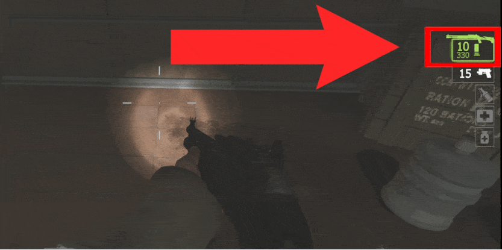
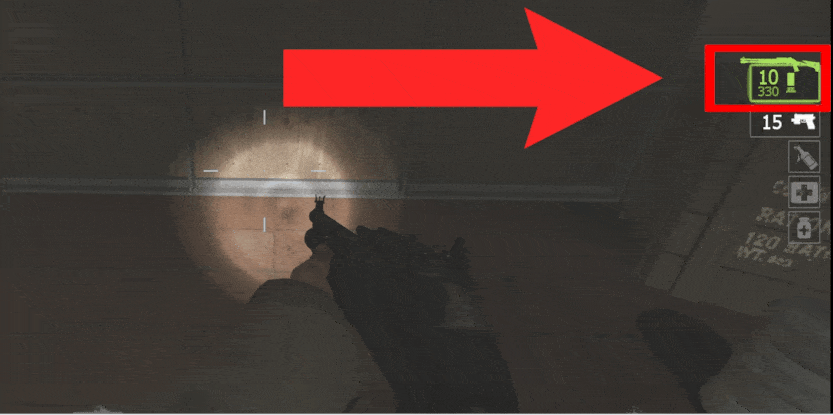

# Description | 內容
Prevent filling the clip when taking the same weapon + save if the amount of weapon ammo is more than vanilla.

* Apply to | 適用於
	```
	L4D1
	L4D2
	```

* Image | 圖示
	| Before (裝此插件之前)  			| After (裝此插件之後) |
	| -------------|:-----------------:|
	| ||
	| ||

    <br/>

* <details><summary>How does it work?</summary>

	* Prevent filling the clip when taking the same weapon.
	* Save if the amount of weapon ammo is more than vanilla.
		* For example: Other plugin gives weapon ammo more than default
</details>

* Require | 必要安裝
<br/>None

* <details><summary>Support | 支援插件</summary>

	1. [Reserve (Ammo) Control](https://forums.alliedmods.net/showthread.php?t=334274): Individually control weapons's reserve counts independent of the ammo_* cvars.
		* 設置每一種武器的後備子彈
	2. [l4d2_weapon_csgo_reload](/l4d2_weapon_csgo_reload): Quickswitch Reloading like CS:GO in L4D2
		* 將武器改成現代遊戲的裝子彈機制 (仿CS:GO切槍裝彈設定)
</details>

* <details><summary>ConVar | 指令</summary>

	* cfg/sourcemod/l4d_save_weapon_ammo.cfg
		```php
		// 0=Plugin off, 1=Plugin on.
		l4d_save_weapon_ammo_enable "1"

		// If 1, Fix picking up same weapons filling the clip
		l4d_save_weapon_ammo_fix_1 "1"

		// If 1, save if the amount of weapon ammo is more than vanilla
		l4d_save_weapon_ammo_fix_2 "1"
		```
</details>

* <details><summary>Changelog | 版本日誌</summary>

	* v1.0 (2025-2-15)
		* Initial Release
</details>

- - - -
# 中文說明
撿起的武器時不會有滿發的彈夾 + 儲存在地上的每個武器的彈藥，撿起來後給予相應的彈藥 (為了應付超出官方指令設定的彈藥)

* 原理
	* 撿起的武器時不會有滿發的彈夾
	* 儲存在地上的每個武器的彈藥，撿起來後給予相應的彈藥 (為了應付超出官方指令設定的彈藥)
		* 譬如有安裝其他插件會給予武器彈藥超過預設的數值

* <details><summary>指令中文介紹 (點我展開)</summary>

	* cfg/sourcemod/l4d_save_weapon_ammo.cfg
		```php
		// 0=關閉插件, 1=啟動插件
		l4d_save_weapon_ammo_enable "1"

		// 為1時，撿起的武器時不會有滿發的彈夾
		l4d_save_weapon_ammo_fix_1 "1"

		// 為1時，儲存在地上的每個武器的彈藥，撿起來後給予相應的彈藥 (為了應付超出官方指令設定的彈藥)
		l4d_save_weapon_ammo_fix_2 "1"
		```
</details>