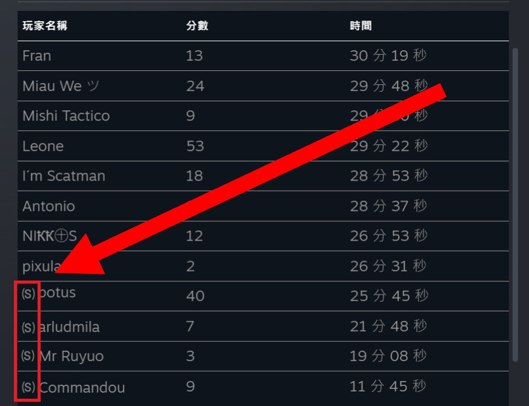

# Description | 內容
when player in spec team, add prefix

* Apply to | 適用於
    ```
    L4D1
    L4D2
    ```

* Image | 圖示
    <br/>

* Require | 必要安裝
<br/>None

* <details><summary>ConVar | 指令</summary>

    * cfg/sourcemod/l4d_spectator_prefix.cfg
        ```php
        // 0=Plugin off, 1=Plugin on.
        l4d_spectator_prefix_allow "1"

        // Turn on the plugin in these game modes, separate by commas (no spaces). (Empty = all).
        l4d_spectator_prefix_modes ""

        // Turn off the plugin in these game modes, separate by commas (no spaces). (Empty = none).
        l4d_spectator_prefix_modes_off ""

        // Turn on the plugin in these game modes. 0=All, 1=Coop, 2=Survival, 4=Versus, 8=Scavenge. Add numbers together.
        l4d_spectator_prefix_modes_tog "0"

        // Determine your preferred type of Spectator Prefix
        l4d_spectator_prefix_type "(S)"
        ```
</details>

* <details><summary>Related Plugin | 相關插件</summary>
	
	1. [l4d_name_prefix_game](https://github.com/fbef0102/Game-Private_Plugin/tree/main/L4D_插件/Server_%E4%BC%BA%E6%9C%8D%E5%99%A8/l4d_name_prefix_game): Set Prefix Name based on team, character, infected class
    	* 根據玩家的狀態與所在隊伍在名字前面增加前輟
</details>

* <details><summary>Changelog | 版本日誌</summary>

    * v1.4 (2024-2-27)
        * Hide change-name message

    * v1.3 (2024-1-31)
        * Remake code, convert code to latest syntax

    * v1.2
        * Initial Release
</details>

- - - -
# 中文說明
旁觀者的名字前，加上前缀符號

* 原理
    * 伺服器內只要玩家是旁觀者，名字前加上```(S)```符號

* 用意在哪?
    * 能夠方便讓玩家查看伺服器狀態，誰正在遊玩

* <details><summary>指令中文介紹 (點我展開)</summary>

    * cfg/sourcemod/l4d_spectator_prefix.cfg
        ```php
        // 0=關閉插件, 1=啟動插件
        l4d_spectator_prefix_allow "1"

        // 什麼模式下啟動此插件, 逗號區隔 (無空白). (留白 = 所有模式)
        l4d_spectator_prefix_modes ""

        // 什麼模式下關閉此插件, 逗號區隔 (無空白). (留白 = 無)
        l4d_spectator_prefix_modes_off ""

        // 什麼模式下啟動此插件. 0=所有模式, 1=戰役, 2=生存, 4=對抗, 8=清道夫. 請將數字相加起來
        l4d_spectator_prefix_modes_tog "0"

        // 設置旁觀者名字前缀符號
        l4d_spectator_prefix_type "(S)"
        ```
</details>