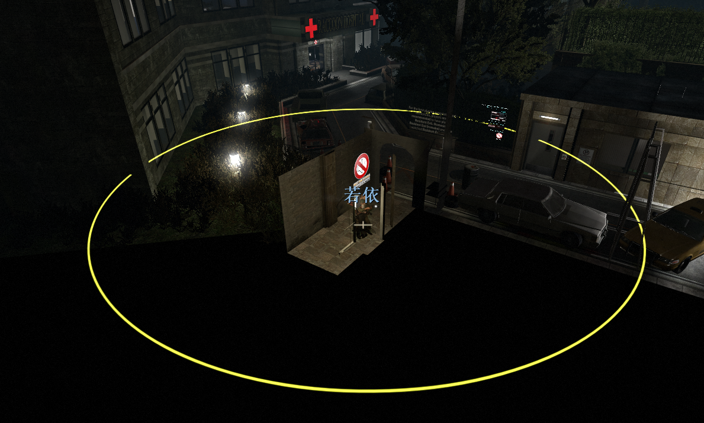

# Description | 內容
Add Custom safe area for any map on start

* Apply to | 適用於
	```
	L4D1
	L4D2
	```

* Image | 圖示
    <br/>

* <details><summary>How does it work?</summary>

	* Many custom maps are not like official maps, which have a safe zone at the beginning.
	* When you are still watching cutscenes or playing mutations like "Special Delivery" or you specail spawn plugins set up early spawn of special infected will attack you who are caught off guard!!!
	* For example:
		* The Hive
		* Chernobyl: Chapter One
		* TheMight4
	* This plugin create its own safe area, before you step out of the custom safe zone, you have enough time to prepare.
	* To control custom safe area, modify file: [data/l4d_start_safe_area.cfg](data/l4d_start_safe_area.cfg)
</details>

* Require | 必要安裝
    1. [left4dhooks](https://forums.alliedmods.net/showthread.php?t=321696)
	
* <details><summary>API | 串接</summary>

	* [l4d_start_safe_area.inc](scripting/include/l4d_start_safe_area.inc)
		```php
		library name: l4d_start_safe_area
		```
</details>

* <details><summary>Related | 相關插件</summary>

	1. [readyup](https://github.com/fbef0102/Game-Private_Plugin/tree/main/L4D_%E6%8F%92%E4%BB%B6/Server_%E4%BC%BA%E6%9C%8D%E5%99%A8/readyup): Ready-up plugin
		* 所有玩家準備才能開始遊戲的插件
	2. [antisaferoomdooropen](https://github.com/fbef0102/Game-Private_Plugin/tree/main/L4D_插件/Survivor_%E4%BA%BA%E9%A1%9E/antisaferoomdooropen): Start Saferoom door anti open + teleport survivor back to safe area when leaving out saferoom until certain time pass
		* 起始安全室的安全門將會鎖住直到時間結束 + 沒有安全門的關卡一旦離開安全區域會傳送回起始安全區域
</details>

* <details><summary>Changelog | 版本日誌</summary>

	* v1.2h (2026-1-28)
		* Detect if the intro cutscene is playing

	* v1.1h (2025-1-3)
		* Updata data

	* v1.0h (2024-12-30)
		* Remake code
		* Support L4D1
		* Provide API and include file
		* Add data file 

	* v1.0
		* [Original Plugin by 洛琪 central_lq](https://forums.alliedmods.net/showthread.php?t=349968)
</details>

- - - -
# 中文說明
遊戲開局時，強制將出生點周圍區域判定為安全區，以確保玩家安全

* 原理
	* 某些三方圖，如果做得爛，沒有任何安全區域
	* 當你還在準備拿武器或是看過場動畫的時候，遊戲導演就會直接開始，生成特感直接攻擊毫無防備的你
	* 譬如以下三方圖:
		* The Hive
		* Chernobyl: Chapter One
		* TheMight4
	* 這插件創造自己的安全區範圍，讓玩家在離開自製的安全區範圍之前有足夠時間準備
	* 可到文件設置自製安全區範圍: [data/l4d_start_safe_area.cfg](data/l4d_start_safe_area.cfg)