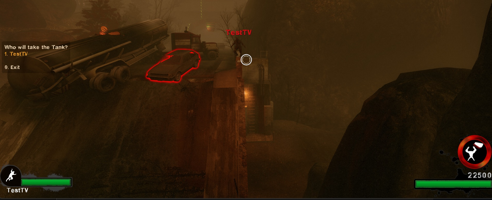
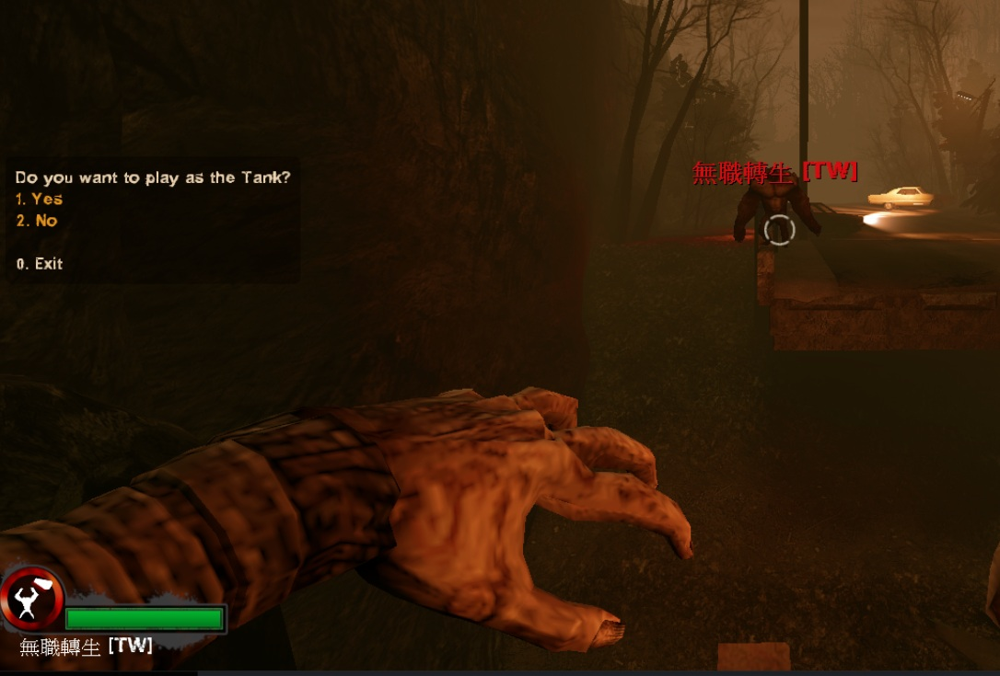
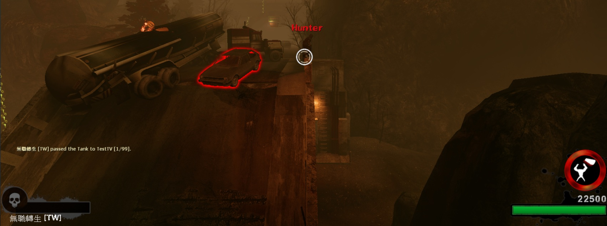

# Description | 內容
Allows the Tank to pass control to another player.

* Apply to | 適用於
    ```
    L4D1
    L4D2
    ```

* Image | 圖示
    <br/>
    <br/>
    <br/>

* <details><summary>How does it work?</summary>

    * When infected player becomes tank
        * Auto display menu to select which teammate player you want to pass tank
        * Type ```!pass`` to display menu manually
        * After another player confirms, pass tank
    * Admin can force pass the tank without confirmation
        * ```!admin``` -> "Player commands" -> "Pass the Tank" or "Control Tank Bot"
</details>

* Require | 必要安裝
    1. [left4dhooks](https://forums.alliedmods.net/showthread.php?t=321696)

* <details><summary>ConVar | 指令</summary>

    * cfg/sourcemod/l4d_tank_pass.cfg
        ```php
        // Execute command according convar value on old_tank and new_tank to close 3d party HUD.
        l4d_tank_pass_command "sm_tankhud"

        // 0=Off, 1=Ask the player if he wants to get the Tank.
        l4d_tank_pass_confirm "1"

        // The number of times the Tank can be passed by plugin. (Frustration counts as pass, 0=Unable to pass tank)
        l4d_tank_pass_count "1"

        // 0=Allow to pass the Tank when taking any damage, 1=Prevent to pass the Tank when taking any damage.
        l4d_tank_pass_damage "0"

        // 0=Allow to pass the Tank when on fire (Ignite the new Tank when passed)
        // 1=Prevent to pass the Tank when on fire
        // 2=Extinguish the new Tank when passed
        l4d_tank_pass_fire "1"

        // 0="X gets Tank" window, 1=Quick pass except finales
        l4d_tank_pass_logic "1"

        // 0=Off, 1=Display the menu when the Tank is spawned
        l4d_tank_pass_menu "1"

        // 0=Off, 1=Display pass command info to the Tank through chat messages.
        l4d_tank_pass_notify "1"

        // 0=Kill the alive player before the Tank pass, 1=Replace the alive player with an infected bot before the Tank pass.
        l4d_tank_pass_replace "1"

        // Sets the Tank passed count according convar value when taking control of the Tank AI. If >1 the tank will be replaced with a bot when the his frustration reaches 0.
        l4d_tank_pass_takeover "1"
        ```
</details>

* <details><summary>Command | 命令</summary>

    * **Pass the Tank control to another player (Need confirmation).**
        ```php
        sm_pass
        sm_passtank
        sm_tankpass
        ```

    * **Force to pass the Tank to target player without confirmation. (Adm Require: ADMFLAG_ROOT)**
        ```php
        sm_forcepass <#userid|name>
        ```

    * **Take control of the Tank AI. (Adm Require: ADMFLAG_ROOT)**
        ```php
        sm_taketank <#userid|name>
        ```
</details>

* Translation Support | 支援翻譯
    ```
    translations/l4d_tank_pass.phrases.txt
    ```

* <details><summary>Changelog | 版本日誌</summary>

    * v2.6.2 (2026-1-28)
        * Optimize code
        * Update cvars, translation
        * Remove l4d_lib.inc
        * Add chinese translation
        * Fixed client index invalid error
        * Added a Tank count check because when the Tank pass with an already active Tank, sometimes one of the Tanks becomes an AI bot (happens often in The Sacrifice when more than a generator is activated at once)
        * Added player menu sorting by name to pass the tank
        * Changed the "menu.Display" time to MENU_TIME_FOREVER
        * Fixed the bug where the tank life is full when an admin passes control of the AI to a player.
        * Adjusted some functions to explicitly return value. 

    * Credit
        * [disawar1](https://forums.alliedmods.net/showthread.php?t=326374) - Original Plugin v2.5
        * [Rugal](https://forums.alliedmods.net/showpost.php?p=2835777&postcount=23) - fork
        * [Marttt](https://forums.alliedmods.net/showpost.php?p=2841587&postcount=25) - fork
</details>

- - - -
# 中文說明
允許Tank轉移控制權給隊友

* 原理
    * 當特感玩家變成Tank時
        * 自動顯示菜單，選擇轉讓控制權
        * 手動輸入 ```!pass`` 打開菜單
        * 需經過對方玩家同意，Tank才會轉讓
    * 管理員可以強制轉讓控制權不需經過玩家同意
        * ```!admin``` -> "玩家指令" -> "轉移Tank控制權" 或 "控制 AI 坦克"

* <details><summary>指令中文介紹 (點我展開)</summary>

    * cfg/sourcemod/l4d_tank_pass.cfg
        ```php
        // 出現轉移控制權菜單時執行這些指令，避免三方插件有其他界面覆蓋.
        l4d_tank_pass_command "sm_tankhud"

        // 為1時，轉移控制權需要經過對方同意
        l4d_tank_pass_confirm "1"

        // 允許此插件轉讓Tank的次數 (失去控制權也會被算入)
        l4d_tank_pass_count "1"

        // 為1時，1=Tank受到傷害時不能轉讓控制權
        l4d_tank_pass_damage "0"

        // 0=Tank著火可以轉移控制權 (轉移之後重新點燃坦克)
        // 1=Tank著火不可以轉移控制權
        // 2=Tank著火可以轉移控制權 (轉移之後熄滅身上的火焰)
        l4d_tank_pass_fire "1"

        // 如何轉移坦克控制權
        // 0=出現 "X即將成為坦克" 的視窗，等待3秒後轉移
        // 1=馬上轉移
        l4d_tank_pass_logic "1"

        // 為1時，1=Tank生成時自動顯示菜單
        l4d_tank_pass_menu "1"

        // 為1時，1=Tank生成時自動顯示提示
        l4d_tank_pass_notify "1"

        // 0=轉移控制權之前先殺死特感玩家
        // 1=轉移控制權之前先用Bot取代特感玩家
        l4d_tank_pass_replace "1"

        // 得到AI Tank控制權之後設置的控制權次數
        // 此數值如果大於1，則得到AI Tank之後如果失去控制權，會又變回AI Tank
        l4d_tank_pass_takeover "1"
        ```
</details>

* <details><summary>Command | 命令</summary>

    * **打開菜單轉讓控制權 (需要對方同意).**
        ```php
        sm_pass
        sm_passtank
        sm_tankpass
        ```

    * **強制轉移Tank控制權給目標玩家，不須經過對方同意 (權限: ADMFLAG_ROOT)**
        ```php
        sm_forcepass <#userid|name>
        ```

    * **強制轉移AI Tank控制權給目標玩家 (權限: ADMFLAG_ROOT)**
        ```php
        sm_taketank <#userid|name>
        ```
</details>


