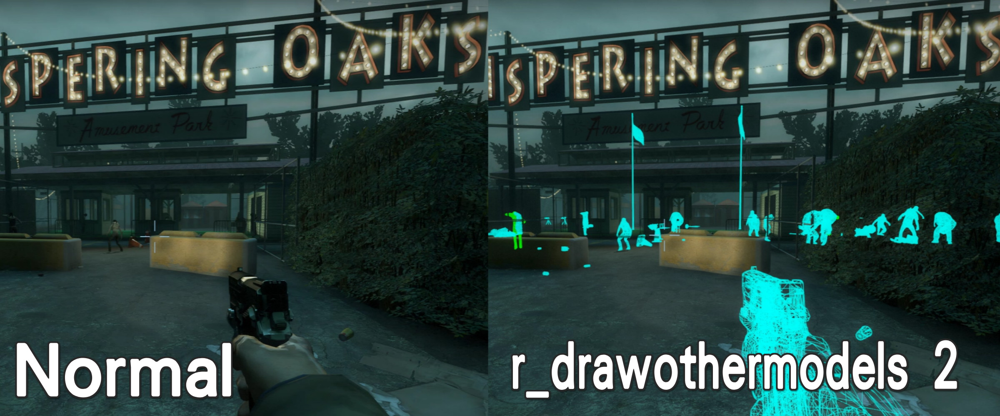
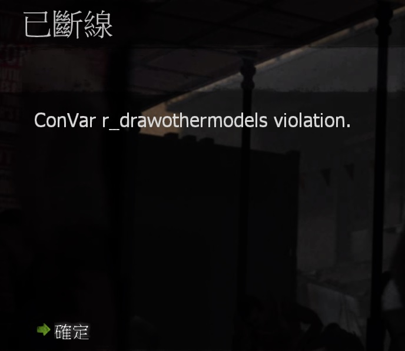

# Description | 內容
Kicks out clients who are potentially attempting to enable mathack

* Video | 影片展示
<br/>None

* Image | 圖示
    * Kick player using cheat cvars (踢出試圖使用作弊指令的玩家)
    <br/>
    <br/>

* <details><summary>How does it work?</summary>

    * Kick players if they try to modify the cvars in [configs\l4d_texture_manager_block.cfg](configs\l4d_texture_manager_block.cfg)
        * Add more cvars if you want
    * Record hackers in ```sourcempd\logs\l4d_texture_manager_block.log```
</details>

* Require | 必要安裝
    1. [[INC] Multi Colors](https://github.com/fbef0102/L4D1_2-Plugins/releases/tag/Multi-Colors)

* <details><summary>ConVar | 指令</summary>

    None
</details>

* <details><summary>Command | 命令</summary>
    
    * **(Server) List Client settings enforced by l4d_texture_manager_block**
        ```php
        list_clientsettings
        ```

    * **(Server) Add a Client CVar to be tracked and enforced by l4d_texture_manager_block**
        ```php
        add_trackclientcvar <cvar> <hasMin> <min> <hasMax> <max> <action> [note]
        ```

    * **(Server) Reload the 'trackclientcvar' list**
        ```php
        reload_trackclientcvar
        ```
</details>

* <details><summary>Data Config</summary>

	* [configs/l4d_texture_manager_block.cfg](configs/l4d_texture_manager_block.cfg)
		```php
        // <cvar> cvar name
        // <action> 0=Kick clients, 1=Record only, in log file(sourcemod/logs/l4d_texture_manager_block.log), Other value: Ban minutes

        //# Client Cvar Tracking        
        //<cvar>                                    <hasMin>    <min>       <hasMax>    <max>       <action>    <note> - Do not delete this line
        cl_bob                                      1           0.002       1           0.002       0
        cl_bobcycle                                 1           0.8         1           0.8         0
        cl_bobup                                    1           0.5         1           0.5         0

        ... //Add more cvars if you want
		```
</details>

* Apply to | 適用於
    ```
    L4D1
    L4D2
    ```

* <details><summary>Changelog | 版本日誌</summary>

    * v1.0h (2024-8-26)
        * Improve code, [Credit](https://github.com/SirPlease/L4D2-Competitive-Rework/blob/master/addons/sourcemod/scripting/confoglcompmod/ClientSettings.sp)
        * Add config file
        * Add log file

    * v1.7 (2023-5-10)
        * Add more client convars

    * 1.0
        * [From L4D2-Competitive-Framework](https://github.com/Attano/L4D2-Competitive-Framework/blob/master/addons/sourcemod/scripting/l4d_texture_manager_block.sp)

    * 0.2
        * [Original Plugin by extrav3rt](https://forums.alliedmods.net/showthread.php?p=2580578)
</details>

- - - -
# 中文說明
遊戲中頻繁檢測每一位玩家並踢出試圖使用作弊指令的客戶

* 原理
    * 幫玩家檢測指令，如有發現試圖使用或超出範圍將踢出伺服器
    * 檢測的指令表位於[configs\l4d_texture_manager_block.cfg](configs\l4d_texture_manager_block.cfg)
        * 如你有發現更多作弊指令想新增檢測，請自行增加
    * 紀錄文件於```sourcempd\logs\l4d_texture_manager_block.log```

* <details><summary>命令中文介紹 (點我展開)</summary>
    
    * **(伺服器後台) 列出所有檢測的指令表**
        ```php
        list_clientsettings
        ```

    * **(伺服器後台) 增加新的指令檢測**
        ```php
        add_trackclientcvar <cvar> <hasMin> <min> <hasMax> <max> <action> [note]
        ```

    * **(伺服器後台) 重新載入configs文件並刷新指令表**
        ```php
        reload_trackclientcvar
        ```
</details>

* <details><summary>文件設定範例</summary>

	* [configs/l4d_texture_manager_block.cfg](configs/l4d_texture_manager_block.cfg)
		```php
        // <cvar> 指令名稱
        // <hasMin> 1=檢查最小值, 0=不檢查最小值
        // <min> 設置最小值
        // <hasMax> 1=檢查最大值, 0=不檢查最大值
        // <min> 設置最大值
        // <action> 當玩家的指令超出範圍時，要採取的動作: 0=踢出伺服器, 1=只紀錄，文件位於 sourcemod/logs/l4d_texture_manager_block.txt, 其他數值=封鎖玩家 (單位: 分鐘)

        //# Client Cvar Tracking        
        //<cvar>                                    <hasMin>    <min>       <hasMax>    <max>       <action>    <note> - 請勿刪除此行
        cl_bob                                      1           0.002       1           0.002       0
        cl_bobcycle                                 1           0.8         1           0.8         0
        cl_bobup                                    1           0.5         1           0.5         0
        
        ... //請自行增加更多作弊指令
		```
</details>